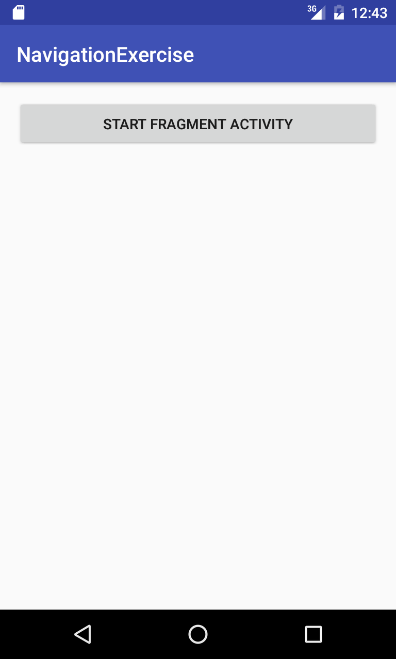
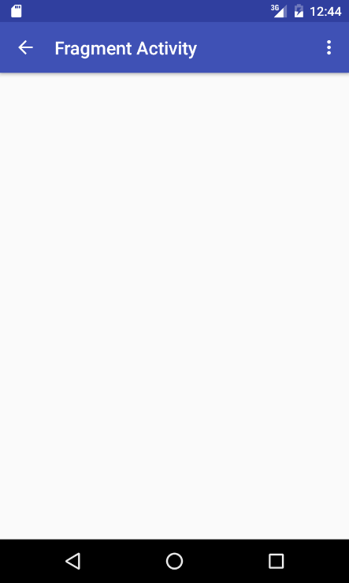
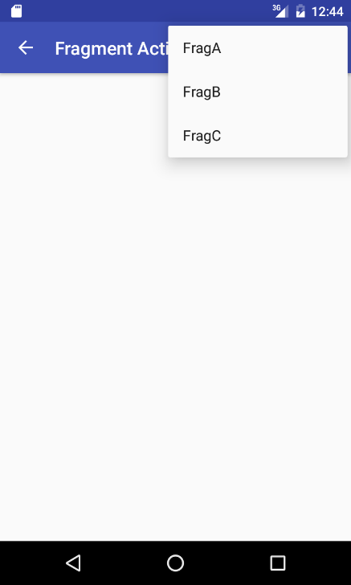
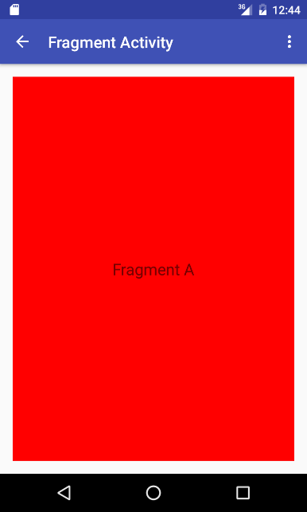
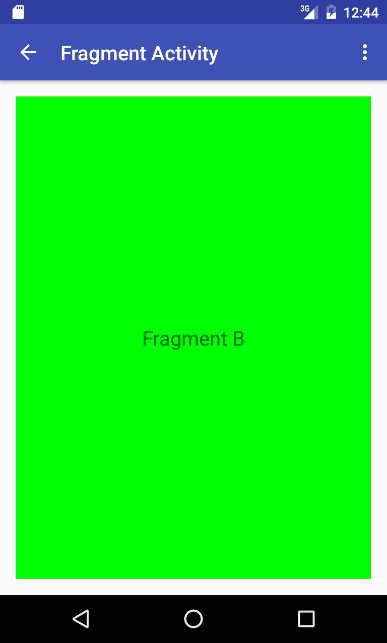
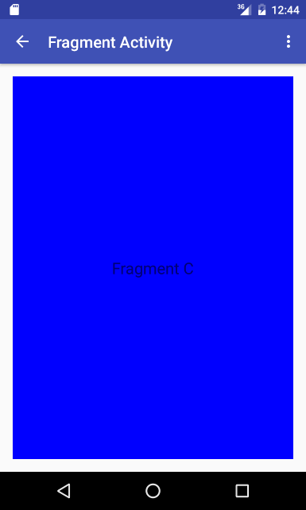

# 액션바와 네비게이션 실습

## 1. 두 개의 액티비티, MainActivity와 FragActivity를 만든다. MainActivity는 FragActivity의 부모 액티비티이다.

## 2. MainActivity는 버튼을 하나 가지고 있고, 버튼을 누르면 FragActivity를 시작한다.

    

## 3. FragActivity는 위로 가기 버튼과 옵션 메뉴를 가지고 있다. 그리고 타이틀은 “Fragment Activity”로 한다. 옵션 메뉴의 아이템에는 FragA, FragB, FragC가 있다.

    
    

## 4. FragActivity에서 옵션 메뉴를 선택하면 각각에 해당하는 프래그먼트를 표시한다. 이때 프래그먼트를 백 스택에 넣는다. (FragmentTransaction의 addToBackStack() 메소드 사용)

    
    
    

## 5. 테스트
* MainActivity에서 버튼 누름 -> FragActivity 표시 -> FragA 메뉴 선택 -> Fragment A 표시 -> FragB 메뉴 선택 -> Fragment B 표시 -> FragC 메뉴 선택 -> Fragment C 표시 -> 백 버튼 -> Fragment B 표시 -> 액션 바의 위로 가기 버튼(<-) -> MainActivity 표시
