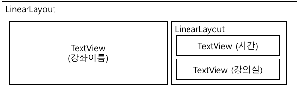

# 어댑터 뷰 실습

* 이번 실습은 아래와 같은 커스텀 리스트 뷰를 완성하는 것임.
* 리스트의 각 항목은 여러분이 수강하는 강좌 정보(강좌이름, 시간, 강의실)를 표시하는 것임.


그림 1 실습 출력 화면

## 1. 커스텀 리스트 뷰의 한 항목을 위한 UI 레이아웃을 구성



* 위 그림과 같이 리스트의 한 항목을 위한 레이아웃 (layout/item.xml)을 정의하라.
* LinearLayout과 TextView의 다양한 속성 (layout_gravity, layout_weight, gravity, textColor, textSize, padding 등)을 활용하여 최대한 그림1에서 보이는 것처럼 설정하라.
* (참고자료) https://github.com/kwanu70/AndroidExamples/blob/master/chap3/CustomAdapterTest/app/src/main/res/layout/item.xml

## 2. 항목의 데이터를 관리하고, 항목의 뷰를 반환하는 커스텀 어댑터 클래스 정의
* 강좌이름, 시간, 강의실 정보로 구성되는 항목 데이터 클래스 (MyItem) 를 정의하라.
* 항목 데이터를 관리하며, 어댑터 뷰에 항목 뷰를 제공해주는 커스텀 어탭터 클래스 (MyAdapter)를 정의하라
* (참고자료) https://github.com/kwanu70/AndroidExamples/blob/master/chap3/CustomAdapterTest/app/src/main/java/com/example/kwanwoo/customadaptertest/MyAdapter.java

## 3. 작성된 커스텀 어탭터 클래스 (MyAdapter)를 ListView에서 사용
* ListView 하나 만으로 구성된 화면 레이아웃을 정의
* MainActivity 클래스에서 ListView에 표시될 항목 데이터를 준비하고, MyAdapter 객체를 생성 시킨후,  이를 ListView에 설정하여 그림 1과 같은 결과를 출력시킨다.
* ListView의 한 항목을 클릭시에 클릭된 항목의 내용을 토스트 메시지로 표시
* (참고자료) https://github.com/kwanu70/AndroidExamples/blob/master/chap3/CustomAdapterTest/app/src/main/java/com/example/kwanwoo/customadaptertest/MainActivity.java

## 4. ListView의 항목 사이의 구분자를 설정하여, 리스트 뷰의 가시성을 개선
* ListView의 구분자를 설정하는 방법:
```java
     listView.setDivider(new ColorDrawable(Color.RED));
     listView.setDividerHeight(5);
```
* (참고자료) 
https://github.com/kwanu70/AndroidExamples/blob/master/chap3/ListViewTest/app/src/main/java/com/example/kwanwoo/listviewtest/MainActivity.java#L38-L40
