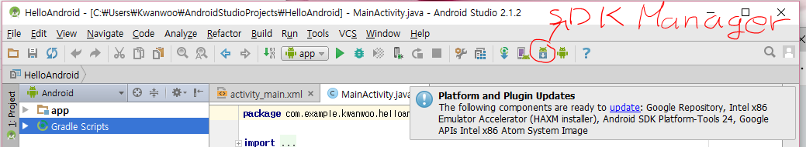
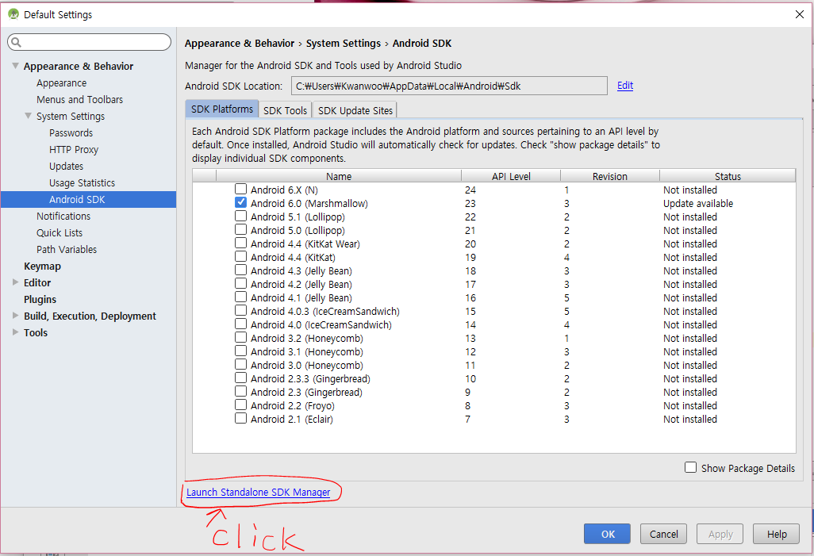
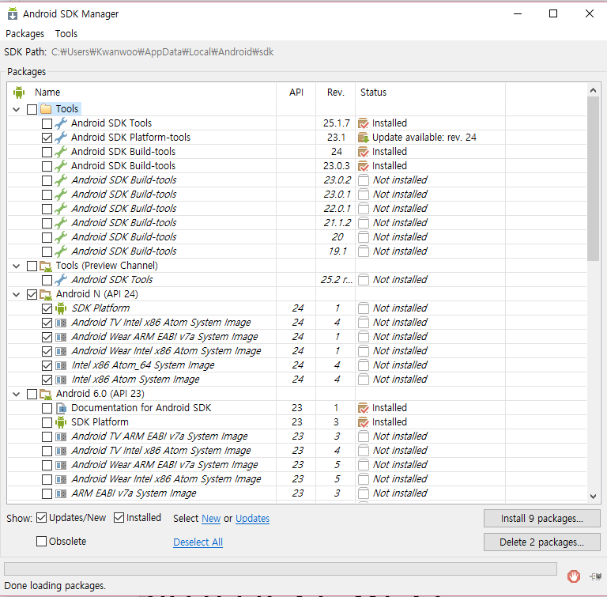
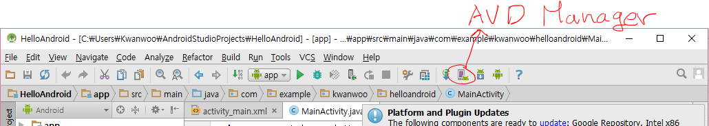
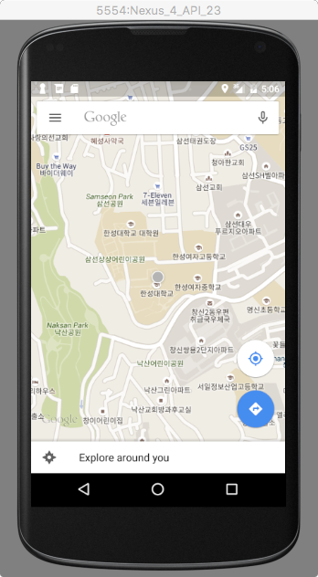
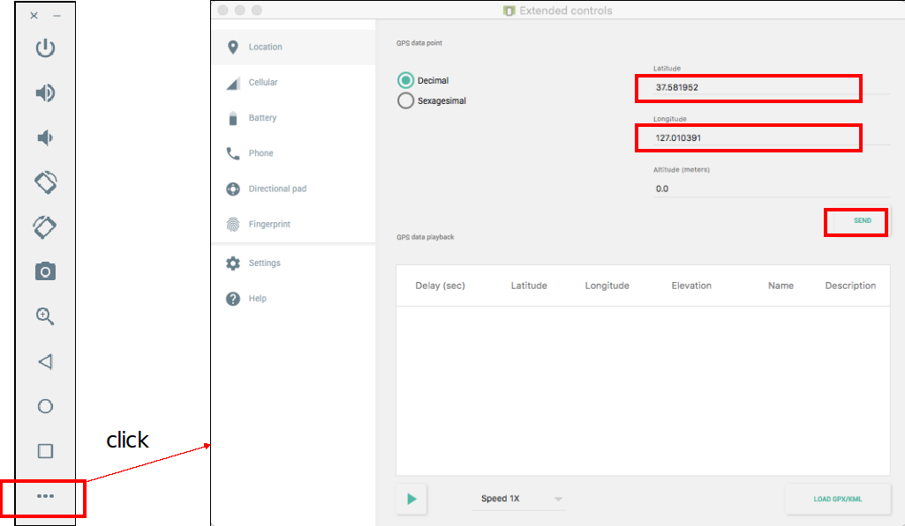

안드로이드 시작하기 실습
===================

## 1. Java SE Development Kit 8 설치하기 [생략가능]
http://www.oracle.com/technetwork/java/javase/downloads/jdk8-downloads-2133151.html 사이트에서 현재 사용중인 컴퓨터에 맞는 Java SE Development Kit을 다운 받아 설치하시오.

## 2. Android Studio 설치하기 [생략가능]
https://developer.android.com/studio/index.html 사이트 접속하여 Android Studio를 다운받아 설치하시오

## 3. SDK Manager를 이용하여 필요한 SDK 도구와 플랫폼을 설치
* SDK Manager 실행시키기
  - i. Android Studio에서 [SDK Manager 아이콘] 클릭
  
  - ii. [Launch Standalone SDK Manager] 링크 클릭
  
  - iii. Android SDK Manger 실행 결과
  

* SDK Manager를 이용하여 최신 도구와 플랫폼 설치, 다음 도구와 플랫폼이 최신 버전으로 설치되었는지 확인
  - Tools
    - Android SDK Tools
    - Android SDK Platform-tools
    - Android SDK Build-tools
  - Android 6.0 (API 23)
    - SDK Platform
  - Android N (API 24)
    - SDK Platform
  - Extras
    - Android Support Repository (installed)
    - Google Repository (updeate)
    - Google USD Driver

## 4. AVD Manager를 이용하여 virtual device (안드로이드 에뮬레이터) 만들기

* 다음 스펙의 Phone 용 Virtual Device를 만드시오
  - Device: Nexus 4
  - Size: 4.7’’
  - Resolution 768x1280
  - Density: xhdpi
  - System Image: Marshmallow/ Intel Atom X86_64/ Google APIs
  - Camera: Front(Emulated), Back(Emulated)
  - SD card: 500 MB

## 5. 안드로이드 에뮬레이터 사용해보기
* 에뮬레이터 제어기의 다음 기능을 사용해 보자
  - 디바이스 회전
  - 카메라 촬영 후, Gallery 앱에서 촬영 이미지 확인
* 에뮬레이터에서 Maps(구글맵 앱)을 실행시키고, 에뮬레이터 제어기에서 아래의 GPS 값을 보냄(“SEND” 버튼 클릭)으로써, 아래와 같이 실행됨을 확인해 본다.

## 6. HelloAndroid 프로젝트를 Android Studio를 이용하여 생성하고, 이를 에뮬레이터에서 실행하여 다음의 결과를 확인하라.

