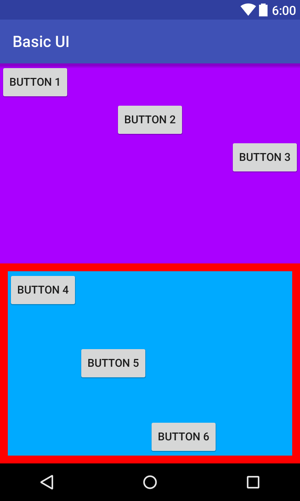

안드로이드 UI 실습
===============

# 1. 안드로이드 프로젝트 생성

# 2. 다음과 같이 UI 레이아웃을 구성
- LinearLayout 내에 LinearLayout을 2개 사용하고 각각의 weight를 1로 사용
- 아래쪽 LinearLayout은 margin을 사용하여 빨간색 background인 부모 LinearLayout이 살짝 보이도록 한다.
- Button마다 적절한 layout_gravity를 사용하여 위치를 조정



# 3. 버튼 클릭 이벤트 처리
-  Button 1과 2, 3을 누르면 각각 “Button 1 clicked”, “Button 2 clicked”, “Button 3 clicked” 메시지 토스트를 보여주도록 한다.

토스트 메시지:
```java
Toast.makeText(getApplicationContext(), R.string.msg, Toast.LENGTH_SHORT).show();
```

# 4. 버튼의 텍스트 변경
-  Button 4번을 누르면 Button 1의 text를 “Button One”과 “Button 1”이 번갈아 바뀌도록 한다.

버튼의 text를 바꾸는 방법:
```java
Button btn = (Button)findViewById(R.id.button1);
btn.setText("Button One");
```

# 5. 참고용 예제
https://github.com/jyheo/AndroidTutorial/tree/master/BasicUI
