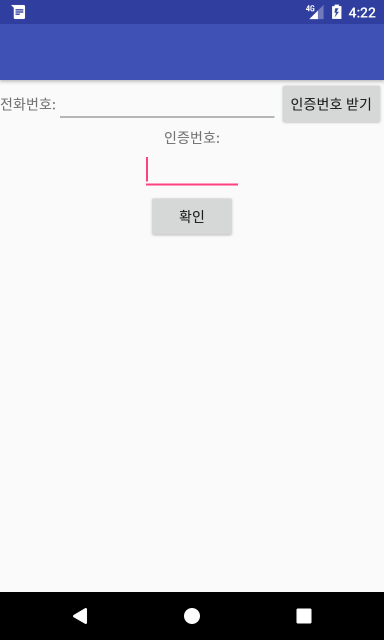
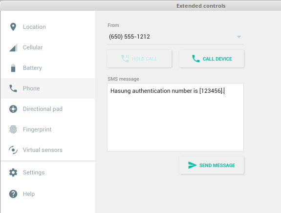

# 브로드캐스트 실습

## 다음과 같이 MainActivity를 생성

## RECEIVE_SMS 권한
* AndroidManifest.xml에 권한 추가
    - 참고 코드: https://github.com/jyheo/AndroidTutorial/blob/master/BroadcastApp/app/src/main/AndroidManifest.xml#L5
* 권한 요청 코드 추가
    - 참고 코드: https://github.com/jyheo/AndroidTutorial/blob/master/BroadcastApp/app/src/main/java/com/example/jyheo/broadcastapp/MainActivity.java#L42

## '인증번호 받기' 버튼을 누르면
* registerReceiver()를 사용하여 SMS 수신용 브로드캐스트 리시버 등록
* 참고 코드
    - https://github.com/jyheo/AndroidTutorial/blob/master/BroadcastApp/app/src/main/AndroidManifest.xml#L30-L34
    - https://github.com/jyheo/AndroidTutorial/blob/master/BroadcastApp/app/src/main/java/com/example/jyheo/broadcastapp/MySMSReceiver.java
    - https://github.com/jyheo/AndroidTutorial/blob/master/BroadcastApp/app/src/main/java/com/example/jyheo/broadcastapp/MainActivity.java#L31

## 에뮬레이터를 이용하여 SMS 발송
* 송신자 번호 1000-1000
* 내용: 'Hasung authentication number is [123456].'

## SMS 수신하면
* 송신자 번호 확인
* 내용에서 인증번호 추출
* 인증번호를 인증번호 입력용 EditText에 입력
* 참고 코드 - https://github.com/jyheo/AndroidTutorial/blob/master/BroadcastApp/app/src/main/java/com/example/jyheo/broadcastapp/MySMSReceiver.java#L15-L32

## '확인' 버튼 누르면
* unregisterReceiver()를 호출하여 브로드캐스트 리시버 등록 취소

## 테스트
* 정상적인 인증 문자 발송의 경우 해당 번호가 자동으로 EditText에 입력되는지 확인
* 아래와 같이 비정상 적인 인증 번호 발송의 경우 자동 입력되면 안됨
    - 'Hansung authentication error [0]'
    - 'Wrong phone number!'
