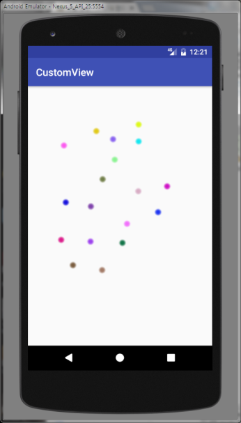

# 커스텀 뷰 실습

커스텀 뷰를 사용하여 터치하는 곳에 ball이 그려지고 움직이도록 하라.



## 1. Ball 클래스를 다음과 같이 구현하라.

```java
public class Ball {
    final   int RAD = 24;     	// 볼의 반지름
    int x, y, dx, dy;         	// 볼의 중심 좌표
    int width, height;    	// 볼의 넓이와 높이
    int color;

    public Ball(int x, int y) {
        this.x = x;
        this.y = y;

        Random Rnd = new Random();
        do {
            dx = Rnd.nextInt(11)-5;
            dy = Rnd.nextInt(11)-5
        } while(dx==0 || dy==0); //  0은 제외

        width=height=RAD*2
        color = Color.rgb(Rnd.nextInt(256),Rnd.nextInt(256),
		                      Rnd.nextInt(256));
    }

    public void draw(Canvas canvas) {

        Paint paint = new Paint();

        for (int r = RAD, alpha = 1; r > 4; r--, alpha += 5)
        { // 바깥쪽은 흐릿하게 안쪽은 진하게 그려지는 원
            paint.setColor(Color.argb(alpha, Color.red(color),
                    Color.green(color), Color.blue(color)));
            canvas.drawCircle(x + RAD, y + RAD, r, paint);
        }
    }
    void move(int width, int height) {
        x += dx;       // x 좌표값을 dx 만큼 증가
        y += dy;       // y 좌표값을 dy 만큼 증가

        if (x<0 || x > width- this.width)
            dx *= -1;                       // 좌우 방향 반전
        }
        if (y<0  || y > height- this.height)
            dy *= -1;                      // 상하 방향 반전

        }
    }
}
```

## 2. View를 상속받은 BallsView를 만들고 onTouch이벤트를 받아서 터치하는 곳에 ball이 그려지도록 하라.
* View 상속 참고: https://github.com/kwanu70/AndroidExamples/blob/master/chap9/GraphicsTest/app/src/main/java/com/example/kwanwoo/graphicstest/AnimatedView.java#L24
* 레이아웃에 BallsView 넣기 참고: https://github.com/kwanu70/AndroidExamples/blob/master/chap9/GraphicsTest/app/src/main/res/layout/activity_main.xml#L17-L20
* 터치 이벤트 처리 참고: https://github.com/kwanu70/AndroidExamples/blob/master/chap9/GraphicsTest/app/src/main/java/com/example/kwanwoo/graphicstest/AnimatedView.java#L71-L81

## 3. Ball 클래스의 move함수와 invalidate함수를 적절히 사용하여 전체 ball들이 움직이는 애니메이션을 프로그램하라.
* 참고:
https://github.com/kwanu70/AndroidExamples/blob/master/chap9/GraphicsTest/app/src/main/java/com/example/kwanwoo/graphicstest/AnimatedView.java#L51-L68

## 4. 다음과 같은 interface를 BallsView에 정의하고, MainActivity에 다음과 같은 코딩을 함으로써 터치할때마다 볼이 증가 함과 동시에 TextView에 볼의 수가 나타나도록 BallsView 클래스를 수정하라.

```java
public interface    OnChangeBallsListener{
    public  void onChangeBalls(int count);
}
```

```java
protected void onCreate(Bundle savedInstanceState) {
    super.onCreate(savedInstanceState);
    setContentView(R.layout.activity_main);
    BallsView   ballsView=(BallsView)findViewById(R.id.ballsView);
    ballsView.setOnChangeBallsListener(new BallsView.OnChangeBallsListener() {
        @Override
        public void onChangeBalls(int count) {
            TextView    textView=(TextView)findViewById(R.id.textView);
            textView.setText("볼의 수:"+count);
        }
    });
}
```


## 5. 4에서 볼의 위를 클릭하면 볼이 삭제 되도록 프로그램하라.
