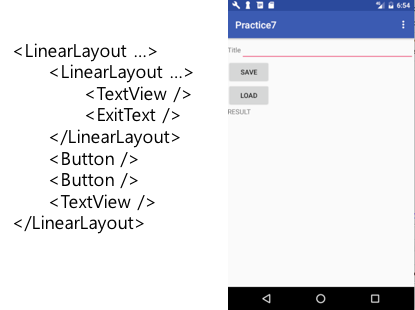
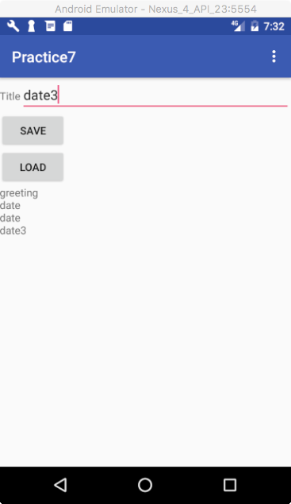
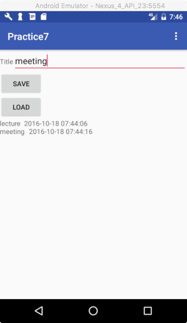

# 데이터 저장과 관리 실습

## 1. 다음과 같은 레이아웃을 가지는 MainActivity를 생성하라.



## 2. 액션바의 옵션 메뉴를 누르면 다음과 같이 3개의 메뉴가 나오고, 이중 하나만 선택되도록 하기 위해 메뉴 리소스의 메뉴 아이템을 <group> 태그로 묶고, **android:checkableBehavior** 의 값을 "single"로 설정하라.


```xml
<menu xmlns:android="http://schemas.android.com/apk/res/android">
    <group android:checkableBehavior="single">
        <item
            android:id="@+id/internal_storage"
            android:title="Internal Storage"
            />
        <item
            android:id="@+id/external_storage"
            android:title="External Storage"
             />
        <item
            android:id="@+id/sqlite"
            android:title="SQLite Database"
            />
    </group>
</menu>
```

## 3. [프레퍼런스 실습]
옵션 메뉴 아이템을 선택하면, 선택된 메뉴 아이템의 체크 상태를 true로 만들어서 체크 표시가 되도록 하고, 선택된 상태를 프레퍼런스에 저장한다. 또한 옵션메뉴가 생성될 때 (onCreateOptionMenu() 메소드), 프레퍼런스에 저장된 선택 상태에 따라서 메뉴 아이템의 체크 상태를 설정하라.

* [힌트]
    - MenuItem 객체의 체크상태 설정 방법: **setChecked(boolean)** 메소드 파라미터에 true/false. 값을 설정함에 따라 해당 객체의 체크상태가 설정됨
    - onCreateOptionMenu(Menu menu) 함수내에서 MenuItem 객체 얻어 체크상태 설정하는 방법

```java
public boolean onCreateOptionsMenu(Menu menu) {
    MenuInflater inflater = getMenuInflater();
    inflater.inflate(R.menu.menu, menu);

    // findItem의 첫번째 파라미터는 메뉴아이템 리소스 아이디
    menu.findItem(R.id.internal_storage).setChecked(true);
}
```

* [결과 확인]
    - 옵선 메뉴 아이템 (Internal Storage, External Storage, SQLite Database) 중에 하나를 선택한 후에, 프로그램을 종류 후 다시 시작했을 때, 이전에 선택한 메뉴 아이템이 선택되어 있으면 됩니다.

## 4. [Internal Storage 실습]
* 옵션 메뉴 아이템 중 Internal Storage가 선택된 상태에서
* 메인 화면의 EditText 창에 임의의 타이틀 텍스트를 입력하고, “SAVE” 버튼을 누르면, 앱 내부의 지정된 위치 (/data/data/패키지명/files/)에 있는 여러분이 지정한 이름의 파일에 입력된 텍스트를 저장합니다. 단 저장 시, 파일에 입력된 내용을 덧붙이는 방식으로 저장합니다.
* [Tool->Android->Android Device Monitor]를 실행시켜서, FileExplorer 탭을 열어 해당 파일이 생성되었는 지 확인합니다.
* 메인 화면의 “LOAD” 버튼을 누르면 해당 파일에서 데이터를 읽어서 결과를 보여는 TextView 창에 출력해 줍니다. [다음 그림은 “LOAD” 버튼을 누른 후 저장된 파일의 내용을 출력한 결과임]



* 참조코드: https://github.com/kwanu70/AndroidExamples/blob/master/chap7/FileTest/app/src/main/java/com/example/kwanwoo/filetest/MainActivity.java [44~90줄]

## 5.  [External Storage 실습]
* 옵션 메뉴 아이템 중 External Storage가 선택된 상태에서
* 메인 화면의 EditText 창에 임의의 타이틀 텍스트를 입력하고, “SAVE” 버튼을 누르면, 외부저장소의 위치(sdcard/)에 있는 여러분이 지정한 이름의 파일에 입력된 텍스트를 저장합니다. 단 저장 시, 파일에 입력된 내용을 덧붙이는 방식으로 저장합니다.
* [Tool->Android->Android Device Monitor]를 실행시켜서, FileExplorer 탭을 열어 해당 파일이 생성되었는 지 확인합니다.
* 메인 화면의 “LOAD” 버튼을 누르면 해당 파일에서 데이터를 읽어서 결과를 보여는 TextView 창에 출력해 줍니다. [4번 결과와 유사함]
* 참조코드: https://github.com/kwanu70/AndroidExamples/blob/master/chap7/FileTest/app/src/main/java/com/example/kwanwoo/filetest/MainActivity.java [92~148줄]

## 6. [SQLite DB Storage 실습]
* 옵션 메뉴 아이템 중 SQLite Database가 선택된 상태에서
* 메인 화면의 EditText 창에 임의의 타이틀 텍스트를 입력하고, “SAVE” 버튼을 누르면, 데이터베이스(data/data/패키지/databases)에 있는 여러분이 지정한 이름의 db 파일에 입력된 텍스트를 저장합니다. 단 저장 시, 입력된 시간도 같이 저장합니다.
* [Tool->Android->Android Device Monitor]를 실행시켜서, FileExplorer 탭을 열어 해당 파일이 생성되었는 지 확인합니다.
* 메인 화면의 “LOAD” 버튼을 누르면 해당 데이터베이스에서 데이터를 읽어서 결과를 보여는 TextView 창에 출력해 줍니다.
* 참조코드: https://github.com/kwanu70/AndroidExamples/blob/master/chap7/SQLiteDBTest/app/src/main/java/com/example/kwanwoo/sqlitedbtest/MainActivity.java


