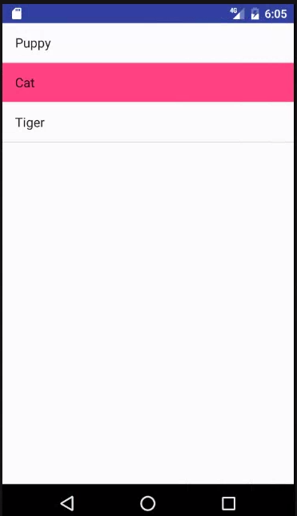
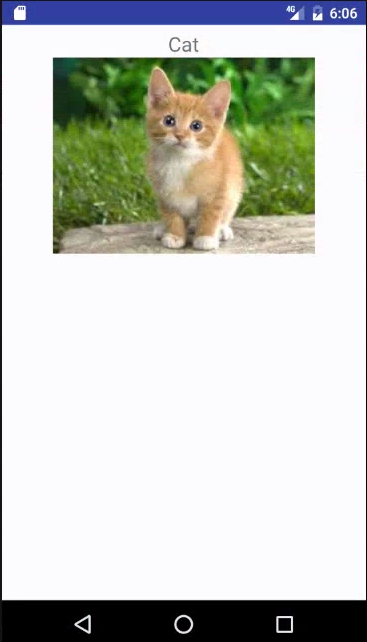
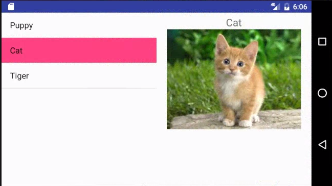

# 프래그먼트 실습

## '화면 방향/크기와 프로그래먼트 활용' 강의 내용을 참고로 하여 아래와 같은 앱을 작성하시오.
* 세로 보기일 때에 동물 이름이 리스트 뷰로 나열되고, 이름을 선택하면 동물 이름과 사진이 표시된 액티비티가 나타난다.

* 가로 보기이거나 태블릿(크기 large)에서 실행할 때에는 왼쪽에 동물 이름이 나열된 리스트 뷰가 보이고 오른쪽에 선택된 동물의 이름과 사진이 표시된다.

* 동물을 10종류 이상 넣을 것

* 태블릿에서 실행시키려면 안드로이드 가상 장치(AVD)를 만들 때 화면 크기 고를 때 size가 large이상 인 것을 선택하면 됨

* 참고용 소스: https://github.com/jyheo/AndroidTutorial/tree/master/FragmentExample
