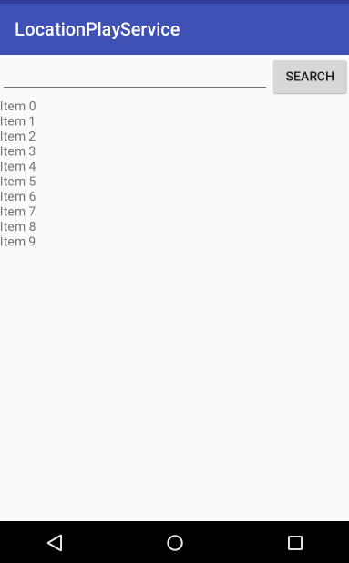

# 위치 기반 서비스 실습

**사전 준비물: 안드로이드 디바이스 (폰 혹은 테블릿), USB 케이블**

## 1. EditText, Button, ListView(또는 RecyclerView)를 적절히 배치한 레이아웃을 갖는 MainActivity를 만든다.

## 2. EditText에 찾고자 하는 장소 이름을 입력한 후에 Button을 누르면, Geocoder를 이용하여 입력된 장소 이름으로부터 위치(위도, 경도, 주소)를 얻어와서 ListView(또는 RecyclerView)에 적절히 표시한다.
    - 예를 들어 '낙산공원'이라고 입력해 봄
    - Geocoder.getFromLocationName() 이 리턴하는 모든 위치를 표시한다.

## 3. EditText에 "현재 위치"라고 입력하면 Fused Location Provider의 getLastLocation() 메소드를 이용하여 현재 위치를 얻어 내고, 그 위치의 위도, 경도, 주소를 ListView(또는 RecyclerView)에 적절히 표시한다.
    - Geocoder.getFromLocation() 이 리턴하는 모든 위치를 표시한다.

## 4. EditText에 "위치 추적"이라고 입력하면 Fused Location Provider의 requestLocationUpdates() 메소드를 이용하여 10초에 한번씩 위치를 얻어내고, 그 위치의 위도, 경도, 주소를 ListView(또는 RecyclerView)에 적절히 표시한다.
    - ListView(RecyclerView)에는 최대 10개까지만 표시하고, 가장 오래된 것 부터 삭제한다.
