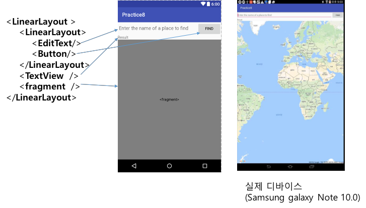
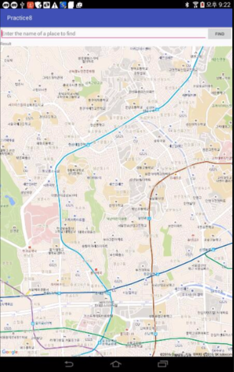
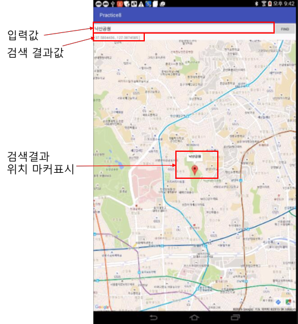

# 위치 기반 서비스 실습

**사전 준비물: 안드로이드 디바이스 (폰 혹은 테블릿), USB 케이블**

## 1. 다음과 같은 레이아웃을 가지는 MainActivity를 실행시켰을 때, <fragment> 부분에 GoogleMap을 표시하여라

## 2. Google Play Service의 Location API 이용을 위한 설정을 한 후에, Fused Location Provider의 getLastLocation() 메소드를 이용하여 현재 위치를 얻어 내고, GoogleMap을 줌 레벨은 15의 현재 위치로 이동하여 표시하라.

(가정: 현재 위치-한성대학교)

[힌트]

참조코드:  
https://github.com/kwanu70/AndroidExamples/blob/master/chap8/LocationServicesTest/app/src/main/java/com/example/kwanwoo/locationservicestest/MainActivity.java (현재 위치 알아내는 방법)

https://github.com/kwanu70/AndroidExamples/blob/master/chap8/SampleMapTest/app/src/main/java/com/example/kwanwoo/samplemaptest/MainActivity.java 32번째줄 (지정된 위치로 지도 이동 방법)

https://github.com/googlemaps/android-samples/blob/master/ApiDemos/app/src/main/java/com/example/mapdemo/CameraDemoActivity.java 118번째 줄 (지정된 위치와 줌 레벨 10으로 지도 이동 방법)

## 3.  EditText 창에 찾고자 하는 장소 이름을 입력한 후에 Button을 클릭하면, Geocoder를 이용하여 입력된 장소 이름으로부터 위치(위도, 경도 값)를 얻고(편의상 첫번째 결과만 이용),
* 해당 위치 정보를 TextView 창에 표시
* 해당 위치로 지도를 이동 (줌 레벨은 15)
* 해당 위치에 마커로 표시 (마커의 타이틀로 장소 이름 설정)

[힌트]

참조코드:  
https://github.com/kwanu70/AndroidExamples/blob/master/chap8/SampleMapTest/app/src/main/java/com/example/kwanwoo/samplemaptest/MainActivity.java 29번째 줄 (해당 위치 마커 표시 방법)

[실행 결과 예시] "낙산공원" 입력후, 검색(Find) 버튼을 누른 결과

