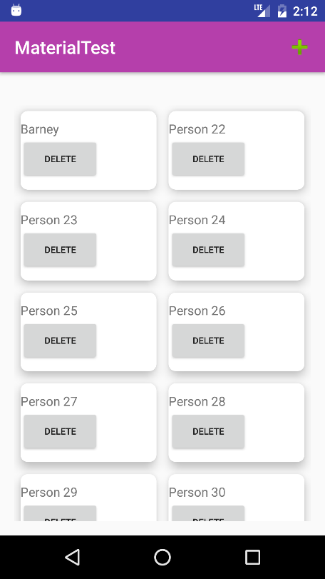

# 머티리얼 디자인 실습

리사이클러 뷰를 사용하여 다음과 같이 스태거 그리드로 항목을 나열하고, 항목을 표시하는 뷰는 카드 뷰를 이용하여 모서리를 둥글게 하고 그림자를 표시하라. 그리고 액션바의 +버튼을 누르면 새로 항목을 추가하고 DELETE 버튼을 누르면 해당 항목을 제거한다.



## 리사이클러 뷰 사용하기

https://github.com/jyheo/AndroidTutorial/blob/master/MaterialTest/app/src/main/java/com/example/jyheo/materialtest/MainActivity.java

https://github.com/jyheo/AndroidTutorial/blob/master/MaterialTest/app/src/main/java/com/example/jyheo/materialtest/ContactsAdapter.java

## 리사이클러 뷰에서 스태거 그리드 레이아웃 사용하기

```java
StaggeredGridLayoutManager gridLayoutManager =
            new StaggeredGridLayoutManager(2, StaggeredGridLayoutManager.VERTICAL);
recyclerView.setLayoutManager(gridLayoutManager);
```

## 리사이클러 뷰 항목에 카드 뷰 사용하기
https://github.com/jyheo/AndroidTutorial/blob/master/MaterialTest/app/src/main/res/layout/item_contact.xml

## 리사이클러 뷰에 항목 추가하기
https://github.com/jyheo/AndroidTutorial/blob/master/MaterialTest/app/src/main/java/com/example/jyheo/materialtest/MainActivity.java
의 36-39라인

## 리사이클러 뷰에서 항목 제거하기

* 어댑터에 다음과 같이 removeItem 메서드를 추가하여 사용.

```java
public class ContactsAdapter extends RecyclerView.Adapter<ContactsAdapter.ViewHolder> {
    public void removeItem(int p) {
        mContacts.remove(p);
        notifyItemRemoved(p);
    }
```

* 뷰 홀더의 생성자에 어댑터 객체를 받아 뷰 홀더 멤버에 저장하도록 아래와 같이 수정.

```java
public ViewHolder(Context context, View itemView, ContactsAdapter contacts) {
    // ...
    mContacts = contacts;
}
```

* 항목 뷰 내의 DELETE 버튼을 눌렀을 때 이벤트 콜백에서(onClick) 어댑터의 removeItem() 호출.

```java
    int position = getLayoutPosition();
    mContacts.removeItem(position);
```
