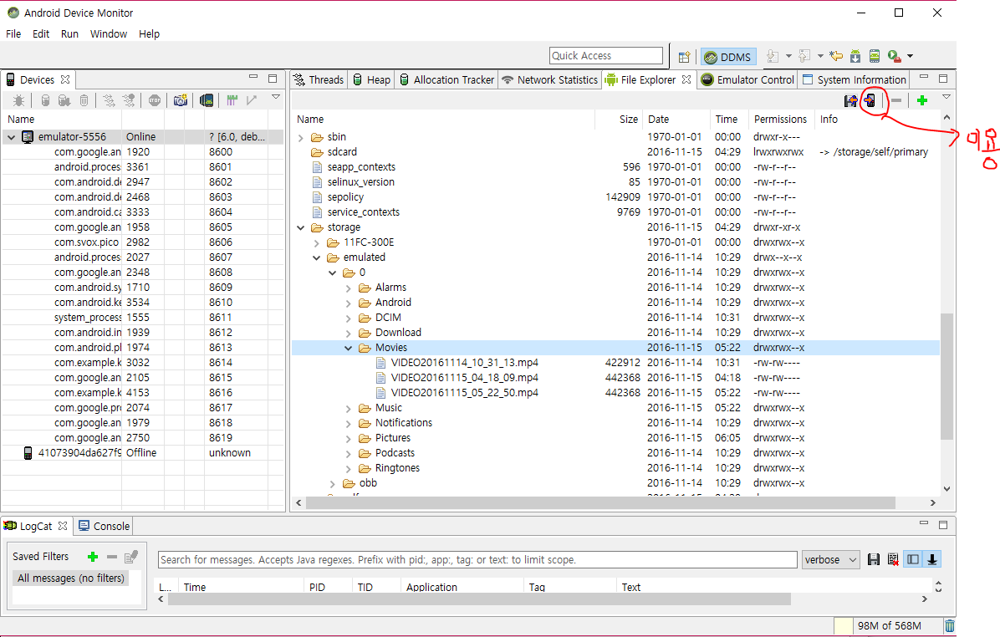
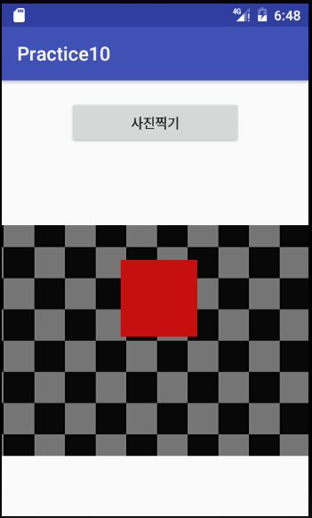

# 멀티미디어 실습

## 1. 음악 파일을 재생하기 실습입니다.
* 먼저 아래 링크의 음악 파일을 다운로드 하세요.
    - https://github.com/kwanu70/AndroidExamples/tree/master/musics/gitan.mp3,
* 위 음악파일을 res/raw 폴더에 저장한 후에 이 음악 파일을 재생하는 코드를 작성해 보세요.
* 위 음악파일을 sdcard의 Music 폴더에 저장한 후에 이 음악 파일을 재생하는 코드를 작성해 보세요
* [참조코드]     https://github.com/kwanu70/AndroidExamples/blob/master/chap10/MultimediaTest/app/src/main/java/com/example/kwanwoo/multimediatest/MainActivity.java  
    219-225의 private void playAudio(Uri uri) 메소드
* sdcard의 해당 폴더에 파일을 복사하는 방법은 Tools>android>Android Device Monitor를 띄운후, 아래 표시된 버튼을 눌러 해당 파일을 디바이스의 폴더로 복사할 수 있습니다.

## 2. 다음은 동영상 재생하기 실습입니다.
* 먼저 아래 링크의 mp4 파일을 다운로드 하세요.
    - https://github.com/kwanu70/AndroidExamples/tree/master/musics/twice.mp4
* 위 동영상 파일을 sdcard의 Movie 폴더에 저장한 후에 이 파일을 재생하는 코드를 작성해 보세요
* [참조코드]  
https://github.com/kwanu70/AndroidExamples/blob/master/chap10/MultimediaTest/app/src/main/java/com/example/kwanwoo/multimediatest/VideoActivity.java

## 3. 사진찍기 버튼을 누르면, 카메라 앱을 실행시키고, 카메라 앱에서 찍은 사진을 sdcard의 Pictures 폴더에 저장하고, 저장된 파일을 다시 읽어서 화면에 표시해 보세요.
* 저장된 이미지가 해당 폴더에 제대로 있는지도 확인해 보세요

* [참조코드]  
https://github.com/kwanu70/AndroidExamples/blob/master/chap10/MultimediaTest/app/src/main/java/com/example/kwanwoo/multimediatest/MainActivity.java  
274-289, 301-306

## 4. 동영상 촬영 버튼을 누르면, 카메라 앱을 실행시키고, 카메라 앱에서 찍은 동영상을 sdcard의 Movie 폴더에 저장하고, 저장된 파일을 다시 읽어서 화면에 표시해 보세요.
* 저장된 이미지가 해당 폴더에 제대로 있는지도 확인해 보세요
* [참조코드]  
 https://github.com/kwanu70/AndroidExamples/blob/master/chap10/MultimediaTest/app/src/main/java/com/example/kwanwoo/multimediatest/MainActivity.java  
 291-297, 307-318
