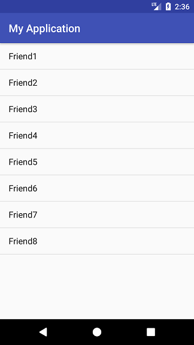

# Notification 실습
* 채팅 앱의 알림을 구현해본다.

## Activities
* 액티비티는 MainActivity, ChatActivity를 만든다.
* MainActivity
    - 리스트뷰가 하나 있고, 리스트 뷰의 항목은 "Friend1" 부터 "Friend8"까지 있다.
    - 항목을 선택하면 ChatActivity가 시작된다. 이때 Intent의 extra로 상대방 이름(즉, Friend?)을 보낸다.

* ChatActivity
    - 간단한 가짜 채팅 내용을 보여주고,
    - ChatActivity의 부모를 MainActivity로 한다.
    - Intent의 extra로 받은 채팅 상대방 이름을 액션바의 타이틀로 사용한다.
    - 아래 예는 Friend3이 선택된 경우

## 알림
* MainActivity의 onCreate에서 쓰레드를 만들고, 그 쓰레드에서 5초 후에 알림을 발생시킨다.
* 이 알림은 일반 액티비티와 연결되는 알림으로, 터치하면 ChatActivity를 실행하도록 한다.
* 이때 pendingIntent에 넘겨주는 intent의 extra에 채팅 상대방 이름(Friend?)을 임의로 랜덤하게 하나 넣는다.

