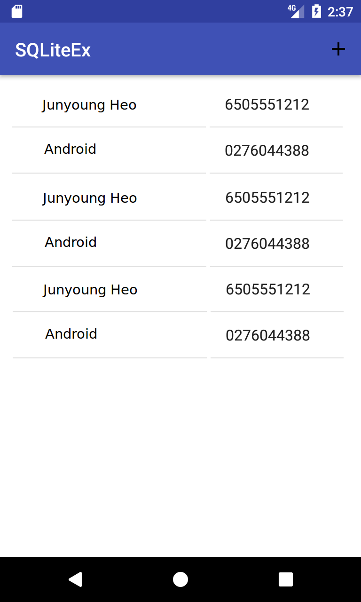
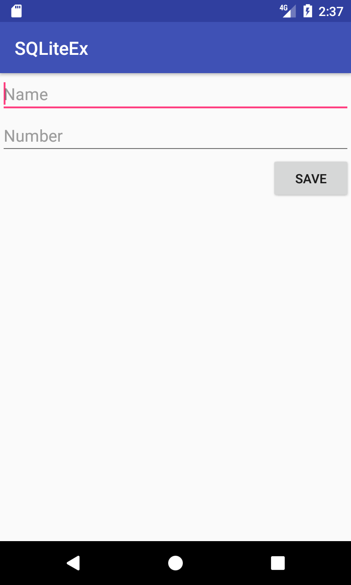

# SQLite 실습

## 다음과 같은 레이아웃을 가지는 MainActivity를 생성하라.
* 액션바에 '+' 액션 버튼
* 리스트 뷰(항목은 2개의 TextView로 구성)

## 1. 새 항목 저장하기
* '+' 버튼을 누르면 ItemActivity 시작  
* ItemActivity의 Name과 Number는 비어 있음
* SAVE 버튼 누르면 ItemActivity가 사라지고 저장할 데이터를 MainActivity에 Intent 전달
* MainActivity에서 데이터베이스에 저장

## 2. 항목 수정하기
* 리스트 뷰의 항목을 선택하면 ItemActivity 시작
* ItemActivity의 Name과 Number에 선택된 항목의 값이 표시
* SAVE 버튼 누르면 ItemActivity가 사라지고 업데이트할 데이터를 MainActivity에 Intent로 전달
* MainActivity에서 데이터베이스 업데이트

## 3. 항목 삭제하기
* 항목을 롱 클릭하면 해당 항목 삭제
* 데이터베이스에서 해당 항목 삭제하고 리스트 뷰를 업데이트

## 검사
* 새 항목 저장, 항목 수정, 삭제가 동작
* 각 기능을 위한 SQLite 메소드/SQL 확인
