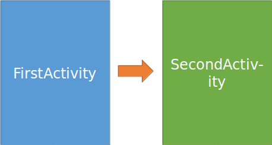

layout: true
.top-line[]

---
class: center, middle
# 액티비티와 인텐트

---
## 액티비티(Activity)
**Activity**는 일종의 **애플리케이션 구성 요소**로서, **사용자와 상호작용할 수 있는 화면** 을 제공하여 전화 걸기, 사진 찍기, 이메일 보내기 또는 지도 보기 등의 일을 할 수 있습니다. 액티비티마다 창이 하나씩 주어져 이곳에 사용자 인터페이스를 끌어올(draw) 수 있습니다. 이 창은 일반적으로 화면을 가득 채우지만, 작은 창으로 만들어 다른 창 위에 띄울 수도 있습니다.

여기에서 창은 View

.footnote[출처: https://developer.android.com/guide/components/activities.html]

???
안드로이드 애플리케이션은 4가지 구성 요소들을 적절히 사용하여 만들어짐
- 액티비티, 서비스, 브로드캐스트 리시버, 컨텐트 프로바이더

---
## 액티비티(Activity) 사용(1/2)
* setContentView()를 이용하여 액티비티의 View를 draw

```java
public class FirstActivity extends AppCompatActivity {
    @Override
    protected void onCreate(Bundle savedInstanceState) {
        super.onCreate(savedInstanceState);
*       setContentView(R.layout.activity_first);
    }    
```

* Android Manifest 파일에 Activity를 등록

```xml
<manifest>
    <application>
*       <activity android:name=".FirstActivity"
*           android:label="First Activity">
*       </activity>
    </application>
</manifest>
```

???
원래는 FirstActivity가 Activity 클래스를 상속해서 만들어지지만, 이전 버전과 호환이 되면서 새로운 기능을 제공하는 appcompat 라이브러리의 AppCompatActivity를 사용하는 것이 좋을 수 있다. 물론 appcompat 라이브러리에서 지원이 안되는 새로운 기능을 위해서는 Activity를 사용해야 한다.

참고: 안드로이드 지원(support) 라이브러리 https://developer.android.com/topic/libraries/support-library/index.html?hl=ko

---
## 액티비티(Activity) 사용 (2/2)
* 라이프 사이클 콜백 처리
  - onCreate, onStart, onResume, onPause, onStop, onDestroy()
* 설정 변경(세로/가로 보기 전환 등)에 따른 콜백 처리
  - onConfigurationChanged
* 액티비티 시작시에 정보를 전달하거나 액티비티가 종료될 때 결과를 리턴할 수 있음

---
## 액티비티 라이프 사이클


.footnote[출처: https://developer.android.com/guide/components/activities.html]

---
## 액티비티 전환 시 라이프 사이클 콜백
* FirstActivity에서 SecondActivity 시작
  - FirstActivity의 onPause()
  - SecondActivity의 onCreate(),
  - onStart(), onResume()
  - FirstActivity의 onStop()
* 단말기의 뒤로가기 버튼 누름
  - SecondActivity의 onPause()
  - FirstActivity의 onRestart(), onStart(), onResume()
  - SecondActivity의 onStop(), onDestroy()



---
## 인텐트
**Intent**는 일종의 **메시지 객체**입니다. 이것을 사용해 다른 **앱 구성 요소**로부터 작업을 요청할 수 있습니다. 인텐트가 여러 구성 요소 사이의 통신을 용이하게 하는 데에는 몇 가지 방법이 있지만, 기본적인 사용 사례는 다음과 같은 세 가지입니다.
* 액티비티 시작하기
* 서비스 시작하기
* 브로드캐스트 전달하기

.footnote[출처: https://developer.android.com/guide/components/intents-filters.html]

???
서비스는 화면이 없는 실행 요소입니다. 보통 백그라운드로 실행될 것들을 서비스로 만들고 포그라운드로 UI를 갖는 것은 액티비티로 만듭니다.

브로드캐스트는 시스템에서 방송하는 기능으로 브로드캐스트 리시버가 이를 받을 수 있습니다. 예를 들어 문자가 왔다는 것을 브로드캐스트 하거나 배터리 잔량을 브로드캐스트 합니다.

---
## 인텐트로 액티비티 시작하기

* 시작하려는 액티비티(SecondActivity.class)를 지정하고 Intent 생성

```java
Intent intent = new Intent(getApplicationContext(),
                           SecondActivity.class);
startActivity(intent);
```

**명시적 인텐트** : 인텐트를 받을 대상이 명확히 정해져 있음

---
## 인텐트 유형
* 명시적(explicit) 인텐트 – 시작할 구성 요소의 이름을 지정
* 암시적(implicit) 인텐트 – 이름을 지정하지 않고 일반적인 작업(전화걸기, 지도보기 등)을 지정


**암시적 인텐트**

---
## 암시적(Implicit) 인텐트 사용

* 필요한 Action을 지정하고 Intent를 생성

```java
Intent intent = new Intent(Intent.ACTION_DIAL,
                           Uri.parse("tel:114"));

startActivity(intent);
```

.footnote[소스: https://github.com/jyheo/AndroidTutorial/tree/master/ActivityIntent]

---
## 암시적 인텐트 받기(인텐트 필터)

* manifest.xml에 인텐트 필터를 추가

```xml
<activity android:name=".SecondActivity">
    <intent-filter>
        <action android:name="android.intent.action.DIAL" />
        <category android:name="android.intent.category.DEFAULT" />
        <data android:scheme="tel" />
    </intent-filter>
</activity>
```

.footnote[소스: https://github.com/jyheo/AndroidTutorial/tree/master/ActivityIntent]

---
## 인텐트에 정보 태워 전달하고 받기

* FirstActivity에서 ThirdActivity로 인텐트를 보내고 결과 인텐트를 기다려서 받기

.left-column-50[

```java
// 인텐트를 ThirdActivity로 보내기
Intent intent =
          new Intent(getApplicationContext(),
                     ThirdActivity.class);
intent.putExtra("UserDefinedExtra", "Hello");
startActivityForResult(intent, request_code);
```

FirstActivity

```java
// 결과 인텐트를 받기
protected void onActivityResult(
    int request, int result, Intent data) {
    ... 생략 ...
    data.getStringExtra("ResultString");
}
```

]

.right-column-50[

```java
// FirstActivity가 보낸 인텐트를 받기
protected void onCreate(Bundle sState) {
    ... 생략 ...
    Intent intent = getIntent();
    intent.getStringExtra("UserDefinedExtra");
}
```

ThirdActivity

```java
// 결과 인텐트 되돌려 주기
Intent resultIntent = new Intent();
resultIntent.putExtra("ResultString","World");
setResult(RESULT_OK, resultIntent);
```

]

.footnote[https://github.com/jyheo/AndroidTutorial/tree/master/ActivityIntent/app/src/main/java/com/jyheo/activityintent]
