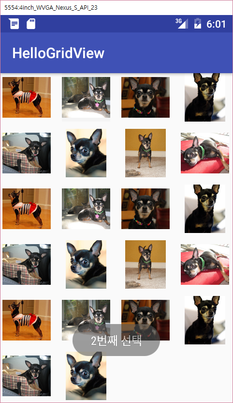

layout: true
.top-line[]

---
class: center, middle
# 어댑터 뷰 - 그리드 뷰

---

## 그리드 뷰 (GridView)
* 2차원 스크롤가능한 그리드에 항목을 표시

* 그리드 뷰 설정 절차

    1. XML 레이아웃에 GridView 정의
    2. 어댑터 정의
    3. 어댑터를 생성하고 GridView 객체에 연결


---
## 그리드 뷰:XML 레이아웃에 GridView 정의

```xml
<?xml version="1.0" encoding="utf-8"?>
<GridView xmlns:android="http://schemas.android.com/apk/res/android"
    android:id="@+id/gridview"
    android:layout_width="match_parent"
    android:layout_height="match_parent"
*   android:columnWidth="60dp"                  항목 하나의 폭 설정
*   android:numColumns="auto_fit"               열의 폭과 화면 폭을 바탕으로 자동 계산
*   android:verticalSpacing="10dp"              항목 간의 간격 설정
    android:horizontalSpacing="10dp"
*   android:stretchMode="columnWidth"           열 내부의 여백을 폭에 맞게 채움
    android:gravity="center"
    />
```

.footnote[https://github.com/kwanu70/AndroidExamples/blob/master/chap3/HelloGridView/app/src/main/res/layout/activity_hello_grid_view.xml]

---
## 그리드 뷰: 어댑터 정의

```java
public class ImageAdapter extends BaseAdapter {
    private Context mContext;
    private Integer[] mThumbIds = {
            R.drawable.sample_2, R.drawable.sample_3,
            R.drawable.sample_4, R.drawable.sample_5, …}

    public ImageAdapter(Context c) {
        mContext = c;
    }

    public int getCount() {
        return mThumbIds.length;
    }
    public Object getItem(int position) {
        return mThumbIds[position];
    }
    public long getItemId(int position) {
        return position;
    }
```

.footnote[https://github.com/kwanu70/AndroidExamples/blob/master/chap3/HelloGridView/app/src/main/java/com/example/kwanwoo/hellogridview/ImageAdapter.java]

---
## 그리드 뷰: 어댑터 정의 (계속)

```java
    public View getView(int position, View convertView, ViewGroup parent) {
        ImageView imageView;
        if (convertView == null) {
            // if it's not recycled, initialize some attributes
*           imageView = new ImageView(mContext);
            imageView.setLayoutParams(new GridView.LayoutParams(100, 100));
            imageView.setScaleType(ImageView.ScaleType.CENTER_CROP);
            imageView.setPadding(8, 8, 8, 8);
        } else {
            imageView = (ImageView) convertView;
        }

*       imageView.setImageResource(mThumbIds[position]);
        return imageView;
    }
}
```

.footnote[https://github.com/kwanu70/AndroidExamples/blob/master/chap3/HelloGridView/app/src/main/java/com/example/kwanwoo/hellogridview/ImageAdapter.java]

---
## 그리드 뷰: 어댑터 생성 및 연결

```java
public class HelloGridViewActivity extends AppCompatActivity {

    protected void onCreate(Bundle savedInstanceState) {
        super.onCreate(savedInstanceState);
        setContentView(R.layout.activity_hello_grid_view);

*       GridView gridview = (GridView) findViewById(R.id.gridview);
*       gridview.setAdapter(new ImageAdapter(this));

        gridview.setOnItemClickListener(new OnItemClickListener() {
            public void onItemClick(AdapterView<?> parent, View v,
                                    int position, long id) {
                Toast.makeText(HelloGridViewActivity.this,
                        "" + (position+1)+ "번째 선택",
                        Toast.LENGTH_SHORT).show();
            }
        });
    }
}
```

.footnote[https://github.com/kwanu70/AndroidExamples/blob/master/chap3/HelloGridView/app/src/main/java/com/example/kwanwoo/hellogridview/HelloGridViewActivity.java]


