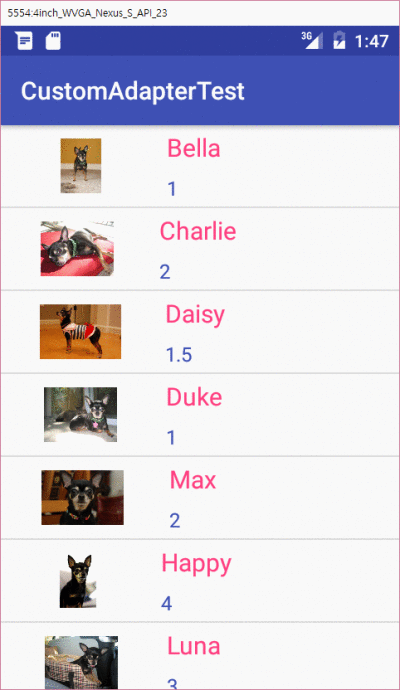
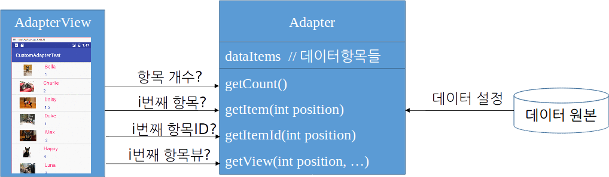
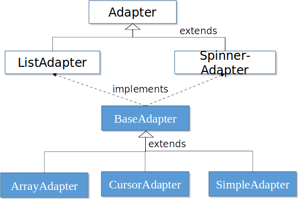
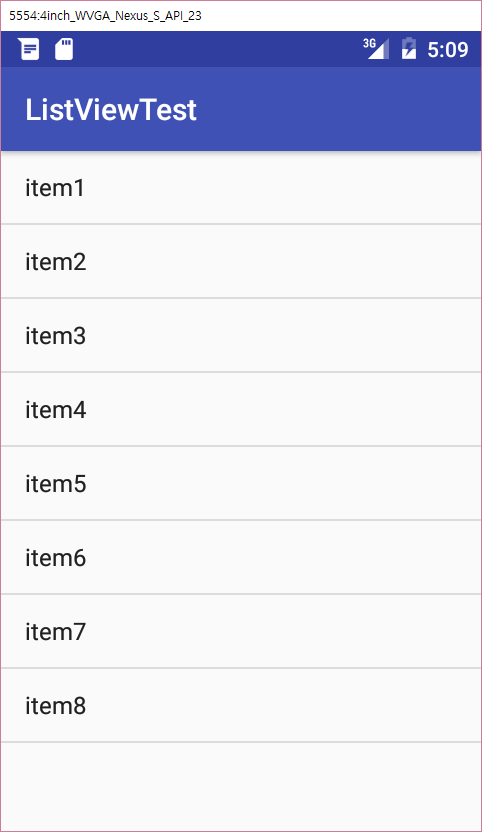
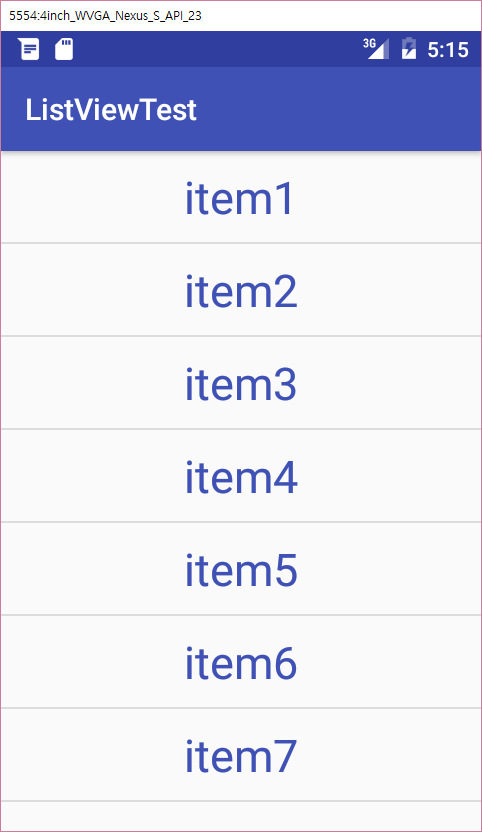
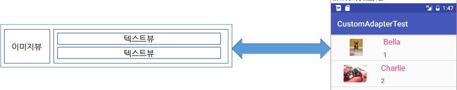
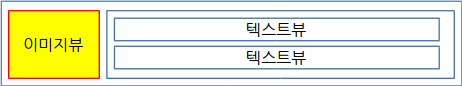
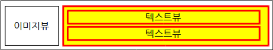

layout: true
.top-line[]

---
class: center, middle
# 어댑터 뷰

---
## Contents
* 어댑터 뷰 개요
* 리스트 뷰 (ListView)
* 커스텀 어댑터 (Custom Adapter)
* 항목 클릭 이벤트 처리

---
## 어댑터 뷰
* 여러 개의 항목을 다양한 형식으로 나열하고 선택할 수 있는 기능
* 표시할 항목을 어댑터(Adapter) 객체로부터 공급 받음




---
## 어댑터(Adapter)
* 어댑터는 데이터를 관리하며 데이터 원본과 어댑터 뷰(ListView, GridView) 사이의 중계 역할



---
## 어댑터 종류
.left-column-50[
* BaseAdapter
    - 어댑터 클래스의 공통 구현, 커스텀 어댑터 구현시 사용
* ArrayAdapter<T>
    - 객체 배열이나 리소스에 정의된 배열로부터 데이터를 공급받음
* CursorAdapter
    - 데이터베이스로부터 데이터를 공급받음
* SimpleAdapter
    - 데이터를 Map(키,값)의 리스트로 관리
    - 데이터를 XML 파일에 정의된 뷰에 대응시키는 어댑터
]

.right-column-50[

]

???

* CursorAdapter는 DB쿼리 결과로 받아오는 Cursor를 어댑터에게 전달함
* SimpleAdapter는 키에 해당하는 값을 보여줄 뷰의 ID를 대응시키는 정보를 전달하면 어댑터가 알아서 처리함


---
## 리스트 뷰 (ListView)
* 리스트 뷰는 어댑터 뷰의 대표 위젯으로서, 복수 개의 항목을 수직으로 표시

* 리스트 뷰 설정 절차

    1. XML 레이아웃에 ListView 정의
    2. 어댑터 생성
    3. ListView 객체에 어댑터 연결
        - void setAdapter (T adapter)


---
## 리스트 뷰:XML 레이아웃에 ListView 정의

```xml
<?xml version="1.0" encoding="utf-8"?>
<LinearLayout xmlns:android="http://schemas.android.com/apk/res/android"
    android:orientation="vertical"
    android:layout_width="match_parent"
    android:layout_height="match_parent">

*   <ListView
*       android:id="@+id/listView"
*       android:layout_width="match_parent"
*       android:layout_height="match_parent"
*      />
</LinearLayout>
```

.footnote[https://https://github.com/kwanu70/AndroidExamples/blob/master/chap3/ListViewTest/app/src/main/res/layout/activity_main.xml]

---
## 리스트 뷰:어댑터 준비
* 데이터 원본이 배열인 경우에 다음 생성자로 어댑터를 초기화  
ArrayAdapter(Context **context**, int **textViewResourceId**, T[] **objects**)
    - **context** 는 현재 액티비티를 컨텍스트로 넘겨준다.
    - **textViewResourceId** 는 항목으로 표시될 텍스트 뷰의 리소스 ID이다
    - **objects** 는 어댑터로 공급될 데이터 원본으로 단순 배열

리소스 ID                            | 설명
----------------------------------- | --------------------------------------
android.R.layout.simple_list_item_1 | 하나의 텍스트 뷰로 구성된 레이아웃
android.R.layout.simple_list_item_2 | 두 개의 텍스트 뷰로 구성된 레이아웃
android.R.layout.simple_list_item_checked | 오른쪽에 체크 표시가 나타난다.
android.R.layout.simple_list_item_single_choice | 오른쪽에 라디오 버튼이 나타난다.
android.R.layout.simple_lsit_item_multiple_choice | 오른쪽에 체크 버튼이 나타난다.

.center[시스템이 목록 표시용으로 미리 정의해 놓은 **textViewResourceId**]

---
## ListView 예제

```java
public class MainActivity extends AppCompatActivity {
    protected void onCreate(Bundle savedInstanceState) {
        super.onCreate(savedInstanceState);
        setContentView(R.layout.activity_main);

        // 데이터 원본 준비
*        String[] items = {"item1", "item2", "item3",
                            "item4","item5","item6","item7","item8"};

        //어댑터 생성
*       ArrayAdapter<String> adapt = new ArrayAdapter<String>(this,
                                android.R.layout.simple_list_item_1, items);

        //어댑터 연결
*       ListView list = (ListView) findViewById(R.id.listView);
        list.setAdapter(adapt);
}
```



.footnote[https://github.com/kwanu70/AndroidExamples/blob/master/chap3/ListViewTest/app/src/main/java/com/example/kwanwoo/listviewtest/MainActivity.java]

---
## 문자열 배열 리소스 사용법
* 고정적인 문자열의 경우, 리소스에 정의해 놓고 사용  
  values/arrays.xml
```xml
<?xml version="1.0" encoding="utf-8"?>
<resources>
    <string-array name="items">
        <item> item1</item>
        <item> item2</item>
        <item> item3</item>
        <item> item4</item>
    </string-array>
</resources>
```

* 리소스로부터 어댑터 생성
```java
ArrayAdapter<CharSequence> adapt = ArrayAdapter.createFromResource(this,
                      R.array.items, android.R.layout.simple_list_item_1);
```

.footnote[https://github.com/kwanu70/AndroidExamples/blob/master/chap3/ListViewTest/app/src/main/res/values/arrays.xml]

---
## 항목을 위한 사용자 정의 TextView
* ListView 항목의 TextView를 위한 템플릿  
  /res/layout/item.xml 생성  
```xml
<TextView
     android:layout_width="match_parent"
    android:layout_height="wrap_content"
    android:textSize="@dimen/menu_item_size"
    android:textColor="@color/colorPrimary"
    android:gravity="center"
    android:padding="10dp" />
```

* 템플릿 레이아웃(item.xml)을 이용하여 ArrayAdapter 준비
```java
ArrayAdapter<String> adapt = new ArrayAdapter<String>(this, R.layout.item, items);
```



.footnote[https://github.com/kwanu70/AndroidExamples/blob/master/chap3/ListViewTest/app/src/main/res/layout/item.xml]

---
## 커스텀 어댑터
* 어댑터 뷰의 항목 하나는 단순한 문자열 이나 이미지 뿐만 아니라, 임의의 뷰가 될 수 있음.

* 커스텀 어댑터 설정 절차
    1. 항목을 위한 XML 레이아웃 정의
    2. 커스텀 어댑터 정의
    3. 어댑터를 생성하고 어댑터 뷰 객체에 연결

---
## 커스텀 어댑터: 항목 XML 레이아웃 정의

```xml
<?xml version="1.0" encoding="utf-8"?>
<LinearLayout xmlns:android="http://schemas.android.com/apk/res/android"
    android:layout_width="match_parent"
    android:layout_height="wrap_content"
    android:orientation="horizontal"
    >
*   <ImageView
        android:id="@+id/iconItem"
        android:layout_width="@dimen/icon_size"
        android:layout_height="@dimen/icon_size"
        android:scaleType="centerInside"
        android:padding="@dimen/icon_padding"
        android:layout_gravity="center_vertical"
        android:layout_weight="1"
        />

```



.footnote[https://github.com/kwanu70/AndroidExamples/blob/master/chap3/CustomAdapterTest/app/src/main/res/layout/item.xml]

---
## 커스텀 어댑터: 항목 XML 레이아웃 정의 (계속)

```xml
*   <LinearLayout
       android:orientation="vertical"
       android:layout_width="wrap_content"
       android:layout_height="wrap_content"
       android:layout_weight="2">
*      <TextView
           android:id="@+id/textItem1"
           android:layout_width="wrap_content"
           android:layout_height="wrap_content"
           android:textColor="@color/colorAccent"
           android:textSize="@dimen/list_item_text_size1"
           android:padding="@dimen/list_item_padding"
           />
*      <TextView
           android:id="@+id/textItem2"
           ...생략...
           />
    </LinearLayout>
</LinearLayout>
```



.footnote[https://github.com/kwanu70/AndroidExamples/blob/master/chap3/CustomAdapterTest/app/src/main/res/layout/item.xml]

---
## 커스텀 어댑터: 어댑터 정의

```java
class MyItem {
    int mIcon; // image resource
    String nName; // text
    String nAge;  // text
    MyItem(int aIcon, String aName, String aAge) { mIcon = aIcon; nName = aName; nAge = aAge; }
}

class MyAdapter extends BaseAdapter {
    private Context mContext;
    private int mResource;
*   private ArrayList<MyItem> mItems = new ArrayList<MyItem>();

    public MyAdapter(Context context, int resource, ArrayList<MyItem> items) {
        mContext = context;
        mItems = items;
        mResource = resource;
    }
*   public int getCount() { return mItems.size(); }
*   public Object getItem(int position) { return mItems.get(position); }
    public long getItemId(int position) { return position;}

```

.footnote[https://github.com/kwanu70/AndroidExamples/blob/master/chap3/CustomAdapterTest/app/src/main/java/com/example/kwanwoo/customadaptertest/MyAdapter.java
]

---
## 커스텀 어댑터: 어댑터 정의 (계속)

```java
    public View getView(int position, View convertView, ViewGroup parent) {
        if (convertView == null) {
            LayoutInflater inflater =
                 (LayoutInflater) mContext.getSystemService(Context.LAYOUT_INFLATER_SERVICE);
*           convertView = inflater.inflate(mResource, parent,false);
        }
        // Set Icon
*       ImageView icon = (ImageView) convertView.findViewById(R.id.iconItem);
*       icon.setImageResource(mItems.get(position).mIcon);

        // Set Text 01
*       TextView name = (TextView) convertView.findViewById(R.id.textItem1);
*       name.setText(mItems.get(position).nName);

        // Set Text 02
*       TextView age = (TextView) convertView.findViewById(R.id.textItem2);
*       age.setText(mItems.get(position).nAge);
        return convertView;
    }
}
```

.footnote[https://github.com/kwanu70/AndroidExamples/blob/master/chap3/CustomAdapterTest/app/src/main/java/com/example/kwanwoo/customadaptertest/MyAdapter.java
]

---
## 커스텀 어댑터: 어댑터 생성 및 연결

```java
public class MainActivity extends AppCompatActivity {
    static MyAdapter adapter;
    protected void onCreate(Bundle savedInstanceState) {
        super.onCreate(savedInstanceState);
        setContentView(R.layout.activity_main);

        // 데이터 원본 준비
*       ArrayList<MyItem> data = new ArrayList<MyItem>();
        data.add(new MyItem(R.drawable.sample_0, "Bella", "1"));
        data.add(new MyItem(R.drawable.sample_1, "Charlie", "2"));
        …
        //어댑터 생성
*       adapter = new MyAdapter(this, R.layout.item, data);

        //어댑터 연결
        ListView list = (ListView) findViewById(R.id.listView);
*       list.setAdapter(adapt);
}
```


.footnote[https://github.com/kwanu70/AndroidExamples/blob/master/chap3/CustomAdapterTest/app/src/main/java/com/example/kwanwoo/customadaptertest/MainActivity.java]

---
##  항목 클릭 이벤트 처리
* 어댑터 뷰의 항목이 클릭될 때, 호출되는 callback method의 인터페이스
```java
public static interface AdapterView.OnItemClickListener {
	abstract void onItemClick(AdapterView<?> parent,
                                             View view,
                                             int position,
                                             long id);
}
```

파라미터   | 설명
---------|-----------------------
parent   | 클릭 이벤트가 발생된 AdapterView
view     | 실제 클릭된 AdapterView안의 View
position | 어댑터 내에서 클릭된 항목/뷰의 위치
id       | 클릭된 항목의 id

---
##  항목 클릭 이벤트 처리

```java
adapter = new MyAdapter(this, R.layout.item, data);

...생략...

*listView.setOnItemClickListener(new AdapterView.OnItemClickListener() {
    public void onItemClick(AdapterView<?> parent, View vClicked, int position, long id) {

         // 클릭된 뷰(vClicked)안에서 id가 textItem1인 텍스트뷰의 레이블을 얻어옴.
         // String name = (String)((TextView)vClicked.findViewById(R.id.textItem1)).getText();

         // 어댑터(adapter) 내의 position 위치의 항목의 nName 값을 읽어옴
         String name = ((MyItem)adapter.getItem(position)).nName;

         Toast.makeText(MainActivity.this, name + " selected", Toast.LENGTH_SHORT).show();
    }
});
```

.footnote[https://github.com/kwanu70/AndroidExamples/blob/master/chap3/CustomAdapterTest/app/src/main/java/com/example/kwanwoo/customadaptertest/MyAdapter.java]
