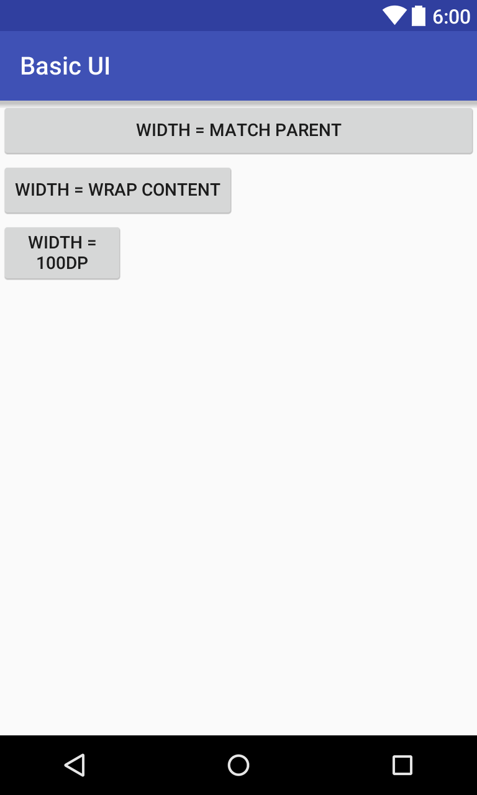
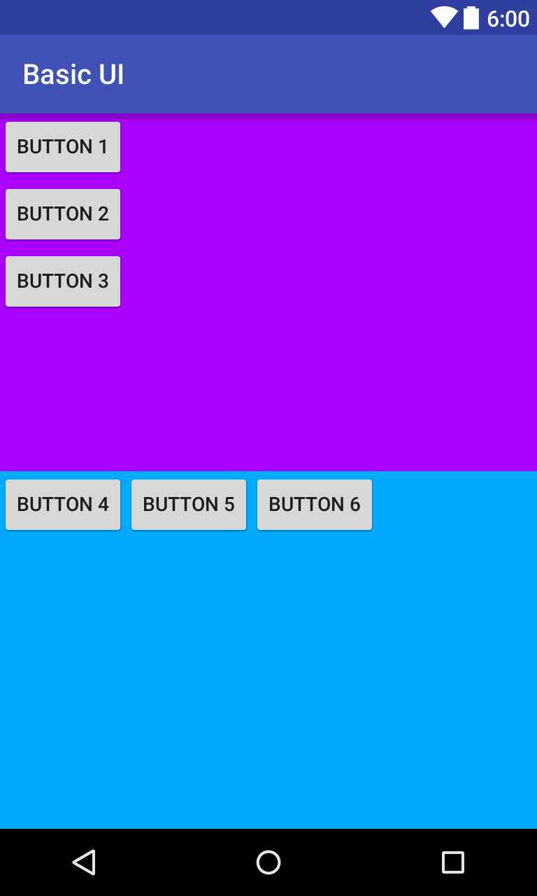
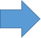
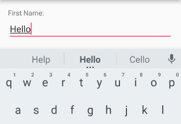
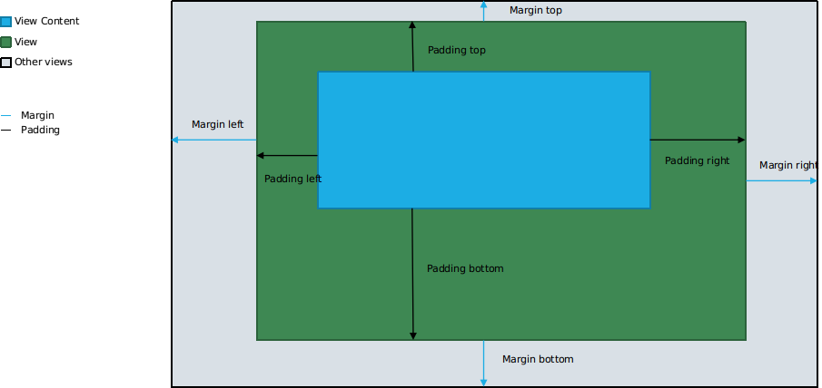
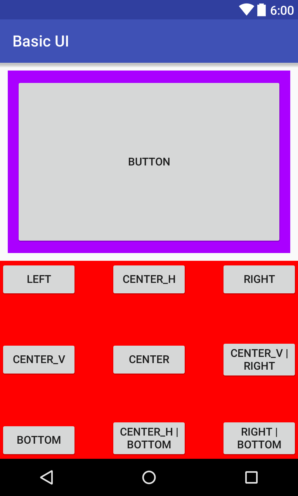
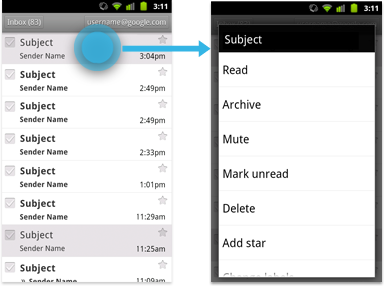
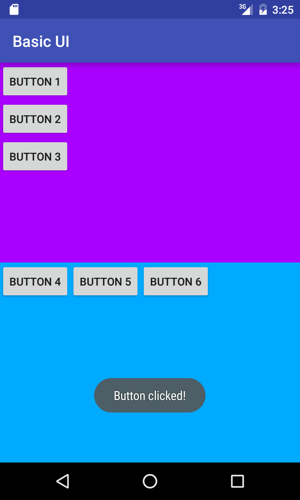

layout: true
.top-line[]

---
class: center, middle

# 안드로이드 UI

---
## 화면 크기를 고려한 디자인

* 기기마다 다른 크기, 해상도, 비율
  * 크기, 해상도에 따라 이미지 크기를 다르게 사용
  * 화면 크기, 비율에 따라 레이아웃을 다르게 구성
* 태블릿은 폰 보다 더 큰 화면
  * 더 많은 UI 요소를 포함할 수 있음
  * 화면 크기에 따라 UI 요소의 크기도 자동으로 조정
  * 프래그먼트(Fragment) 활용
* 기기 방향 변화에 따른 디자인
  * 가로 보기와 세로 보기에 따라 다르게 디자인
  * 또는 방향을 고정하여 한가지만 디자인

UI요소: Button, EditText, TextView, LinearLayout, ...

---
## UI 요소 크기
* 모든 UI요소들은 가로,세로 크기를 지정할 수 있음
* layout_width
* layout_height
* 크기 값으로
  * match_parent
  * wrap_content
    * 특정 값 – 예를 들어 300dp

---
## UI 요소 크기 - Example

.left-column-70[
```xml
<Button
*   android:layout_width="match_parent"
    android:layout_height="wrap_content"
    android:text="Width = Match Parent"/>

<Button
*   android:layout_width="wrap_content"
    android:layout_height="wrap_content"
    android:text="Width = wrap content"/>

<Button
*   android:layout_width="100dp"
    android:layout_height="wrap_content"
    android:text="Width = 100dp"/>

```
]

.right[

]

.footnote[https://github.com/jyheo/AndroidTutorial/blob/master/BasicUI/app/src/main/res/layout/ui_component_size.xml]

---
## 레이아웃(Layout)

레이아웃은 사용자 인터페이스에 대한 시각적 구조를 정의합니다. 예컨대 액티비티 또는 앱 위젯에 대한 UI가 이에 해당됩니다.
.right[출처: https://developer.android.com/guide/topics/ui/declaring-layout.html]

&nbsp;

* 레이아웃 내에 자식 뷰(UI요소 들)의 배치 방법을 결정함
  * 안드로이드에서 모든 UI요소들은 뷰(View)를 상속 받음
  * 당연히 자식 뷰 중에 레이아웃이 있을 수 있음(즉, 레이아웃 내에 다른 레이아웃이 존재할 수 있음)
* 레이아웃 종류
  * LinearLayout
  * RelativeLayout
  * FrameLayout, GridLayout, TableLayout

---
## LinearLayout or RelativeLayout

.left-column-70[
* LinearLayout(선형 레이아웃)
  * 자식 뷰들을 하나의 가로 방향 또는 세로 방향 행으로 정리하는 레이아웃


* RelativeLayout(상대 레이아웃)
  * 자식 뷰들을 서로 관련지어 나타냄(자식 A가 자식 B의 왼쪽, 자식 C가 자식 B의 왼쪽에 정렬)
]

.right[
<br/>

]

---
## LinearLayout - Example(1/2)
.left-column-70[
```xml
<LinearLayout
    android:layout_width="match_parent"
    android:layout_height="match_parent"
    android:orientation="vertical">

    <LinearLayout
*       android:layout_width="match_parent"
*       android:layout_height="match_parent"
*       android:layout_weight="1"
*       android:orientation="vertical"
        android:background="#aa00ff">
        <Button
            android:layout_width="wrap_content"
            android:layout_height="wrap_content"
            android:text="Button 1"
            android:id="@+id/button1"/>
        <Button
            android:layout_width="wrap_content"
            android:layout_height="wrap_content"
            android:text="Button 2"/>
        <Button
            android:layout_width="wrap_content"
            android:layout_height="wrap_content"
            android:text="Button 3"/>
    </LinearLayout>
```
]

.right[

]



.footnote[https://github.com/jyheo/AndroidTutorial/blob/master/BasicUI/app/src/main/res/layout/activity_main.xml]

---
## LinearLayout - Example(2/2)
.left-column-70[
```xml
    <LinearLayout
*       android:layout_width="match_parent"
*       android:layout_height="match_parent"
*       android:layout_weight="1"
*       android:orientation="horizontal"
        android:background="#00aaff">
        <Button
            android:layout_width="wrap_content"
            android:layout_height="wrap_content"
            android:text="Button 4"/>
        <Button
            android:layout_width="wrap_content"
            android:layout_height="wrap_content"
            android:text="Button 5"/>
        <Button
            android:layout_width="wrap_content"
            android:layout_height="wrap_content"
            android:text="Button 6"/>
    </LinearLayout>

</LinearLayout>
```
]

.right[

]


.footnote[https://github.com/jyheo/AndroidTutorial/blob/master/BasicUI/app/src/main/res/layout/activity_main.xml]

---
class: center, middle
## 뷰(View)와 ViewGroup
---
## 뷰(View)
* 모든 UI요소들은 뷰(View)를 상속하여 구현
* 윈도우 GUI에서 윈도우(CWnd)와 동일한 개념
* 화면에 표시 가능한 사각형 영역
* 각각의 뷰는 알아서 자신의 내용을 그리고, 이벤트(키보드, 마우스) 처리를 해결
* 세 가지 visibility 상태를 가짐
  * Visible
  * Gone – 자리 차지도 안함
  * Invisible – 자리는 있지만 보이지는 않음

---
## View/ViewGroup으로 UI 구성
* ViewGroup는 View이지만 다른 View를 포함할 수 있는 View
  * LinearLayout이나 RelativeLayout도 ViewGroup
* View로 구성된 트리로 UI가 구성됨
.center[]

---
## 자주 사용되는 View(UI요소들)
.left-column-50[
* Views
  * TextView
  * EditText
  * Button
  * RadioButton
  * CheckBox
  * Switch
  * ImageView
  * WebView
  * ViewStub
]
.right-column-50[
* ViewGroups
  * ScrollView
  * ViewPager


* AdapterViews
  * Spinner
  * ListView
  * GridView
]

---
## TextView와 EditText
* 기본적인 텍스트 표시/입력 뷰
* TextView – 사용자가 수정할 수 없으나 코드에서 텍스트를 변경할 수 있음
* EditText – 사용자가 입력 가능함



---
## Button
* 일반적으로 많이 사용되는 푸시 버튼
* 버튼내에 텍스트, 아이콘을 표시할 수 있음
  * 버튼 전체를 이미지로 그리기 위해서는 ImageButton 사용
* 레이아웃 XML에 버튼 속성으로 onClick에 on-click 이벤트 핸들러를 지정할 수 있음


---
## CompoundButton
* 두 개의 상태를 갖는 버튼
  * 체크/미체크, 온/오프

CompoundButton | 모양  
-------------|------------------------------------
ToggleButton | 
Switch       | 
CheckBox     | 
RadioButtons | 

---
class: center, middle

## Margin, Padding, Gravity

---
## Margin, padding
.cetner[]

---
## Margin, Padding, Gravity Example
.left-column-70[
```xml
<LinearLayout
    android:layout_width="match_parent"
    android:layout_height="match_parent"
    android:layout_weight="1"
    android:orientation="vertical"
*   android:layout_margin="10dp"
*   android:padding="10dp"
    android:background="#aa00ff">
    <Button
        android:layout_width="match_parent"
        android:layout_height="match_parent"
        android:text="Button"/>
</LinearLayout>
```
]

.right[

]


.footnote[https://github.com/jyheo/AndroidTutorial/blob/master/BasicUI/app/src/main/res/layout/margin_padding_gravity.xml]

???
layout_margin은 해당 뷰의 바깥쪽 여백을 지정
padding은 해당 뷰의 내부 여백을 지정
배경색이 보라색인 레이아웃의 layout_margin=10dp이므로 보라색 바깥쪽에 회색이 약간 보이고
내부의 버튼의 크기가 match_parent임에도 불구하고 레이아웃의 padding=10dp이므로 레이아웃의 배경색인 보라색이 약간 보이게 되는 것임

---
## Gravity
* 부모 뷰 안에 포함되는 자식 뷰의 위치를 결정하는 속성
* LinearLayout/FrameLayout의 자식 뷰에서 layout_gravity 속성으로 흔히 사용
* 가능한 값들들
  * BOTTOM – 부모 뷰에서 아래쪽에 위치시킴
  * CENTER – 부모 뷰의 중앙에 위치시킴
  * CENTER_HORIZONTAL – 부모 뷰의 수평 기준으로 중앙에 위치시킴
  * CENTER_VERTICAL – 부모 뷰의 수직 기준으로 중앙에 위치시킴
  * END – 부모 뷰에서 텍스트 방향의 끝(한글이나 영어의 경우는 오른쪽)에 위치시킴
  * LEFT – 부모 뷰에서 왼쪽에 위치시킴
  * RIGHT – 부모 뷰에서 오른쪽에 위치시킴
  * TOP – 부모 뷰에서 위쪽에 위치시킴

---
.left-column-70[
```xml
<FrameLayout/>
    <Button android:layout_width="100dp" android:layout_height="wrap_content"
            android:text="Left"
            android:layout_gravity="left"/>
    <Button android:layout_width="100dp" android:layout_height="wrap_content"
            android:text="center_h"
            android:layout_gravity="center_horizontal"/>
    <Button android:layout_width="100dp" android:layout_height="wrap_content"
            android:text="right"
            android:layout_gravity="right"/>

    <Button android:layout_width="100dp" android:layout_height="wrap_content"
            android:text="center_v"
            android:layout_gravity="center_vertical"/>
    <Button android:layout_width="100dp" android:layout_height="wrap_content"
            android:text="Center"
            android:layout_gravity="center"/>
    <Button android:layout_width="100dp" android:layout_height="wrap_content"
            android:text="center_v | right"
            android:layout_gravity="center_vertical|right"/>

    <Button android:layout_width="100dp" android:layout_height="wrap_content"
            android:text="bottom"
            android:layout_gravity="bottom"/>
    <Button android:layout_width="100dp" android:layout_height="wrap_content"
            android:text="center_h | bottom"
            android:layout_gravity="center_horizontal|bottom"/>
    <Button android:layout_width="100dp" android:layout_height="wrap_content"
            android:text="right | bottom"
            android:layout_gravity="right|bottom"/>
</FrameLayout>
```
]

.right[

]


???
실행 화면의 아래쪽 빨간색 배경의 레이아웃에 대한 xml코드임

---
class: center, middle
## 이벤트 처리

---
## 이벤트 리스너(Event Listeners)
* 이벤트를 처리할 콜백 메소드를 포함하는 인터페이스
* 사용자가 뷰를 사용하여 상호작용할 때 안드로이드 프레임워크에 의해 호출됨
  * 버튼을 눌렀을 때 처리
  * 리스트 뷰에서 항목을 선택했을 때 처리
  * ...



---
## Event Listener Interface
* View.OnClickListener – 뷰를 클릭했을 때 콜백
* View.OnLongClickListener – 뷰를 오래 눌렀을 때(롱 클릭) 콜백
* View.OnFocusChangeListener – 뷰에 입력 포커스가 변경됐을 때 콜백
* View.OnKeyListener – 키를 눌렀을 때 콜백
* View.onTouchListener – 뷰를 터치했을 때, 땠을 때 등에 대한 콜백
* View.onCreateContextMenu – 롱 클릭으로 컨텍스트 메뉴가 생성될 때 호출되는 콜백 인터페이스

---
## Event Listener Example
.left-column-70[
```java
public class MainActivity extends AppCompatActivity {

    @Override
    protected void onCreate(Bundle savedInstanceState) {
        super.onCreate(savedInstanceState);
*       setContentView(R.layout.activity_main);

*       Button btn = (Button)findViewById(R.id.button1);
*       btn.setOnClickListener(new View.OnClickListener() {
            @Override
*           public void onClick(View view) {
                Toast.makeText(getApplicationContext(),
                        R.string.button_clicked_msg,
                        Toast.LENGTH_SHORT).show();
            }
        });
    }
}
```
]

.right[

]
.footnote[https://github.com/jyheo/AndroidTutorial/blob/master/BasicUI/app/src/main/java/com/example/jyheo/basicui/MainActivity.java]
