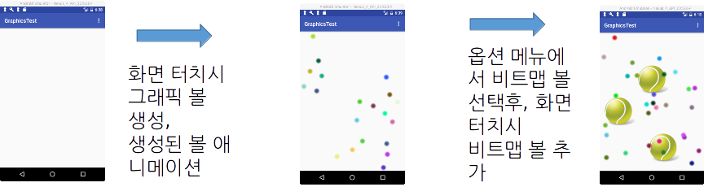
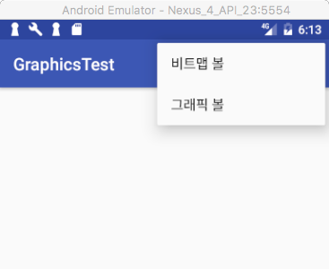

layout: true
.top-line[]

---
class: center, middle
# 애니메이션과 그래픽

---
class: center, middle
# 애니메이션

---
## 애니메이션개요
* 안드로이드 프레임워크의 애니메이션 종류
    - 프로퍼티 애니메이션 (Android 3.0, API level11부터 제공)
    - 뷰 애니메이션 (오래전부터 제공된 기능)
        + 트윈 애니메이션
        + 드로워블 애니메이션 (프레임 애니메이션)

* 애니메이션 설정 방법
    - XML 파일 이용
    - 자바 프로그래밍 코드 이용

.footnote[출처: https://developer.android.com/guide/topics/graphics/overview.html]

---
## 드로워블 (Drawable) 애니메이션
* 하나의 *뷰의 배경*에 여러 *드로워블 리소스 (이미지)를 번갈아* 보이게 하여 움직이는 효과를 주는 애니메이션
    - **프레임(Frame) 애니메이션** 이라고도 불림
* 드로워블 애니메이션 정의 XML 파일
    - **res/drawable**/frame_anim.xml

```xml
<?xml version="1.0" encoding="utf-8"?>
*<animation-list xmlns:android="http://schemas.android.com/apk/res/android"
*   android:oneshot="true" >             [한번만 애니메이션 수행]
    <item android:drawable="@drawable/countdown3" android:duration="500" />
    <item android:drawable="@drawable/countdown2" android:duration="500" />
    <item android:drawable ="@drawable/countdown1" android:duration="500" />
    <item android:drawable ="@drawable/countdown0" android:duration="500" />  
*</animation-list>
```

.footnote[https://github.com/kwanu70/AndroidExamples/blob/master/chap9/AnimationTest/app/src/main/res/drawable/frame_anim.xml]

---
## 드로워블 (Drawable) 애니메이션
* 자바 코드
    1. 이미지 뷰에 드로워블 애니메이션을 설정
    2. 드로워블 애니메이션 객체 생성
    3. 드로워블 애니메이션 시작

```java
ImageView mCountDown = (ImageView) findViewById(R.id.countdown);

private void startCountDownFrameAnimation() {		
*/*1*/    mCountDown.setBackgroundResource(R.drawable.frame_anim);

*/*2*/    AnimationDrawable countdownAnim =
				    (AnimationDrawable)mCountDown.getBackground();
*/*3*/    countdownAnim.start();
}
```

.footnote[https://github.com/kwanu70/AndroidExamples/blob/master/chap9/AnimationTest/app/src/main/java/com/example/kwanwoo/animationtest/MainActivity.java]

---
## 트윈 애니메이션
* 두 지점 사이의 중간 프레임을 다양한 변환을 통해 생성하는 애니메이션
    - Alpha : 투명도 변환, fade-in/fade-out 효과
    - Rotate: 회전 변환
    - Scale: 크기 변환
    - Translate: 이동 변환

* 트윈 애니메이션 정의 XML 파일 위치
    - **res/anim**/filename.xml

---
## 트윈 애니메이션 XML 리소스 형식

.left-column-50[

```xml
*<set xmlns:android="http://schemas.android.com/apk/res/android"
*    android:interpolator="@[package:]anim/interpolator_resource"
*    android:shareInterpolator=["true" | "false"] >
*       <alpha
                android:fromAlpha="float"
                android:toAlpha="float" />
*       <scale
                android:fromXScale="float"
                android:toXScale="float"
                android:fromYScale="float"
                android:toYScale="float"
                android:pivotX="float"
                android:pivotY="float" />
*       <translate
                android:fromXDelta="float"
                android:toXDelta="float"
                android:fromYDelta="float"
                android:toYDelta="float" />
*       <rotate
                android:fromDegrees="float"
                android:toDegrees="float"
                android:pivotX="float"
                android:pivotY="float" />
</set>
```

]

.right-column-50[
<small>
* interpolator: 두 지점 사이의 값의 변화 속도
    - 예: @android:anim/accelerate_interpolator
* shareInterpolator: 모든 자식 요소간에 동일한 interpolator를 공유할지 여부
* Alpha
    - 0.0: 투명
    - 1.0: 불투명
* Scale
    - 1.0: 크기 변환 없음
* scale Pivot: 크기변환시 x, y좌표의 기준점
    - 0%: 뷰의 좌측 기준
    - 50% 가로 크기의 중간 기준
* Delta: 애니메이션 시작 x, y좌표
    - 50: 50픽셀 단위의 위치
    - 50%: 뷰 너비의 50%에 해당하는 크기의 위치
    - 50%p: 부모 뷰 너비의 50%에 해당하는 크기의 위치
* Degree: 회전 각도
* rotate Pivot: 회전시 x, y좌표 기준점
    - 50: 뷰 좌측으로부터 50픽셀의 위치
    - 50%: 뷰 좌측으로부터 50%에 해당하는 크기의 위치
    - 50%p: 부모 뷰 좌측으로부터 50%에 해당하는 크기의 위치
]
</small>

---
## 트윈 애니메이션 XML 리소스 정의 예제
* **res/anim**/rocket.xml

```xml
<set xmlns:android="http://schemas.android.com/apk/res/android"
*   android:interpolator="@android:anim/accelerate_interpolator"
*   android:shareInterpolator="true"
*   android:fillAfter="true">   [애니메이션 종료후 초기 상태로 돌아가지 않음]

    <scale
*       android:startOffset="2000"  android:duration="2000"   |2초 후에 시작해서 2초동안  |
        android:fromXScale="1" android:toXScale="0.1"         |뷰의 중심을 기준으로 축소 됨|
        android:fromYScale="1" android:toYScale="0.1"
        android:pivotX="50%" android:pivotY="50%"/>
    <translate                                               |2초 후에 시작해서 2초동안         |
        android:startOffset="2000" android:duration="2000"   |뷰의 0픽셀 위치에서 부모 뷰 높이의  |
        android:fromYDelta="0" android:toYDelta="-100%p" />  | -100%에 해당하는 크기의 위치     |
                                                             |(위로 부모 뷰 높이만큼 이동)       |
</set>
```

.footnote[https://github.com/kwanu70/AndroidExamples/blob/master/chap9/AnimationTest/app/src/main/res/anim/rocket.xml]

---
## 트윈 애니메이션 실행
* XML로 작성된 animation 리소스를 로드할 때 다음 정적 메소드 사용
    - **static Animation AnimationUtils.loadAnimation(Context, context int id)**
        + context는 통상 액티비티
        + id는 animation XML 파일을 가리키는 리소스 id
* Animation을 실행할 때는 View의 다음 메소드를 호출
    - **void View.startAnimation(Animation animation)**

```java
ImageView mRocket = (ImageView) findViewById(R.id.rocket);
private void startRocketTweenAnimation() {
*   Animation rocket_anim = AnimationUtils.loadAnimation(this, R.anim.rocket);
*   mRocket.startAnimation(rocket_anim);
}
```

.footnote[https://github.com/kwanu70/AndroidExamples/blob/master/chap9/AnimationTest/app/src/main/java/com/example/kwanwoo/animationtest/MainActivity.java]

---
## 프로퍼티 (Property) 애니메이션
* 시간에 대한 객체 프로퍼티의 변화를 기술
    - Duration: 애니메이션 시간 (디폴트 300 ms)
    - Time interpolation: 애니메이션 변화율에 대한 정의
    - Repeat count and behavior: 반복 횟수 및 반복 모드
    - Animator sets: 애니메이션 집합을 설정하고 집합 내의 애니메이션을 동시에, 순차적으로, 지정된 시간 이후에 실행
* 프로퍼티 애니메이션을 위한 클래스
    - ValueAnimator: 애니메이션될 프로퍼티의 값을 계산하는 핵심 기능
    - ObjectAnimator:
        + ValueAnimator의 서브클래스,
        + **타켓 객체 프로퍼티** 값을 계산
        + 하나의 프로퍼티 애니메이션이 한번에 하나의 객체에만 적용
    - AnimatorSet: ValueAnimator, ObjectAnimator, AnimatorSet 요소를 담는 컨테이너

.footnote[참고자료 https://developer.android.com/guide/topics/graphics/prop-animation.html]

---
## ValueAnimator를 이용한 애니메이션
1. 지정된 타입의 값을 애니메이션하기 위해서, ValueAnimator 인스턴스 생성
2. 애니메이션 값의 변화율, 애니메이션 기간, 시작 시점  설정
3. 애니메이션 값의 변경시에 호출될 리스너 등록 (적용 대상에 애니메이션 값 설정)
4. 애니메이션 시작

```java
* /*1*/ ValueAnimator positionAnimator = ValueAnimator.ofFloat(0,-mScreenHeight);
* /*2*/ positionAnimator.setInterpolator(new AccelerateDecelerateInterpolator());
*       positionAnimator.setDuration(2000); positionAnimator.setStartDely(2000);
* /*3*/ positionAnimator.addUpdateListener(new ValueAnimator.AnimatorUpdateListener() {
            public void onAnimationUpdate(ValueAnimator valueAnimator){
                float value = (float) valueAnimator.getAnimatedValue(); // 애니메이션값 획득
                mRocket.setTranslationY(value);			      // 적용대상에 값 적용
            }
        });
* /*4*/ positionAnimator.start();
```

.footnote[https://github.com/kwanu70/AndroidExamples/blob/master/chap9/AnimationTest/app/src/main/java/com/example/kwanwoo/animationtest/MainActivity.java]

---
## ObjectAnimator를 이용한 애니메이션
1. *타겟 객체*의, *지정된 프로퍼티* 값을 애니메이션하기 위해서, ObjectAnimator 인스턴스 생성
2. 애니메이션 값의 변화율, 애니메이션 기간, 시작 시점  설정
3. 애니메이션 시작

```java
* /*1*/ ObjectAnimator positionAnimator = ObjectAnimator.ofFloat(
					      mRocket, 		          // 애니메이션 적용 타겟객체
					      "translationY",   		// 변화시킬 프로퍼티 (Y 좌표 값)
        				0, -mScreenHeight); 	// 값의 범위
* /*2*/ positionAnimator.setInterpolator(new AccelerateDecelerateInterpolator());	// 가속후 감속
*       positionAnimator.setDuration(2000); 				// 애니메이션 기간
*       positionAnimator.setStartDely(2000);				// 애니메이션 시작 시점

* /*3*/ positionAnimator.start();
```

.footnote[https://github.com/kwanu70/AndroidExamples/blob/master/chap9/AnimationTest/app/src/main/java/com/example/kwanwoo/animationtest/MainActivity.java]

---
## AnimatorSet을 이용한 애니메이션 결합
* 여러 Animator 객체들을 동시에 혹은 순차적으로 수행
    - animatorSet.**play**(anim1).**with**(anim2) – anim1과 anim2 동시 수행
    - animatorSet.**play**(anim1).**before**(anim2) – anim1,anim2 순으로 수행
    - animatorSet.**play**(anim1).**after**(anim2) – anim2,anim1 순으로 수행
    - animatorSet.**playTogether**(anim1, ... , animN)

```java
ObjectAnimator positionAnimator = ObjectAnimator.ofFloat(mRocket, "translationY",
        							0, -mScreenHeight);
ObjectAnimator scaleXAnimator = ObjectAnimator.ofFloat(mRocket,"scaleX",1,0.1f);
ObjectAnimator scaleYAnimator = ObjectAnimator.ofFloat(mRocket,"scaleY",1,0.1f);

*AnimatorSet animatorSet = new AnimatorSet();
*animatorSet.playTogether(positionAnimator,scaleXAnimator,scaleYAnimator);
...
animatorSet.start();
```

.footnote[https://github.com/kwanu70/AndroidExamples/blob/master/chap9/AnimationTest/app/src/main/java/com/example/kwanwoo/animationtest/MainActivity.java]

---
## 애니메니션 리스너
* 애니메이션 종료 후에 곧바로 다른 일을 해야 한다면 애니메이션 객체에 AnimationListener 객체를 등록해야 함

* AnimationListener 인터페이스
    - Animation.AnimationListener
    - Animator.AnimationListener

* AnimationListener 객체 등록 방법
    - Animation.setAnimationListener(Animation.AnimationListener)
    - Animator.addListener(Animator.AnimationListener)

---
## 애니메니션 리스너 예제

```java
*Animation.AnimationListener animationListener = new Animation.AnimationListener() {
    public void onAnimationStart(Animation animation) {…}

    public void onAnimationEnd(Animation animation) {
 	      finish();
	      // 다른 액티비티를 시작시키는 코드를 여기에 삽입해도 됩니다.
    }

    public void onAnimationRepeat(Animation animation) {…}
};

private void startFireTweenAnimation() {
*     Animation fire_anim = AnimationUtils.loadAnimation(this, R.anim.fire);
      mFirework.startAnimation(fire_anim);
*     fire_anim.setAnimationListener(animationListener);
}
```

.footnote[https://github.com/kwanu70/AndroidExamples/blob/master/chap9/AnimationTest/app/src/main/java/com/example/kwanwoo/animationtest/MainActivity.java]

---
class: center, middle
# 그래픽

---
## 그래픽 개요
* 사용 목적
    - 기존 뷰(버튼)를 수정 및 확장하여 새로운 룩앤필 구현
    - 다양한 그래픽(도형, 비트맵)를 캔버스에 그려서 비디오 게임 개발
* 그래픽 그리기
    - 점, 선, 사각형, 원, 텍스트, 비트맵 등
* 그래픽 애니메이션
    - 뷰(View) 클래스 이용
        + 메인 스레드만이 뷰에 접근 가능
        + 복잡한 그래픽 객체들을 메인스레드가 모두 처리하면 속도의 지연 발생 가능
    - 서피스뷰(SurfaceView) 클래스 이용
        + 뷰의 서브 클래스로, 시스템 뷰 계층을 관리하는 메인 스레드와 독립적으로, 다른 스레드에 의해 서피스 뷰를 자유롭게 이용할 수 있음
        + 3D 객체와 같이 복잡한 그래픽을 효율적으로 처리하기 위해 개발됨. 2D 그래픽도 적용가능

---
## 간단한 도형 그리기
1. 뷰(View)를 상속한 클래스 정의
2. 페인트 객체 초기화 (색상, 선 스타일, 선 굵기 등 설정)

```java
*public class CustomView extends View {  /*1*/
    private Paint paint;
    // View 클래스의 생성자 재정의
    public CustomView(Context context) {
        super(context);
        init();
    }
    public CustomView(Context context, AttributeSet attrs) { ... }
    public CustomView(Context context, AttributeSet attrs, int defStyleAttr) { ... }
    public void init() { /*2*/
*       paint = new Paint();
*       paint.setColor(Color.RED);
    }
```

.footnote[https://github.com/kwanu70/AndroidExamples/blob/master/chap9/GraphicsTest/app/src/main/java/com/example/kwanwoo/graphicstest/CustomView.java]

---
## 간단한 도형 그리기
&nbsp;3. View.onDraw() 메소드 내에서 도형 그리기

```java
public class CustomView extends View {
    ...생략...
    protected void onDraw(Canvas canvas) {
 	      super.onDraw(canvas);
*       canvas.drawRect(100,100, 200, 200,paint);
        // 기타 도형 그리기 메소드
        // https://developer.android.com/reference/android/graphics/Canvas.html
    }
}
```

&nbsp;4. 새로 만든 뷰를 액티비티 레이아웃에 추가하기

```xml
*<com.example.kwanwoo.graphicstest.CustomView
    android:layout_width="wrap_content"
    android:layout_height="wrap_content"
    android:id="@+id/customView"
    />
```

.footnote[https://github.com/kwanu70/AndroidExamples/blob/master/chap9/GraphicsTest/app/src/main/java/com/example/kwanwoo/graphicstest/CustomView.java]

---
## 비트맵 이미지 그리기
* BitmapFactory 클래스
    - 비트맵 이미지를 만들기 위한 클래스 메소드 제공

클래스 메소드   | 설명
-------------|----------------------------------------------------------------
public static Bitmap decodeFile(String pathName)                          | pathName 위치의 이미지 파일 읽기
public static Bitmap decodeResource(Resources res, int id)                | 리소스에 저장한 이미지 파일을 id를 통해 읽기
public static Bitmap decodeByteArray(byte[] data, int offset, int length) | 바이트 배열로 되어 있는 비트맵 이미지를 읽기

```java
protected void onDraw(Canvas canvas) {
     ...
*   Bitmap bitmap= BitmapFactory.decodeResource( getResources(), R.drawable.ball );
    canvas.drawBitmap(bitmap, 100,300,null);
}
```

---
## 그래픽 애니메이션 (예제)
* 화면에 터치 시에 볼 생성
    - 옵션 메뉴에 따라 비트맵/그래픽 볼 생성
    - 그래픽 볼의 색상은 랜덤으로 설정
    - 볼의 방향과 속도도 랜덤으로 설정
* 볼은 임의의 방향과 속도로 움직이다가 벽에 부딪히면 반사




---
## 그래픽 애니메이션: 볼 생성 및 그리기
```java
public class AnimatedView extends View {
    private ArrayList<Ball> arBall = new ArrayList<Ball>();
    ...
*   protected void onDraw(Canvas canvas) {
        super.onDraw(canvas);
        for (int idx=0; idx<arBall.size(); idx++) {
            Ball B = arBall.get(idx);  // 4. arBall 리스트에서 볼을 추출
*           B.draw(canvas);            // 5. 추출된 볼을 캔버스에 그림
        }
    }
*   public boolean onTouchEvent(MotionEvent event) {
        // 1. View 터치 시
        if (event.getAction() == MotionEvent.ACTION_DOWN) {
            // 2. 터치 위치에 볼 생성하여 arBall 리스트에 추가
*           arBall.add(new Ball((int)event.getX(), (int)event.getY(), bitmap));            
*           invalidate();  // 3. onDraw() 간접 호출
            return true;
        }
        return false;
    }
```

.footnote[https://github.com/kwanu70/AndroidExamples/blob/master/chap9/GraphicsTest/app/src/main/java/com/example/kwanwoo/graphicstest/AnimatedView.java]

---
## 그래픽 애니메이션: 볼 애니메이션

```java
public class AnimatedView extends View {
    private ArrayList<Ball> arBall = new ArrayList<Ball>();
    ...
*   public void updateAnimation() {
        for (int idx=0; idx<arBall.size(); idx++) {
            Ball B = arBall.get(idx);    // 3. arBall 리스트에서 볼을 추출
*           B.move(getWidth(),getHeight());  // 4. 추출된 볼을 애니메이트
        }
*       invalidate();  // 5. 다시 onDraw() 간접 호출 (무한 반복)
    }

    protected void onDraw(Canvas canvas) {
        super.onDraw(canvas);
        // 1. arBall 리스트에 있는 모든 Ball 객체 그리기
        for (int idx=0; idx<arBall.size(); idx++) {
            Ball B = arBall.get(idx);
            B.draw(canvas);
        }
*       updateAnimation(); // 2. updateAnimation 메소드 호출
    }
```

**주의** 볼 애니메이션 루프와 터치 입력시 볼 생성 및 추가 작업이 *메인 스레드에서 모두 수행됨*
**(뷰는 메인스레드만 접근 가능)**

.footnote[https://github.com/kwanu70/AndroidExamples/blob/master/chap9/GraphicsTest/app/src/main/java/com/example/kwanwoo/graphicstest/AnimatedView.java]

---
## 그래픽 애니메이션 (SurfaceView 이용)
* SurfaceView는 빠른 성능이 필요한 화면에서 주로 사용됨
* SurfaceView 사용 패턴

```java
*public class AnimatedSurfaceView extends SurfaceView
*       implements SurfaceHolder.Callback { // 1. SurfaceView 상속, Callback 인터페이스 구현
    public AnimatedSurfaceView(Context context) {
        super(context);
*       holder = getHolder();  // 2. SurfaceHolder 객체 획득 (후에 사용됨)
*       holder.addCallback(this);  // 3. SurfaceHolder 객체에 Callback 인터페이스 설정
        thread = new BallAnimation();
    }

    // 4. Callback 인터페이스 구현
*   public void surfaceCreated(SurfaceHolder surfaceHolder) { thread.start() }
*   public void surfaceChanged(SurfaceHolder surfaceHolder, int i, int i1, int i2) { ... }
*   public void surfaceDestroyed(SurfaceHolder surfaceHolder) { ... }
    ...
```

.footnote[https://github.com/kwanu70/AndroidExamples/blob/master/chap9/GraphicsTest/app/src/main/java/com/example/kwanwoo/graphicstest/AnimatedSurfaceView.java]

---
## 그래픽 애니메이션 (SurfaceView 이용)
* SurfaceView에 그래픽 그리기

```java
class BallAnimation extends Thread {
    public void run() {
        while (true) {
*           // 1. 볼을 그릴 캔버스를 lockCanvas() 메소드를 통해 참조하고 캔버스에 락을 걸어 둠
*           Canvas canvas  = holder.lockCanvas(null);

*           // 2. 앞에서 얻은 캔버스에 볼을 그리고, 볼을 이동시킴
*           canvas.drawColor(Color.WHITE);
            synchronized (holder) {
                for (int idx=0; idx<arBall.size(); idx++) {
                    Ball B = arBall.get(idx);
*                   B.move(getWidth(),getHeight());
*                   B.draw(canvas);
                }
            }
*           // 3. 캔버스 객체에 락을 풀어줌
*           holder.unlockCanvasAndPost(canvas);
        }
    }
}
```

**주의** 메인 스레드와 별도의 스레드에서 볼 애니메이션 루프를 수행

.footnote[https://github.com/kwanu70/AndroidExamples/blob/master/chap9/GraphicsTest/app/src/main/java/com/example/kwanwoo/graphicstest/AnimatedSurfaceView.java]
