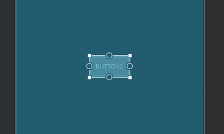
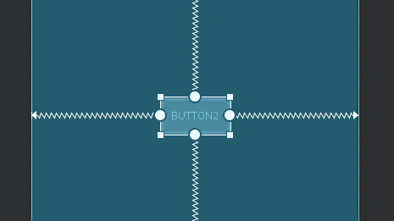
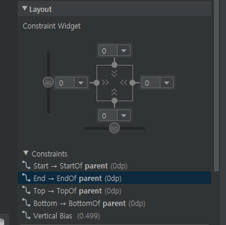
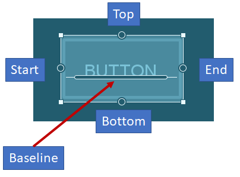

# ConstraintLayout
<!-- _class: lead -->
### 허준영(jyheo@hansung.ac.kr)

## ConstraintLayout
* 기존의 레이아웃(Linear, Relative 등)에 비해 레이아웃 중첩하지 않고도 복잡한 레이아웃을 만들 수 있음
    - Flat Hierarchy
* 안드로이드 스튜디오의 레이아웃 에디터로 만들기 편리함
    - 반대로 XML로 코딩하려면 매우 귀찮음
* 성능이 다른 레이아웃에 비해 우수함
* 구글에서 계속 밀고 있음

## Constraints
* 위젯 정렬 방식 지정
* 앵커(anchor)를 사용하여 위젯들 간의 정렬 규칙을 정함
    - 위젯 선택했을 때 위,아래,왼쪽,오른쪽 테두리에 보이는 원 모양이 앵커    
      

## Constraints – Start/End, Top/Bottom

```xml
 <Button
    android:id="@+id/button1"
    android:layout_width="wrap_content"
    android:layout_height="wrap_content"
    android:text="Button"
    app:layout_constraintBottom_toBottomOf="parent"
    app:layout_constraintEnd_toEndOf="parent"
    app:layout_constraintStart_toStartOf="parent"
    app:layout_constraintTop_toTopOf="parent" />
```
