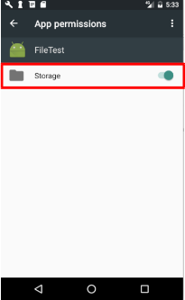
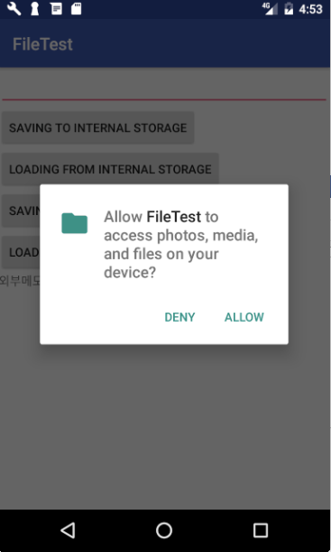

layout: true
.top-line[]

---
class: center, middle
# 파일과 설정, 컨텐트 프로바이더

---
## Contents
* Files
* SharedPreferences
* ContentProvider

---
class: center, middle
# Files

---
## 안드로이드 파일 시스템
* Linux 파일 시스템과 java.io의 입출력 스트림에 대한 이해 필수

.left-column-50[
* 내부 저장소
    - 내장 메모리
    - 항상 사용 가능
    - 기본적으로 자신의 앱에서만 액세스 할 수 있음
    - 사용자와 다른 앱이 앱의 파일에 직접 액세스하는 것을 원치 않을 때 적합
]

.right-column-50[
* 외부 저장소
    - 이동식 저장장치 (SD 카드)
    - 외부 저장소의 마운트 여부에 따라 사용 가능
    - 모든 사람이 읽을 수 있음
    - 다음 경우에 적합
        + 액세스 제한이 필요치 않은 파일
        + 다른 앱과 공유하기를 원하는 파일
        + 사용자가 컴퓨터에서 액세스 할 수 있도록 허용하는 파일
]

---
## 내부 저장소의 파일 입출력
* 보안상의 제약으로 인해 Context 클래스에서 보안이 적용된 파일 관리 메서드를 별도로 제공
```java
FileOutputStream openFileOutput (String name, int mode)
FileInputStream openFileInput (String name)
```
    - name
        + 파일의 이름으로 경로를 표시하는 '/' 문자가 들어가면 에러
        + 파일의 위치는 /data/data/패키지명/files 디렉토리로 지정
    - mode

모드          | 설명
-------------|---------------------------------------------------
MODE_RPIVATE | 혼자만 사용하는 배타적인 모드로 파일을 생성. (디폴트)
MODE_APPEND  | 파일이 이미 존재할 경우 덮어쓰기 모드가 아닌 추가 모드로 Open.

---
## OpenFileOuput

```java
package com.example.kwanwoo.filetest;
... 생략 ...

    iSave.setOnClickListener(new View.OnClickListener() {    
        public void onClick(View view) {
            String data = input.getText().toString();

            try {
*               FileOutputStream fos = openFileOutput
*                                           ("myfile.txt",             // 파일명 지정
*                                             Context.MODE_APPEND);    // 저장모드
             PrintWriter out = new PrintWriter(fos);
                 out.println(data);
                 out.close();

                 result.setText("file saved");
            } catch (Exception e) {
                 e.printStackTrace();
            }
        }
    });
```

**myfile.txt** 는 data/data/com.example.kwanwoo.filetest/files/ 에 위치

.footnote[https://github.com/kwanu70/AndroidExamples/blob/master/chap7/FileTest/app/src/main/java/com/example/kwanwoo/filetest/MainActivity.java]

---
## OpenFileInput

```java
    iLoad.setOnClickListener(new View.OnClickListener() {
        public void onClick(View view) {
            try {
                // 파일에서 읽은 데이터를 저장하기 위해서 만든 변수
                StringBuffer data = new StringBuffer();
*               FileInputStream fis = openFileInput("myfile.txt");  //파일명
                BufferedReader buffer = new BufferedReader(new InputStreamReader(fis));
                String str = buffer.readLine(); // 파일에서 한줄을 읽어옴
                while (str != null) {
                    data.append(str + "\n");
                    str = buffer.readLine();
                }
                result.setText(data); // 파일에서 읽은 데이터를 출력
                buffer.close();
            } catch (FileNotFoundException e) {
                result.setText("File Not Found");
            }
        }
    });
```

.footnote[https://github.com/kwanu70/AndroidExamples/blob/master/chap7/FileTest/app/src/main/java/com/example/kwanwoo/filetest/MainActivity.java]

---
## res/raw 폴더 파일 이용하기
* 대용량의 읽기 전용 데이터 파일은 리소스에 포함시켜 두는 것이 좋다.
    - ( ex: 게임의 지도 맵 데이터, 우편 번호부, 영한사전 데이터 등 )
* 포함시킬 파일은 res/raw에 복사해 둔다
* 리소스의 파일을 읽을 때는 Resources 객체의 메서드를 사용하며, id로는 확장자를 뺀 파일명을 부여한다.
    - InputStream openRawResource (int id)
    - 모든 file resource는 접미사(확장자)를 제외하고 유일한 이름을 가져야 한다.
    - res/raw에 file1.txt 와 file1.dat가 동시에 존재하면 안됨

---
## 외부 저장소 사용하기
1. 외부 저장소 접근 권한 설정
2. 외부 저장소 상태 확인
3. 외부 저장소 사용
    - 다른 앱과 공유되는 파일 입출력
    - 앱 전용 파일 입출력

---
## 1. 외부 저장소의 접근 권한 설정
* 외부 저장소에 데이터를 쓰려면 Manifest 파일에서 **WRITE_EXTERNAL_STORAGE** 권한을 요청해야 합니다.

```xml
<manifest ...>
    <uses-permission android:name="android.permission.WRITE_EXTERNAL_STORAGE"/>
</manifest>
```

* Android 6.0 (API level 23) 이상부터는
    - 앱 실행 중에 사용하려는 권한(permission)을 반드시 요청
    - 앱 사용자는 권한의 승인/거부를 결정
    - 앱의 환경설정에서 권한 설정을 언제든지 변경할 수 있음



???
오른쪽 그림은 Storage권한을 변경하는 예를 보여주는 것임.

---
## 앱 실행 시 접근 권한 검사 및 요청

```java
void requestPermission() {
    final int REQUEST_EXTERNAL_STORAGE = 1;
    String[] PERMISSIONS_STORAGE = {    // 요청할 권한 목록을 설정
            Manifest.permission.READ_EXTERNAL_STORAGE,
            Manifest.permission.WRITE_EXTERNAL_STORAGE
    };

*   int permission = ActivityCompat.checkSelfPermission(this, 			
			Manifest.permission.WRITE_EXTERNAL_STORAGE);

    if (permission != PackageManager.PERMISSION_GRANTED) {
*       ActivityCompat.requestPermissions(
                this,			// this는 현재 액티비티 객체 인스턴스를 나타냄
                PERMISSIONS_STORAGE,
                REQUEST_EXTERNAL_STORAGE  // 사용자 정의 int 상수.  
        );			// 권한 요청 결과를 받을 때 사용하나, 여기서는 사용되지 않고 있음.
    }
}
```



.footnote[https://github.com/kwanu70/AndroidExamples/blob/master/chap7/FileTest/app/src/main/java/com/example/kwanwoo/filetest/MainActivity.java]

---
## 2. 외부 저장소의 상태 확인
* 외부 저장소를 사용하기 전에 *사용 가능성* 검사
    - static String Environment.getExternalStorageState()
        + 반환값
            - MEDIA_MOUNTED: 미디어가 읽기/쓰기 권한으로 마운트 됨
            - MEDIA_MOUNTED_READ_ONLY: 미디어가 읽기 권한으로 마운트 됨
            - MEDIA_REMOVED: 미디어가 존재하지 않음
            - MEDIA_UNMOUNTED: 미디어가 마운트 안됨

```java
    public boolean isExternalStorageWritable() {
*       String state = Environment.getExternalStorageState();
*       if (Environment.MEDIA_MOUNTED.equals(state)) {
            result.setText("외부메모리 읽기 쓰기 모두 가능");
            return true;
        }
        return false;
    }
```

.footnote[https://github.com/kwanu70/AndroidExamples/blob/master/chap7/FileTest/app/src/main/java/com/example/kwanwoo/filetest/MainActivity.java]

---
## 3. 외부 저장소 사용 - 다른 앱과 공유되는 파일 입출력
* 공유 디렉토리 (Music, Pictures, Ringtones) 접근하기
    - static File Environment.getExternalStoragePublicDirectory(String type)
        + Type
            - DIRECTORY_MUSIC, DIRECTORY_PICTURES, DIRECTORY_RINGTONES, 등
        + 반환값: 외부저장소의 루트 디렉토리의 지정된 타입의 서브 디렉토리 (예,sdcard/Pictures)

```java
*   File path = Environment.getExternalStoragePublicDirectory
*                           (Environment.DIRECTORY_DOWNLOADS);
    File f = new File(path, "external.txt");      // 경로, 파일명
    FileWriter write = new FileWriter(f, true);   // 지정된 파일에 문자 스트림 쓰기

    PrintWriter out = new PrintWriter(write);     // formatted 출력 스트림
    out.println(data);
    out.close();
```

.footnote[https://github.com/kwanu70/AndroidExamples/blob/master/chap7/FileTest/app/src/main/java/com/example/kwanwoo/filetest/MainActivity.java]

---
## 3. 외부 저장소 사용 - 앱 전용 파일 입출력
* 외부 저장소의 앱 전용(private) 저장소 디렉토리 접근하기
    - File getExternalFilesDir(String type)    [Context 클래스 메소드]
        + Type
            - DIRECTORY_MUSIC, DIRECTORY_PICTURES, DIRECTORY_RINGTONES, 등
        + 반환값: 외부저장소의 Android/data/패키지명/files 디렉토리 아래의 지정된 타입의 서브 디렉토리
            - (예,sdcard/Android/data/com.example.kwanwoo.filetest/files/Pictures)

```java
*   File f = new File(getExternalFilesDir(null), "demofile.jpg"); // 경로, 파일명
*   InputStream in = getResources().openRawResource(R.raw.ballons);
    OutputStream out = new FileOutputStream(f);

    byte[] data = new byte[in.available()]; //in 스트림으로부터 읽을 바이트 수만큼 배열 생성
    in.read(data);                          // in 스트림으로부터 data를 읽고
    out.write(data);                        // out 스트림에 data를 저장
```

.footnote[https://github.com/kwanu70/AndroidExamples/blob/master/chap7/FileTest/app/src/main/java/com/example/kwanwoo/filetest/MainActivity.java]

---
class: center, middle
# SharedPreferences

---
## 프레퍼런스
* **프로그램의 설정 정보 (사용자의 옵션 선택 사항 이나 프로그램의 구성 정보)를** 영구적으로 **저장**하는 용도로 사용
* XML 포맷의 텍스트 파일에 정보를 저장.

* **SharedPreferences** 클래스
    - 프레프런스의 데이터를 관리하는 클래스
    - **응용 프로그램 내의 액티비티 간에 공유**하며, 한쪽 액티비티에서 수정 시 다른 액티비티에서도 수정된 값을 읽을 수 있다.
    - 응용 프로그램의 고유한 정보이므로 **외부에서는 읽을 수 없다.**

---
## SharedPreferences 객체 얻기
* **SharedPreferences** 객체를 얻는 2 가지 방법
    - **public SharedPreferences getSharedPreferences (String name, int mode)**
        + 첫 번째 인수 : 프레프런스를 저장할 XML 파일의 이름이다.
        + 두 번째 인수 : 파일의 공유 모드
            - MODE_PRIVATE: 읽기 쓰기가 가능

    - **public SharedPreferences getPreferences(int mode)**
        + 생성한 액티비티 전용이므로 같은 패키지의 다른 액티비티는 읽을 수 없다.
        + 액티비티와 동일한 이름의 XML 파일 생성

---
## 프레퍼런스의 데이터 읽기
* 프레퍼런스에 저장된 여러 타입의 정보를 **SharedPreferences 객체의 다음 메서드**를 이용하여 읽을 수 있다
    - int getInt (String key, int defValue)
    - String getString (String key, String defValue)
    - boolean getBoolean (String key, boolean defValue)    
        + *key* 인수 : 데이터의 이름 지정
        + *defValue* 인수 : 값이 없을 때 적용할 디폴트 지정.

---
## 프레퍼런스에 데이터 저장하기
* 프레프런스는 키와 값의 쌍으로 데이터를 저장
    - 키는 정보의 이름이며 값은 정보의 실제값

* **SharedPreferences.Editor** 이용하여 프레프런스에 값을 저장
    - 데이터 저장 시 프레퍼런스의 **edit() 메서드를 호출하여 Editor 객체를 먼저 얻음.**
    - Editor 객체에는 값을 저장하고 관리하는 메서드가 제공됨
        + SharedPreferences.Editor putInt(String key, int value)
        + SharedPreferences.Editor putBoolean(String key, int value)
        + SharedPreferences.Editor putString(String key, String value)
        + SharedPreferences.Editor remove(String key)
        + SharedPreferences.Editor clear()
        + Boolean commit()
    - Editor는 모든 변경을 모아 두었다가 **commit() 메소드를 통해 한꺼번에 적용**

---
## SharedPreferences Example

```java
public class MainActivity extends AppCompatActivity {
*   public static final String	PREFERENCES_GROUP = "MyPreference";
    public static final String 	PREFERddENCES_ATTR = "TextInput";
*   SharedPreferences	setting;

    public void onCreate(Bundle savedInstanceState) {
        ... 생략 ...
*       setting = getSharedPreferences(PREFERENCES_GROUP, MODE_PRIVATE);
        final EditText textInput = (EditText) findViewById(R.id.textInput1);
*       textInput.setText(retrieveText());

        Button btn = (Button) findViewById(R.id.button1);
        btn.setOnClickListener( new View.OnClickListener() {
            public void onClick(View v) {
                String name = textInput. getText().toString();
*               saveText(name);
            }    
        });
    }
```

.footnote[https://github.com/kwanu70/AndroidExamples/blob/master/chap7/SharedPreferenceTest/app/src/main/java/com/example/kwanwoo/sharedpreferencetest/MainActivity.java]

---
## SharedPreferences Example (계속)

```java
    private String retrieveText() {
        String initText="";
        if (setting.contains(PREFERENCES_ATTR)) {
*           initText = setting.getString(PREFERENCES_ATTR, "");
        }
        return initText;
    }

    private void saveText(String text) {
*       SharedPreferences.Editor editor = setting.edit();
*       editor.putString(PREFERENCES_ATTR, text);
*       editor.commit();
    }
}
```

.footnote[https://github.com/kwanu70/AndroidExamples/blob/master/chap7/SharedPreferenceTest/app/src/main/java/com/example/kwanwoo/sharedpreferencetest/MainActivity.java]

---
## ContentProvider

* TBA
