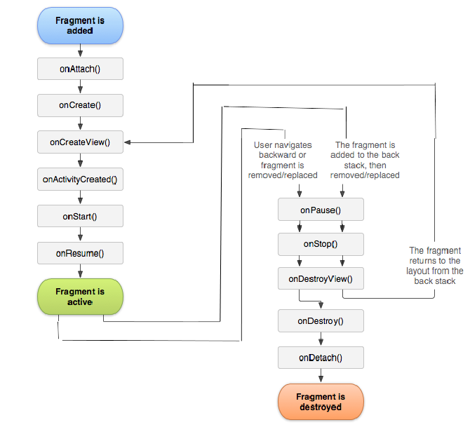
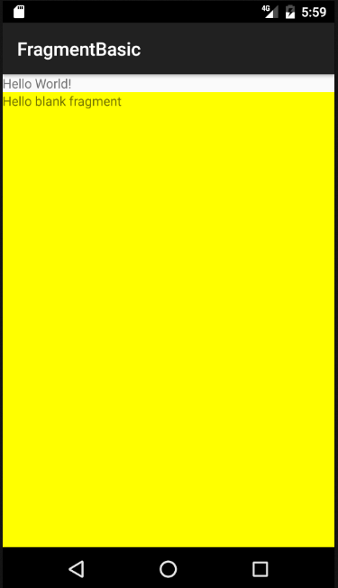
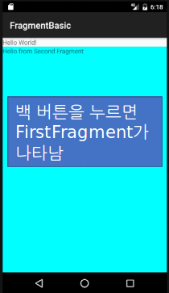
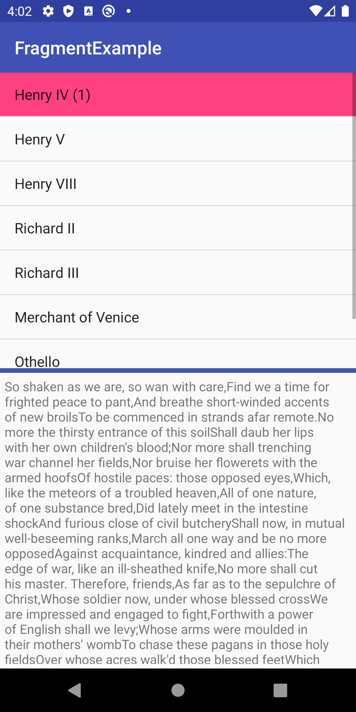

# 프래그먼트(Fragment)
<!-- _class: lead -->
### 허준영(jyheo@hansung.ac.kr)

출처: https://developer.android.com/guide/components/fragments.html?hl=ko


## 프래그먼트(Fragment)
* 액티비티 실행 중에 추가 및 제거가 가능한 모듈식 UI 섹션
  - 여러 개의 프래그먼트를 하나의 액티비티에 조합하여 UI를 구축할 수 있음
  - 프래그먼트 구현 클래스를 여러 액티비티에서 재사용할 수 있음
* 프래그먼트는 자체 수명 주기를 가지고, 자체 입력 이벤트를 받음


## 프래그먼트 디자인
* 태블릿과 같은 큰 화면에서 유연한 UI 디자인을 지원
* 프래그먼트는 재사용 가능하며, 다른 UI요소처럼 액티비티의 구성 요소가 됨
    - **재사용을 염두에 두고 디자인하며, 한 프래그먼트를 또 다른 프래그먼트로부터 직접 조작하는 것은 삼가**  
    - ViewModel 등을 이용하여 프래그먼트 간의 데이터 교환


## 라이프 사이클
* onAttach:
  - 프래그먼트가 액티비티에 연결
* onCreateView:
  - 프래그먼트의 레이아웃을 생성
* onActivityCreated:
  - 연결된 액티비티의 onCreate가  
    완료된 후



## Library dependency in gradle
* gradle (app)
    ```
    dependencies {
        ...
        implementation 'androidx.fragment:fragment:1.2.4'
    }
    ```

## 프래그먼트 클래스
* Fragment를 상속 받아서 생성
    ```java
    public class FirstFragment extends Fragment {
        public FirstFragment() {
            // Required empty public constructor
        }

        @Override
    *   public View onCreateView(LayoutInflater inflater, ViewGroup container,
                                Bundle savedInstanceState) {
            // Inflate the layout for this fragment (layout/fragment_first.xml)
    *       return inflater.inflate(R.layout.fragment_first, container, false);
        }
    }
    ```
* Android Studio에서 File > New > Fragment 에서 간단히 추가할 수 있음


## 프래그먼트 레이아웃
* layout/fragment_first.xml
  - 액티비티의 레이아웃과 동일한 방법으로 작성
    ```xml
    <LinearLayout xmlns:android="http://schemas.android.com/apk/res/android"
        xmlns:tools="http://schemas.android.com/tools"
        android:layout_width="match_parent"
        android:layout_height="match_parent“
        android:orientation="vertical"
        android:background=“#ffff00">

        <TextView
            android:layout_width="match_parent"
            android:layout_height="match_parent"
            android:text="@string/hello_blank_fragment" />
    </LinearLayout >
    ```

## 액티비티에 프래그먼트 추가
* 액티비티 레이아웃에 정적으로 추가(activity_main.xml)
    ```xml
    <LinearLayout xmlns:android="http://schemas.android.com/apk/res/android"
        xmlns:tools="http://schemas.android.com/tools"
        android:layout_width="match_parent"
        android:layout_height="match_parent"
        android:orientation="vertical">

        <TextView
            android:layout_width="wrap_content"
            android:layout_height="wrap_content"
            android:text="Hello World!" />

    *   <androidx.fragment.app.FragmentContainerView
    *       android:id="@+id/fragment"
    *       android:name="com.jyheo.fragmentbasic.FirstFragment"
            android:layout_width="match_parent"
            android:layout_height="0dp"
            android:layout_weight="1" />

    </LinearLayout>
    ```




## 프래그먼트 동적 교체
* 프레그먼트 동적 교체

```java
public class MainActivity extends AppCompatActivity {

    void switchFragment() {
        FragmentTransaction fragmentT = 
                getSupportFragmentManager().beginTransaction();
        fragmentT.replace(R.id.fragment, new SecondFragment());
        fragmentT.addToBackStack(null);
            // addToBackStack()을 호출해야 백 버튼 누를 때,
            //    이전 프래그먼트로 되돌아가기가 됨
        fragmentT.commit();
    }
}
```



## 프래그먼트 동적 교체
* 전체 소스
    - https://github.com/jyheo/android-java-examples/tree/master/FragmentBasic


## Fragment와 ViewModel
* TitlesFragment와 DetailsFragment
* TitlesFragment 에서 선택하면 DetailsFragment에서 선택한 항목의 내용이 표시됨
* 두 fragment 사이의 데이터 전달을 위해 ViewModel을 사용
* ViewModel을 사용하기 위해 gradle에 lifecycle 라이브러리 추가
    ```
    dependencies {
        ...
        implementation 'androidx.lifecycle:lifecycle-extensions:2.2.0'
    }
    ```    

 


## Fragment와 ViewModel
* ViewModel
    - View를 위한 데이터 모델, activity나 fragment와 연관된 데이터 모델
    - Activity나 fragment가 완전히 메모리에서 사라질 때 까지 데이터 유지, Activity가 회전으로 다시 만들어질 때에도 데이터를 유지함
    - 보통 LiveData와 같이 사용
* LiveData
    - Observer 패턴
    - 데이터가 변경될 때 자동으로 지정한 객체의 onChanged() 메소드 호출


## Fragment와 ViewModel
* MyViewModel.java
    ```java
    public class MyViewModel extends ViewModel {
        private final MutableLiveData<Integer> selected = new MutableLiveData<>();              

        public MyViewModel() {
            selected.setValue(-1);
        }

        public void select(Integer item) {
            selected.setValue(item);
        }

        public LiveData<Integer> getSelected() {
            return selected;
        }
    }
    ```

## Fragment와 ViewModel
* 액티비티 레이아웃
    ```xml
    <LinearLayout xmlns:android="http://schemas.android.com/apk/res/android"                                    
        android:layout_width="match_parent"
        android:layout_height="match_parent"
        android:orientation="vertical">

        <androidx.fragment.app.FragmentContainerView
            android:name="com.jyheo.fragmentexample.TitlesFragment"
            android:id="@+id/titles"
            android:layout_width="match_parent"
            android:layout_height="0dp"
            android:layout_weight="1" />

        <View
            android:layout_width="match_parent"
            android:layout_height="5dp"
            android:background="#3F51B5" />

        <androidx.fragment.app.FragmentContainerView
            android:name="com.jyheo.fragmentexample.DetailsFragment"
            android:id="@+id/details"
            android:layout_width="match_parent"
            android:layout_height="0dp"
            android:layout_weight="1" />
    </LinearLayout>
    ```


## Fragment와 ViewModel
* TitlesFragment.java
    ```java
    public class TitlesFragment extends Fragment {

        private FragmentTitlesBinding binding;
        private MyViewModel model;

        public TitlesFragment() { }

        @Override
        public View onCreateView(@NonNull LayoutInflater inflater, ViewGroup container,
                                 Bundle savedInstanceState) {
            binding = FragmentTitlesBinding.inflate(inflater, container, false);

    *       model = new ViewModelProvider(requireActivity()).get(MyViewModel.class);
            binding.listview.setAdapter(new ArrayAdapter<>(requireContext(),android.R.layout.simple_list_item_activated_1,
                                         Shakespeare.TITLES));
            binding.listview.setOnItemClickListener(new AdapterView.OnItemClickListener() {
                @Override
                public void onItemClick(AdapterView<?> adapterView, View view, int i, long l) {
    *               model.select(i);
                }
            });
            binding.listview.setChoiceMode(ListView.CHOICE_MODE_SINGLE);

            return binding.getRoot();
        }
    }
    ```


## Fragment와 ViewModel
* DetailsFragment.java
    ```java
    public class DetailsFragment extends Fragment {
        private FragmentDetailsBinding binding;

        public DetailsFragment() { }

        @Override
        public View onCreateView(@NonNull LayoutInflater inflater, ViewGroup container, Bundle savedInstanceState) {
            binding = FragmentDetailsBinding.inflate(inflater, container, false);
            return binding.getRoot();
        }

        @Override
        public void onStart() {
            super.onStart();
    *       MyViewModel model = new ViewModelProvider(requireActivity()).get(MyViewModel.class);
    *       model.getSelected().observe(this, new Observer<Integer>() {
                @Override
                public void onChanged(Integer idx) {
                    if (idx >= 0)
                        binding.textview.setText(Shakespeare.DIALOGUE[idx]);
                }
            });
        }
    }
    ```

## Fragment와 ViewModel
* 전체 소스
    - https://github.com/jyheo/android-java-examples/tree/master/FragmentExample