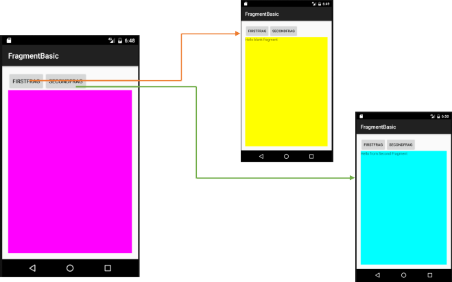
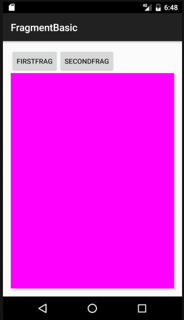
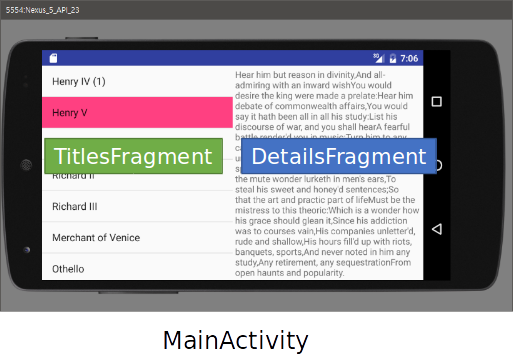
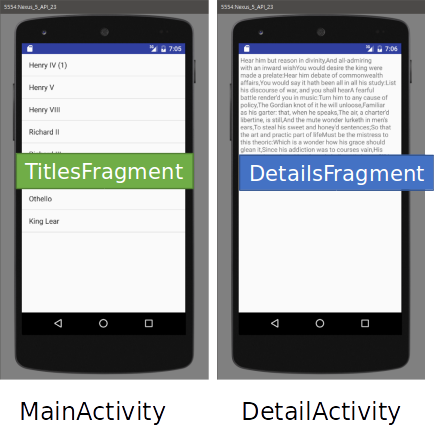
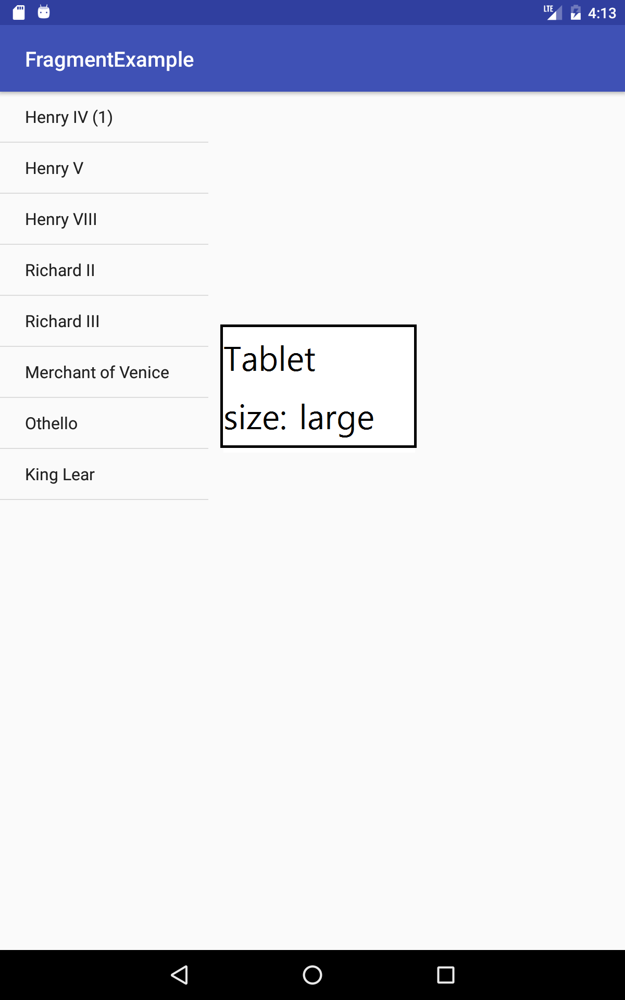

# 프래그먼트(Fragment)
<!-- _class: lead -->
### 허준영(jyheo@hansung.ac.kr)

출처: https://developer.android.com/guide/components/fragments.html?hl=ko


## 프래그먼트(Fragment)
* 액티비티 실행 중에 추가 및 제거가 가능한 모듈식 섹션
  - 여러 개의 프래그먼트를 하나의 액티비티에 조합하여 창이 여러 개인 UI를 구축할 수 있음
  - 프래그먼트 구현 클래스를 여러 액티비티에서 재사용할 수 있음
* 프래그먼트는 자체 수명 주기를 가지고, 자체 입력 이벤트를 받음


<!--
왼쪽 그림은 Fragment A와 B를 하나의 액티비티에 조합하여 UI를 구축한 예(화면이 큰 태블릿)
오른쪽 그림은 Fragment A와 B를 각각 별도의 액티비티에 연결하여 UI를 구축한 예(화면이 작은 스마트폰)
-->

## 프래그먼트 디자인
* Android 3.0(API 레벨 11)부터 생겼음
* 기본적으로 태블릿과 같은 큰 화면에서 보다 역동적이고 유연한 UI 디자인을 지원하는 것이 목적
* 프래그먼트는 재사용 가능하며, 다른 UI요소처럼 액티비티의 구성 요소가 됨
    - **재사용을 염두에 두고 디자인하며, 한 프래그먼트를 또 다른 프래그먼트로부터 직접 조작하는 것은 삼가**  

<!--
어떤 프래그먼트에서 다른 프래그먼트를 제어하거나 데이터를 전달하기 위해서는 액티비티를 거치도록 만들어야 함
-->

## 라이프 사이클
* onAttach:
  - 프래그먼트가 액티비티에 연결
* onCreateView:
  - 프래그먼트의 레이아웃을 생성
* onActivityCreated:
  - 연결된 액티비티의 onCreate가  
    완료된 후


## 프래그먼트 클래스
* Fragment를 상속 받아서 생성
    ```java
    public class FirstFragment extends Fragment {
        public FirstFragment() {
            // Required empty public constructor
        }

        @Override
    *   public View onCreateView(LayoutInflater inflater, ViewGroup container,
                                Bundle savedInstanceState) {
            // Inflate the layout for this fragment (layout/fragment_first.xml)
    *       return inflater.inflate(R.layout.fragment_first, container, false);
        }
    }
    ```

.footnote[https://github.com/jyheo/AndroidTutorial/blob/master/FragmentBasic/app/src/main/java/com/jyheo/fragmentbasic/FirstFragment.java]

<!--
**Tip!** 안드로이드 스튜디오에서 File > New > Fragment > Fragment(Blank) 를 이용하여 쉽게 생성할 수 있음(다만, 이때에는 support v4 Fragment로 생성됨)
-->

## 프래그먼트 레이아웃
* layout/fragment_first.xml
  - 액티비티의 레이아웃과 동일한 방법으로 작성

```xml
<LinearLayout xmlns:android="http://schemas.android.com/apk/res/android"
    xmlns:tools="http://schemas.android.com/tools"
    android:layout_width="match_parent"
    android:layout_height="match_parent“
    android:orientation="vertical"
    android:background=“#ffff00">

    <TextView
        android:layout_width="match_parent"
        android:layout_height="match_parent"
        android:text="@string/hello_blank_fragment" />
</LinearLayout >
```

.footnote[https://github.com/jyheo/AndroidTutorial/blob/master/FragmentBasic/app/src/main/res/layout/fragment_first.xml]


## 액티비티에 프래그먼트 추가
* 액티비티 레이아웃에 정적으로 추가(activity_main.xml)

```xml
<LinearLayout xmlns:android="http://schemas.android.com/apk/res/android"
    xmlns:tools="http://schemas.android.com/tools"
    android:layout_width="match_parent"
    android:layout_height="match_parent"
    android:orientation="vertical">
    <TextView
        android:layout_width="wrap_content"
        android:layout_height="wrap_content"
        android:text="Hello World!" />
    <FrameLayout
        android:id="@+id/fragment“
        android:layout_width="match_parent”   android:layout_height="match_parent“ />
*       <fragment
*           android:name="com.jyheo.fragmentbasic.FirstFragment"
            android:layout_width="match_parent"
            android:layout_height="match_parent“/>
    </FrameLayout>
</LinearLayout>
```


https://github.com/jyheo/AndroidTutorial/blob/master/FragmentBasic/app/src/main/res/layout/activity_main.xml


## 프래그먼트 동적 교체
* 프레그먼트 동적 교체

```java
public class MainActivity extends AppCompatActivity {

    @Override
    protected void onCreate(Bundle savedInstanceState) {
        super.onCreate(savedInstanceState);
        setContentView(R.layout.activity_main);

*       final FragmentTransaction fragmentTransaction =
*    					 getFragmentManager().beginTransaction();
*       fragmentTransaction.replace(R.id.fragment, new SecondFragment());
*       fragmentTransaction.addToBackStack(null);
        // addToBackStack()을 호출해야 백 버튼 누를 때 이전 프래그먼트로 되돌아가기가 됨
*       fragmentTransaction.commit();
    }
}
```


https://github.com/jyheo/AndroidTutorial/blob/master/FragmentBasic/app/src/main/java/com/jyheo/fragmentbasic/MainActivity.java
https://github.com/jyheo/AndroidTutorial/blob/master/FragmentBasic/app/src/main/java/com/jyheo/fragmentbasic/SecondFragment.java


## 프래그먼트 교체 예제(1/4)
* 버튼을 누르면 해당 프래그먼트가 나타남


https://github.com/jyheo/AndroidTutorial/blob/master/FragmentBasic/app/src/main/java/com/jyheo/fragmentbasic/FragSwitchActivity.java
https://github.com/jyheo/AndroidTutorial/blob/master/FragmentBasic/app/src/main/res/layout/activity_frag_switch.xml


## 프래그먼트 교체 예제(2/4)
* 액티비티
    ```java
    public class FragSwitchActivity extends AppCompatActivity {

        @Override
        protected void onCreate(Bundle savedInstanceState) {
            super.onCreate(savedInstanceState);
    *       setContentView(R.layout.activity_frag_switch);

            Button button = (Button)findViewById(R.id.button_first);
            button.setOnClickListener(new View.OnClickListener() {
                @Override
                public void onClick(View view) {
    *               switchFragment(0);
                }
            });
            button = (Button)findViewById(R.id.button_second);
            button.setOnClickListener(new View.OnClickListener() {
                @Override
                public void onClick(View view) {
    *               switchFragment(1);
                }
            });
        }
    ```

<!--
First버튼과 Second버튼에 대한 클릭 리스너를 만들고, 각각 switchFragment()에 대해 0과 1을 인자로 주어 호출함
-->

## 프래그먼트 교체 예제(3/4)
* layout/activity_frag_switch.xml
    ```xml
    *<LinearLayout ...
        android:orientation="vertical">
    *   <LinearLayout
            android:layout_width="match_parent"
            android:layout_height="wrap_content"
            android:orientation="horizontal">
    *       <Button
                android:layout_width="wrap_content"
                android:layout_height="wrap_content"
                android:text="FirstFrag"
                android:id="@+id/button_first"/>
    *       <Button
                android:layout_width="wrap_content"
                android:layout_height="wrap_content"
                android:text="SecondFrag"
                android:id="@+id/button_second"/>
        </LinearLayout>
    *   <FrameLayout    참고:FrameLayout 대신 다른 Layout을 사용해도 됨
            android:layout_width="match_parent"
            android:layout_height="match_parent"
            android:background="#ff00ff"
    *       android:id="@+id/fragment">
        </FrameLayout>
    </LinearLayout>
    ```




## 프래그먼트 교체 예제(4/4)
* switchFragment()

```java
final FirstFragment firstFragment = new FirstFragment();
final SecondFragment secondFragment = new SecondFragment();

*protected void switchFragment(int id) {
    final FragmentTransaction fragmentTransaction = getFragmentManager().beginTransaction();
    if (id == 0)
*       fragmentTransaction.replace(R.id.fragment, firstFragment);
    else
*       fragmentTransaction.replace(R.id.fragment, secondFragment);

    fragmentTransaction.commit();
}
```


## 화면 방향/크기와 프래그먼트 활용
* TitlesFragment 와 DetailsFragment  
  
<!--
왼쪽(가로보기, landscape)은 좌측에 TitlesFragment가 우측에 DetailsFragment가 표시되는 형태이고,
가운데(세로보기, portrait)는 TitlesFragment만 보이다가 항목을 선택하면 DetailsFragment만 표시된다.
오른쪽(크기=large)은 태블릿용 레이아웃으로 TitlesFragment와 DetailsFragment가 모두 표시되는 형태로 landscape와 유사하다.
-->

## 화면 방향/크기와 프래그먼트 활용
* 액티비티에 가로보기(Landscape) 레이아웃을 추가
  - res/layout 에서 마우스 오른쪽 클릭, 팝업 메뉴 보기
    - New > Layout resource file
    - Qualifiers에서 Orientation - Landscape 선택
    - 파일 이름은 원래 있던 것과 동일하게 activity_main.xml

**주의!** 화면 방향을 바꾸면 액티비티가 새로 만들어짐. 당연히 프래그먼트도 다시 만들어짐

.footnote[예제 프로젝트 파일: https://github.com/jyheo/AndroidTutorial/tree/master/FragmentExample]


## 화면 방향/크기와 프래그먼트 활용
* 액티비티에 태블릿용(large) 레이아웃을 추가
  - res/layout 에서 마우스 오른쪽 클릭, 팝업 메뉴 보기
    - New > Layout resource file
    - Qualifiers에서 Size - large 선택
    - 파일 이름은 원래 있던 것과 동일하게 activity_main.xml

**참고** 화면의 크기에 따라(일반적으로 폰은 normal, 태블릿은 large이상임) 해당되는 레이아웃 파일을 알아서 사용하게 됨


## 화면 방향과 프래그먼트 활용
* Portrait 용 레이아웃 layout/activity_main.xml
    ```xml
    <LinearLayout xmlns:android="http://schemas.android.com/apk/res/android"
        android:layout_width="match_parent"
        android:layout_height="match_parent"
        android:orientation="vertical">

        <fragment
            android:name="com.jyheo.fragmentexample.TitlesFragment"
            android:id="@+id/titles"
            android:layout_width="match_parent"
            android:layout_height="match_parent" />

    </LinearLayout>
    ```

https://github.com/jyheo/AndroidTutorial/blob/master/FragmentExample/app/src/main/res/layout/activity_main.xml


## 화면 방향과 프래그먼트 활용
* Landscape 용 레이아웃 layout-land/activity_main.xml
* Large 용 레이아웃 layout-large/activity_main.xml
    ```xml
    <LinearLayout xmlns:android="http://schemas.android.com/apk/res/android"
        android:orientation="horizontal"
        android:layout_width="match_parent"
        android:layout_height="match_parent">
        <fragment
            android:name="com.jyheo.fragmentexample.TitlesFragment"
            android:id="@+id/titles"
            android:layout_weight="1"
            android:layout_width="0px"
            android:layout_height="match_parent" />

        <FrameLayout               [DetailsFragment를 동적으로 추가할 위치]
            android:id="@+id/details"
            android:layout_weight="2"
            android:layout_width="0px"
            android:layout_height="match_parent" />
    </LinearLayout>
    ```
https://github.com/jyheo/AndroidTutorial/blob/master/FragmentExample/app/src/main/res/layout-land/activity_main.xml


## 화면 방향과 프래그먼트 활용
* TitlesFragment.java
    ```java
    public class TitlesFragment extends Fragment {

        private int mCurCheckPosition = -1; // 선택한 항목의 위치
        private FragmentTitlesBinding binding;
        private OnTitleSelectedListener mTitleSelectedListener;

        public TitlesFragment() { }

        @Override
        public View onCreateView(@NonNull LayoutInflater inflater, ViewGroup container,
                                Bundle savedInstanceState) {
            binding = FragmentTitlesBinding.inflate(inflater, container, false);
            return binding.getRoot();
        }

        public interface OnTitleSelectedListener {  // 액티비티로 메시지를 전달하기 위한 인터페이스
            void onTitleSelected(int i, boolean restoreSaved);
        }

        void setOnTitleSelectedListener(OnTitleSelectedListener listener) {
            mTitleSelectedListener = listener;
        }

    ```
---

* TitlesFragement.java 계속
    ```java
        @Override
        public void onActivityCreated(Bundle savedInstanceState) {
            super.onActivityCreated(savedInstanceState);

            binding.listview.setAdapter(new ArrayAdapter<String>(getContext(),
                    android.R.layout.simple_list_item_activated_1, Shakespeare.TITLES));
            binding.listview.setOnItemClickListener(new AdapterView.OnItemClickListener() {
                @Override
                public void onItemClick(AdapterView<?> adapterView, View view, int i, long l) {
                    mCurCheckPosition = i;
                    if (mTitleSelectedListener != null)
                        mTitleSelectedListener.onTitleSelected(i, false);
                }
            });

            binding.listview.setChoiceMode(ListView.CHOICE_MODE_SINGLE);

            if (savedInstanceState != null)
                mCurCheckPosition = savedInstanceState.getInt("curChoice", -1);

            binding.listview.setSelection(mCurCheckPosition);
            binding.listview.smoothScrollToPosition(mCurCheckPosition);
        }

        @Override
        public void onStart() {
            super.onStart();
            if (mCurCheckPosition >= 0 && mTitleSelectedListener != null)
                mTitleSelectedListener.onTitleSelected(mCurCheckPosition, true);
        }

        @Override
        public void onSaveInstanceState(@NonNull Bundle outState) { // 프래그먼트가 사라질 때 선택 항목의 위치를 저장
            super.onSaveInstanceState(outState);
            outState.putInt("curChoice", mCurCheckPosition);
        }
    }
    ```

https://github.com/jyheo/AndroidTutorial/blob/master/FragmentExample/app/src/main/java/com/jyheo/fragmentexample/TitlesFragment.java


## 화면 방향과 프래그먼트 활용
* MainActivity.java
    ```java
    public class MainActivity extends AppCompatActivity implements TitlesFragment.OnTitleSelectedListener{
        boolean mDetailsEnabled;
        @Override
        protected void onCreate(Bundle savedInstanceState) {
            super.onCreate(savedInstanceState);
            setContentView(R.layout.activity_main);

            TitlesFragment titlesFragment = (TitlesFragment)getSupportFragmentManager().findFragmentById(R.id.titles);
            titlesFragment.setOnTitleSelectedListener(this);
            mDetailsEnabled = findViewById(R.id.details) != null;
        }

        public void onTitleSelected(int i, boolean restoreSaved) {
            if (mDetailsEnabled) {
                getSupportFragmentManager().beginTransaction().replace(R.id.details, new DetailsFragment(i)).commit();
            } else {
                if (!restoreSaved) {
                    Intent intent = new Intent(this, DetailsActivity.class);
                    intent.putExtra("index", i);
                    startActivity(intent);
                }
            }
        }
    }
    ```

https://github.com/jyheo/AndroidTutorial/blob/master/FragmentExample/app/src/main/java/com/jyheo/fragmentexample/MainActivity.java]


## 화면 방향과 프래그먼트 활용
* DetailsFragment.java
    ```java
    public class DetailsFragment extends Fragment {
        private FragmentDetailsBinding binding;
        private int mIndex;

        public DetailsFragment() { }
        public DetailsFragment(int idx) { mIndex = idx; }

        @Override
        public View onCreateView(@NonNull LayoutInflater inflater, ViewGroup container,
                                Bundle savedInstanceState) {
            binding = FragmentDetailsBinding.inflate(inflater, container, false);
            binding.textview.setText(Shakespeare.DIALOGUE[mIndex]);
            return binding.getRoot();
        }

    }
    ```

https://github.com/jyheo/AndroidTutorial/blob/master/FragmentExample/app/src/main/java/com/jyheo/fragmentexample/DetailsFragment.java


## 화면 방향과 프래그먼트 활용
* DetailsActivity.java
    ```java
    public class DetailsActivity extends AppCompatActivity {

        @Override
        protected void onCreate(Bundle savedInstanceState) {
            super.onCreate(savedInstanceState);
            setContentView(R.layout.activity_details);

            if (getResources().getConfiguration().orientation == Configuration.ORIENTATION_LANDSCAPE) {
                finish();
                return;
            }

            Intent intent = getIntent();
            int idx = intent.getIntExtra("index", 0);
            getSupportFragmentManager().beginTransaction().replace(R.id.details, new DetailsFragment(idx)).commit();
        }
    }
    ```

https://github.com/jyheo/AndroidTutorial/blob/master/FragmentExample/app/src/main/java/com/jyheo/fragmentexample/DetailsActivity.java
