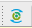
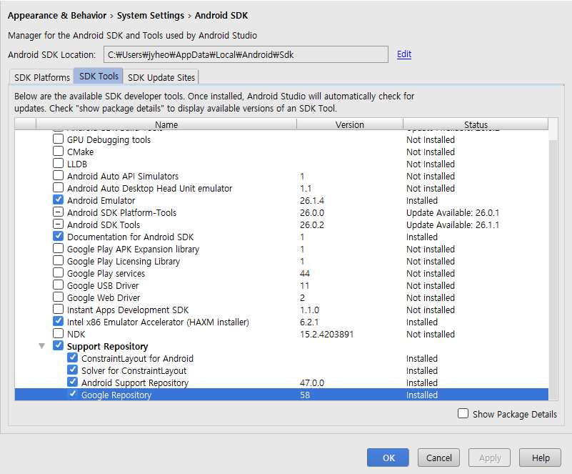
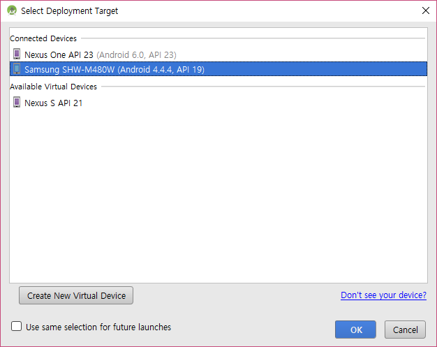
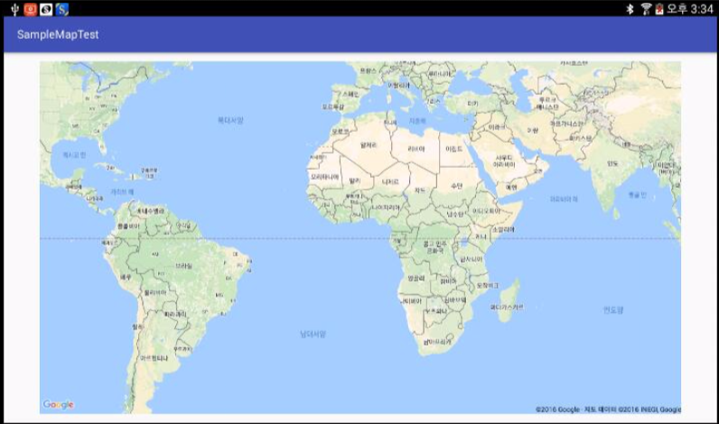
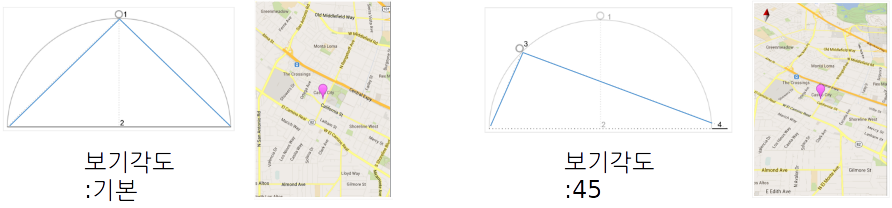

layout: true
.top-line[]

---
class: center, middle
# Google Map

---
## Google Map 개요
* 이번 시간에 다룰 내용
    - Google Play Services 설정
    - Google Maps API 키 가져오기
    - 앱에 지도 추가 및 설정
    - 앱 실행시키기
    - 지도에 마커 추가 및 설정
    - 카메라 뷰 제어

.footnote[참고 자료: https://developers.google.com/maps/documentation/android-api/intro]

---
## Google Play Services 설정
* Google Play Services SDK 다운로드 및 설치
    - Tools>Android>SDK Manager 이용
        + SDK Tools 탭에서
        + Support Repository - Google Repository 선택 후 OK
* 프로젝트에 라이브러리 추가
    1. build.gradle (Module:app) 파일 오픈
    2. 새로운 빌드 규칙 추가
```java
        dependencies {
            ...
            compile 'com.google.android.gms:play-services-maps:11.0.4'
        }
```
    3. 툴바에서 "Sync Project with Graddle Files()" 또는 Sync Now 클릭



.footnote[출처: https://developers.google.com/android/guides/setup]

---
## Google Maps API 키 가져오기
1. Google Developers Console https://console.developers.google.com/ 로 이동
2. 프로젝트 만들기 (또는 기존 프로젝트 선택)
    - 프로젝트 이름 입력 후, 만들기 버튼 클릭
3. Google Maps Android API 활성화
    - API 목록(라이브러리 메뉴) 중 "Google Maps Android API" 선택 후, "사용 설정" 클릭
4. 사용자 인증 정보, API 키 생성
    -  클릭
    - API 키 선택, 키(다음 형식: AIzaSyCnGHbf6vK3MXYfWArS1fYo0rU0BiXg)를 얻는다.

---
## 앱에 지도 추가 및 설정
* Manifest 파일에 **API 키 추가**
    ```xml
    <application ...>
        <meta-data
            android:name="com.google.android.geo.API_KEY"
    *       android:value="AIzaSyCnGHbf6vK3MXYfWArS1fYo0rU0BiXg" />
    	  ...
    </application>
    ```
* Activity에 지도를 위한 프레그먼트 추가
```xml
    <LinearLayout ... >
    *   <fragment xmlns:android="http://schemas.android.com/apk/res/android"
            xmlns:map="http://schemas.android.com/apk/res-auto"
            xmlns:tools="http://schemas.android.com/tools"
            android:id="@+id/map"
    *       android:name="com.google.android.gms.maps.SupportMapFragment"
            android:layout_width="match_parent"
            android:layout_height="match_parent"
            tools:context="com.example.jyheo.googlemaptest.MapsActivity" />
    </LinearLayout>
```

???
com.google.android.gms.maps.SupportMapFragment는 API 11 디바이스까지 지원 가능

---
## 앱 실행시키기
* 실제 Android 기기에서 앱 실행
    - Android 기기를 USB로 컴퓨터와 연결 및 USB 드라이버 설치
    - 개발자 옵션 활성화
    - 에뮬레이터에서도 실행 가능하나, 실제 Android 기기에서 실행을 추천




---
## 앱에서 지도 사용하기
* OnMapReadyCallback 인터페이스를 구현
    ```java
    public class MainActivity extends AppCompatActivity implements OnMapReadyCallback {
        public void onMapReady(GoogleMap googleMap) {

        }
    }
```
* MapFragment 객체에 콜백의 인스턴스를 설정
    ```java
    protected void onCreate(Bundle savedInstanceState) {
        ...생략...
        SupportMapFragment mapFragment = (SupportMapFragment) getSupportFragmentManager()
                .findFragmentById(R.id.map);
    *   mapFragment.getMapAsync(this);
    }
```

---
## 앱에서 지도 사용하기
* onMapReady(GoogleMap) 콜백 메서드를 사용하여 GoogleMap 객체의 획득
    - 지도를 사용할 준비가 되면 콜백이 실행됨

```java
public class MainActivity extends AppCompatActivity implements OnMapReadyCallback {
*   public void onMapReady(GoogleMap gMap) {

        // Add a marker in Sydney and move the camera
        LatLng sydney = new LatLng(-34, 151);
*       gMap.addMarker(new MarkerOptions().position(sydney).title("Marker in Sydney"));
	      // move the camera
*       gMap.moveCamera(CameraUpdateFactory.newLatLng(sydney));
    }
}
```

.footnote[https://github.com/jyheo/AndroidTutorial/blob/master/GoogleMapTest/app/src/main/java/com/example/jyheo/googlemaptest/MapsActivity.java]

---
## 지도에 마커 추가 및 설정
* 마커
    - 지도에서 단일 위치 식별
    - API로 아이콘 색상, 이미지, 앵커 지점 변경 가능
    - Marker 유형의 객체로, GoogleMap.addMarker() 메소드로 추가됨
* 마커 사용자 지정
    - 위치 (필수) : LatLng 객체로 위치 지정
    - 앵커: 마커 위치에 배치될 이미지의 지점 (기본값은 이미지 하단 중앙)
    - 알파: 마커의 투명도
    - 제목: 마커 클릭시에, 정보창에 표시되는 문자열
    - 스니펫: 제목 아래 표시되는 추가 문자열
    - 아이콘: 기본 마커 이미지 대신 표시되는 비트맵
    - 드래그 가능: 사용자가 마커를 이동할 수 있게 하려면 true로 설정

.footnote[https://github.com/googlemaps/android-samples/blob/master/ApiDemos/app/src/main/java/com/example/mapdemo/MarkerDemoActivity.java]

---
## 지도에 마커 추가 및 설정
* 마커 클릭 이벤트 (마커 드래그 이벤트도 유사)
    - OnMarkerClickListener를 사용하여 마커에서 클릭 이벤트를 처리

```java
public class MarkerDemoActivity extends AppCompatActivity implements
*       OnMarkerClickListener, ... {

    public void onMapReady(GoogleMap map) {
        mMap = map;
        ...생략...
*       mMap.setOnMarkerClickListener(this);    // mMap 지도 객체에 마커 클릭 리스너 설정
    }

*   public boolean onMarkerClick(final Marker marker) { // 사용자가 마커 클릭스 호출됨
        if (marker.equals(mPerth)) {  // mPerth 마커가 클릭된 경우
            ...생략...                 // 사용자 지정 동작 수행
        }
        ...생략...
        return false;		// 기본 동작 병행 (마커를 지도 중앙에 표시 후, 카메라를 이동)
    }
```

.footnote[https://github.com/googlemaps/android-samples/blob/master/ApiDemos/app/src/main/java/com/example/mapdemo/MarkerDemoActivity.java]

---
## 카메라 뷰 제어
* 지도 뷰는 카메라가 평면을 내려다 보는 것으로 모델링 됨
* 카메라의 위치(및 지도의 렌더링)를 지정하는 속성:
    - 목표물 (위도/경도 위치) : 지도 중앙 위치
    - 확대/축소: 0 일때 세계 전체, 1수준 올리면 세계의 너비가 두배가 됨
    - 베어링(방향): 지도의 수직선이 가리키는 방향으로, 북쪽에서 시계방향으로 도 단위로 측정
    - 틸트:지도의 중앙 바로 위와 지표면 사이의 호에 있는 카메라 위치로, 천저 (카메라 바로 아래를 가리키는 방향)에서부터 도 단위로 측정됩니다
    

---
## 카메라 이동
* 카메라 위치를 변경하여 지도에서 보이는 부분을 변경
* CamaraUpdateFactory를 사용하여 다양한 CameraUpdate 생성
    - **확대/축소 수준 변경**
        + CameraUpdateFactory.zoomIn(), CameraUpdateFactory.zoomOut()
        + CameraUpdateFactory.zoomTo(float),
        + CameraUpdateFactory.zoomBy(float) 및 CameraUpdateFactory.zoomBy(float, Point)
    - **카메라 위치 변경**
        + CameraUpdateFactory.newLatLng(LatLng), CameraUpdateFactory.newLatLngZoom(LatLng, float)
    - **경계 설정**
        + CameraUpdateFactory.newLatLngBounds(LatLngBounds bounds, int padding): 지정된 여백(padding)을 고려하여 주어진 영역(bounds)이 지도에 완전히 맞춰지도록 카메라 위치를 변경
    - **패닝 (스크롤)**
        + CameraUpdateFactory.scrollBy(float, float): 지도가 지정된 픽셀 수만큼 이동하도록 카메라의 위도와 경도를 변경

---
## 카메라 뷰 업데이트
* **GoogleMap.moveCamera**(cameraUpdate):
    - 주어진 cameraUpdate로 즉시 카메라를 이동
* **GoogleMap.animateCamera**(*cameraUpdate*, *duration*, *callback*):
    - 지도가 매끄럽게 이동됨
    - *cameraUpdate*: 카메라가 이동할 위치
    - *duration*: 애니메이션 지속시간
    - *callback*: GoogleMap.CancellableCallback을 구현하는 객체로 다음 두 가지 메소드를 포함
        + onFinish() 애니메이션이 중단 없이 완료되면 호출됨.
        + onCancel() stopAnimation()를 호출하거나 새로운 카메라 이동이 시작되어 애니메이션이 중단되면 호출됩니다.

---
## 카메라 이동 예제

```java
private static final LatLng SYDNEY = new LatLng(-33.88,151.21);
private static final LatLng MOUNTAIN_VIEW = new LatLng(37.4, -122.1);

private GoogleMap map;
... // Obtain the map from a MapFragment or MapView.

// Move the camera instantly to Sydney with a zoom of 15.
*map.moveCamera(CameraUpdateFactory.newLatLngZoom(SYDNEY, 15));

// Zoom in, animating the camera.
*map.animateCamera(CameraUpdateFactory.zoomIn());

// Zoom out to zoom level 10, animating with a duration of 2 seconds.
*map.animateCamera(CameraUpdateFactory.zoomTo(10), 2000, null);
```

.footnote[더 많은 예제: https://github.com/googlemaps/android-samples/blob/master/ApiDemos/app/src/main/java/com/example/mapdemo/CameraDemoActivity.java]
