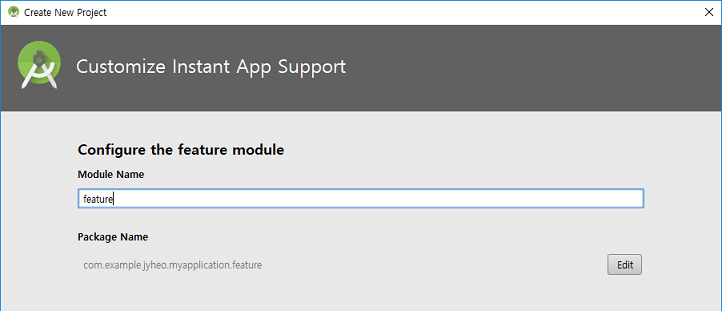
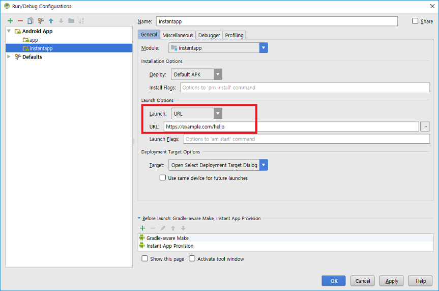

layout: true
.top-line[]

---
class: center, middle
# 인스턴트 앱

---
## 인스턴트 앱
* 설치 과정 없이 URL을 통해 네이티브 안드로이드 앱을 바로 실행시킬 수 있음
* 필요한 것들
	- Android Studio 3.0
	- Instant Apps Development SDK 설치
	- Android SDK 6.0 이상 필요
	- Android SDK Build Tools 26.x 이상
	- Android SDK Tools 25.x 이상
	- Android SDK Platform Tools 25.x 이상
* 실행 가능 기기
	- Android 6.0 (API level 23) 이상
	- 기기나 에뮬레이터에서 반드시 로그인이 되어 있어야 함
	- 주의: x86_64 에뮬레이터 이미지는 안됨

---
## 인스턴트 앱
* Play Store에서 인스턴트 앱  


---
## 프로젝트 생성


Instant App SDK component 인스톨 물어보면 [Yes]

---
## 프로젝트 생성



* feature module
	- Google Play에서 설치 없이 실행 가능한 모듈
	- 나중에 더 추가할 수 있음
	
---
## 프로젝트 생성
* URL  


---
## 생성된 모듈
* base: Feature들이 사용하는 공통 코드
	- build.gradle 의 android {
		+ baseFeature true
* feature: 특정 feature 코드
	- build.gradle 의	dependencies {
		+ implementation project(':base')
* app: 설치형 앱
	- build.gradle 의 dependencies { 
		+ implementation project(':feature')
		+ implementation project(':base')
* instantapp: 인스턴트 앱
	- build.gradle의 dependencies {
		+ implementation project(':feature')
		+ implementation project(':base')

---
## App Link
* https://example.com/hello
* feature의 AndroidManifest.xml

```xml
    <application>
        <activity android:name=".MainActivity">
            <intent-filter android:order="1">
                <action android:name="android.intent.action.VIEW" />

                <category android:name="android.intent.category.BROWSABLE" />
                <category android:name="android.intent.category.DEFAULT" />

                <data
*                   android:host="example.com"
*                   android:pathPattern="/hello"
*                   android:scheme="https" />
            </intent-filter>
            <intent-filter>
                <action android:name="android.intent.action.MAIN" />

                <category android:name="android.intent.category.LAUNCHER" />
            </intent-filter>
        </activity>
    </application>
```

.footnote[https://github.com/jyheo/AndroidTutorial/blob/master/InstantAppTest/feature/src/main/AndroidManifest.xml]

---
## 실행 설정
* 실행할 URL(App Link) 지정



---
## 실행
* instantapp 을 선택해서 실행  


---
## Feature 추가
* Android Studio 메뉴에서 File > New > New Module
* Feature 모듈 선택
* 처음 만들 때처럼 필요한 정보 입력
	- module 이름은 새 feature의 이름
	- URL은 처음 만든 feature와 겹치지 않도록
* instantapp의 build.gradle에 새 feature 추가
	- build.gradle의 dependencies {
		+ implementation project(':feature')
		+ implementation project(':feature2')
		+ implementation project(':base')

.footnote[https://github.com/jyheo/AndroidTutorial/blob/master/InstantAppTest/instantapp/build.gradle]

---
## APP내에서 App Link로 다른 feature 실행

```java
    @Override
    protected void onCreate(Bundle savedInstanceState) {
        super.onCreate(savedInstanceState);
        setContentView(R.layout.activity_main);
        findViewById(R.id.button).setOnClickListener(new View.OnClickListener() {
            @Override
            public void onClick(View view) {
                Intent intent = new Intent(Intent.ACTION_VIEW,
*                       Uri.parse("https://example.com/hello2"));
                intent.setPackage(getPackageName());
                intent.addCategory(Intent.CATEGORY_BROWSABLE);
                startActivity(intent);
            }
        });
    }
```

.footnote[https://github.com/jyheo/AndroidTutorial/blob/master/InstantAppTest/feature/src/main/java/com/example/jyheo/instantapptest/feature/MainActivity.java#L15-L24]
