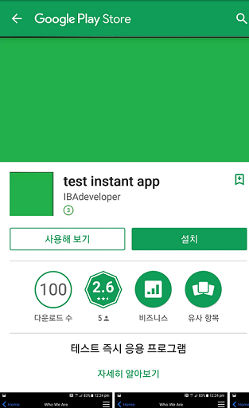
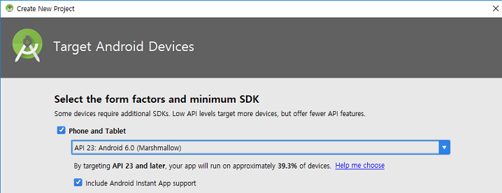
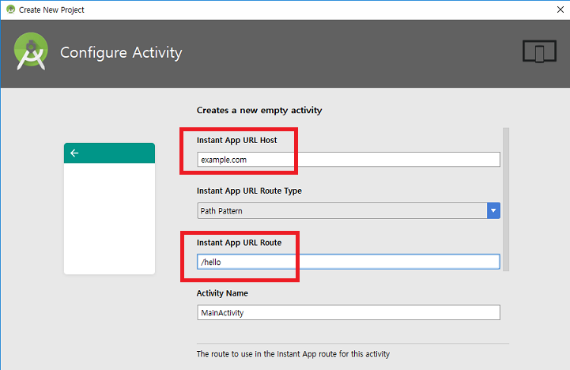
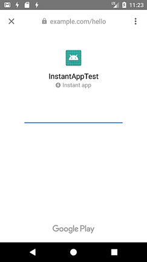
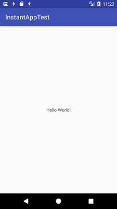

layout: true
.top-line[]

---
class: center, middle
# 인스턴트 앱

---
## 인스턴트 앱
* 설치 과정 없이 URL을 통해 네이티브 안드로이드 앱을 바로 실행시킬 수 있음
* 필요한 것들
	- Android Studio 3.0
	- Instant Apps Development SDK 설치
	- Android SDK 6.0 이상 필요
	- Android SDK Build Tools 26.x 이상
	- Android SDK Tools 25.x 이상
	- Android SDK Platform Tools 25.x 이상
* 실행 가능 기기
	- Android 6.0 (API level 23) 이상
	- 기기나 에뮬레이터에서 반드시 로그인이 되어 있어야 함
	- 주의: x86_64 에뮬레이터 이미지는 안됨

---
## 인스턴트 앱
* Play Store에서 인스턴트 앱  

---
## 프로젝트 생성

Instant App SDK component 인스톨 물어보면 [Yes]

* feature module
	- Google Play에서 설치 없이 실행 가능한 모듈
	- 나중에 더 추가할 수 있음 
	
---
## 프로젝트 생성
* URL

---
## 생성된 모듈
* base: Feature들이 사용하는 공통 코드
* feature: 특정 feature 코드
* app: 설치형 앱
* instantapp: 인스턴트 앱

---
## 실행
* instantapp 을 선택해서 실행  

