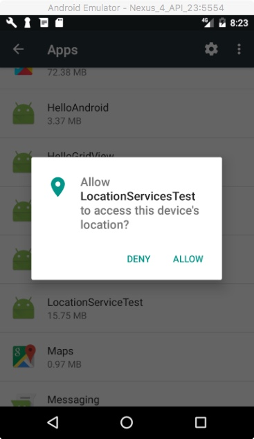

layout: true
.top-line[]

---
class: center, middle
# 위치 기반 서비스

---
## Location Service 개요
* Location APIs
    - Android framework location APIs
    - Google Play Services location APIs (추천)
* 이번 시간에 다룰 내용 (Google Play Service 이용)
    - Google Play Services 설정
    - 위치 접근 권한 얻기
    - Google Play Services 연결
    - 마지막으로 알려진 위치 얻기
    - 주기적인 위치 업데이트 시작/중단 하기
        + 위치 요청 설정 ( 요청 주기, 정확도, 전력 소비 등)
    - 주소 찾기

.footnote[출처: https://developer.android.com/training/location/index.html]

---
## Google Play Services 설정
* Google Play Services SDK 다운로드 및 설치
    - Tools>Android>SDK Manager 이용
        + SDK Tools 탭에서
        + Support Repository - Google Repository 선택 후 OK
* 프로젝트에 라이브러리 추가
    1. build.gradle (Module:app) 파일 오픈
    2. 새로운 빌드 규칙 추가
```java
        dependencies {
            ...
            compile 'com.google.android.gms:play-services-location:11.0.4'
        }
```
    3. 툴바에서 "Sync Project with Graddle Files()" 또는 Sync Now 클릭


.footnote[출처: https://developers.google.com/android/guides/setup]

---
## 위치 접근에 필요한 권한 얻기
* 위치 접근에 필요한 권한
    - ACCESS_COARSE_LOCATION : 대략적 위치 접근 허용 (도시의 블럭 단위)
    - ACCESS_FINE_LOCATION : 정밀한 위치 접근 허용
* Android Manifest 파일에서 권한 설정
```xml
    <manifest xmlns:android="http://schemas.android.com/apk/res/android"
        package="com.example.jyheo.locationplayservice">
        ...
    *   <uses-permission android:name="android.permission.ACCESS_COARSE_LOCATION"/>
    </manifest>
```

.footnote[https://github.com/jyheo/AndroidTutorial/blob/master/LocationPlayService/app/src/main/AndroidManifest.xml]

---
## 위치 접근에 필요한 권한 얻기
* Android 6.0 (API level 23) 이상부터는
    - 앱 실행 중에 사용하려는 권한(permission)을 반드시 요청
* EasyPermission Library
    - https://github.com/googlesamples/easypermissions
    - build.gradle (Module:app) 파일에 EasyPermission 추가
```java
            dependencies {
                ...
                compile 'pub.devrel:easypermissions:1.0.1'
            }
```

---
## 위치 접근에 필요한 권한 얻기

```java
public class MainActivity extends AppCompatActivity {
    @Override
*   public void onRequestPermissionsResult(int requestCode, String[] permissions, int[] grantResults) {
        super.onRequestPermissionsResult(requestCode, permissions, grantResults);
        // Forward results to EasyPermissions
*       EasyPermissions.onRequestPermissionsResult(requestCode, permissions, grantResults, this);
    }

*   @SuppressWarnings("MissingPermission")
*   @AfterPermissionGranted(RC_LOCATION) // automatically re-invoked after getting the permission
    public void getLastLocation() {
        String[] perms = {Manifest.permission.ACCESS_COARSE_LOCATION};
*       if (EasyPermissions.hasPermissions(this, perms)) {
            // Already Have permissions.

        } else {
            // Do not have permissions, request them now
*           EasyPermissions.requestPermissions(this,
                    "This app needs access to your location to know where you are.",
*                   RC_LOCATION, perms);
        }
    }
}
```



.footnote[https://github.com/jyheo/AndroidTutorial/blob/master/LocationPlayService/app/src/main/java/com/example/jyheo/locationplayservice/MainActivity.java]

---
## 마지막으로 알려진 위치 얻기
* Fused Location Provider
    - Google Play Services의 location API중의 하나
    - 디바이스의 배터리 사용을 최적화
    - 간단한 API 제공
        + 명시적인 위치 제공자 지정 없이, 상위 수준 요구사항 (높은 정확도, 저전력 등) 명세
* Fused Location Provider의 getLastLocation() 메소드 이용
    - Task 객체를 반환, Task가 완료 후 Task.getResult()를 통해 결과 받음
    - 디바이스에 마지막으로 알려진 위치를 Location 객체 (위도, 경도, 정확도, 고도 값 등을 얻을 수 있음)로 받음
    - 위치가 가용하지 않으면 null값이 반환될 수 있음

---
## 마지막으로 알려진 위치 얻기

```java
public void onCreate(Bundle savedInstanceState) {
    FusedLocationProviderClient mFusedLocationClient
        = LocationServices.getFusedLocationProviderClient(this);
}

@AfterPermissionGranted(RC_LOCATION) // automatically re-invoked after getting the permission
public void getLastLocation() {
    String[] perms = {Manifest.permission.ACCESS_COARSE_LOCATION};
    if (EasyPermissions.hasPermissions(this, perms)) {
*       mFusedLocationClient.getLastLocation()
*                   .addOnCompleteListener(this, new OnCompleteListener<Location>() {
                        @Override
                        public void onComplete(@NonNull Task<Location> task) {
                            if (task.isSuccessful() && task.getResult() != null) {
*                               mLastLocation = task.getResult();
                            }
                        }
                    });
    }
}
```

.footnote[https://github.com/jyheo/AndroidTutorial/blob/master/LocationPlayService/app/src/main/java/com/example/jyheo/locationplayservice/MainActivity.java]

---
## 주기적인 위치 업데이트 시작하기
1. 위치 요청 (Location Request) 설정
2. 위치 업데이트 콜백 정의
3. Fused Location Provider의 **requestLocationUpdates()** 메소드 호출

```java
private void startLocationUpdates() {
*   LocationRequest locRequest = new LocationRequest();
    locRequest.setInterval(10000);
    locRequest.setFastestInterval(5000);
    locRequest.setPriority(LocationRequest.PRIORITY_HIGH_ACCURACY);

*   mLocationCallback = new LocationCallback() {
        @Override
        public void onLocationResult(LocationResult locationResult) {
            super.onLocationResult(locationResult);
*           mLastLocation = locationResult.getLastLocation();
            updateUI();
        }
    };
*   mFusedLocationClient.requestLocationUpdates(locRequest, mLocationCallback, Looper.myLooper());
}
```

.footnote[https://github.com/jyheo/AndroidTutorial/blob/master/LocationPlayService/app/src/main/java/com/example/jyheo/locationplayservice/MainActivity.java]

---
## 위치 요청 설정
* Fused Location Provider에 위치 요청을 위한 파라미터를 설정
    - setInterval(): 요구되는 위치 업데이트 간격 설정 (더 빠를 수도, 더 느릴 수도 있음)
    - setFastestInterval(): 위치 업데이트를 처리하는 가장 빠른 주기
    - setPriority(): 어떤 위치 소스를 사용할 지에 대한 힌트
        + PRIORITY_BALANCED_POWER_ACCURACY: 대략적인 정밀도 (100m, 도시 블럭), 적은 전력 소비, Wifi와 기지국 위치 사용.
        + PRIORITY_HIGH_ACCURACY: 가능한 가장 정밀한 위치 요청, GPS 사용
        + PRIORITY_LOW_POWER: 도시 수준의 정밀도 (10 km), 훨씬 낮은 전원 소비
        + PRIORITY_NO_POWER : 전원 소비가 무시될 정도, 해당 앱이 위치 업데이트를 요청하지 않고, 다른 앱에 의해 요청된 위치를 수신.

```java
locRequest = new LocationRequest();

locRequest.setInterval(10000); 		// 10초 보다 빠를 수도 느릴 수도 있음
locRequest.setFastestInterval(5000);		// 5초 보다 더 빠를 순 없음
locRequest.setPriority(LocationRequest.PRIORITY_HIGH_ACCURACY);
```

---
## 주기적인 위치 업데이트 중단하기
* 위치 업데이트 중단

```java
public void stopLocationUpdate() {
*   mFusedLocationClient.removeLocationUpdates(mLocationCallback);
}
```

.footnote[https://github.com/jyheo/AndroidTutorial/blob/master/LocationPlayService/app/src/main/java/com/example/jyheo/locationplayservice/MainActivity.java]

---
## 주소 찾기
* Geocoding
    - 위치좌표를 주소로 변경하거나 주소를 위치좌표로 변경하는 것
* 특별한 Permission은 필요치 않음
* Geocoding 방법
    - Geocoder 객체 생성
        + Geocoder geocoder = new Geocoder(this, Locale.KOREA);
        + 두번째 생성자 파라미터는 로케일 값으로, 특정 지역 및 언어 영역을 나타냄
    - Geocoder class의 아래 함수들을 이용
        + List &lt; Address &gt; **getFromLocation**(double latitude, double longitude, int maxResults);
        + List &lt; Address &gt; **getFromLocationName**(String locationName, int maxResults);

---
## 주소 찾기
* Address class:
    - getLatitude() : double type의 위도
    - getLongitude(): double type의 경도
    - getMaxAddressLineIndex() : 주소가 표시줄 수
    - getAddressLine(int index): 행별 주소 문자열
    - getLocality():  locality(서울특별시)
    - getFeatureName():  장소명(395-3)
    - getThoroughfare():  길이름(삼선동2가)
    - getCountryName(): 국가명(대한민국)
    - getPostalCode(): 우편번호 (136-792)

---
## 주소 찾기
* 위치로부터 주소 얻기 예제

```java
try {
  	Geocoder geocoder = new Geocoder(this, Locale.KOREA);
*       List<Address> addresses = geocoder.getFromLocation(
  					mCurrentLocation.getLatitude(),
  					mCurrentLocation.getLongitude(),1);
        if (addresses.size() >0) {
            Address address = addresses.get(0);
            mAddressTextView.setText(String.format("\n[%s]\n[%s]\n[%s]\n[%s]",
                          address.getFeatureName(),
                          address.getThoroughfare(),
                          address.getLocality(),
                          address.getCountryName()
                          ));
        }
} catch (IOException e) {
   ...
}
```

.footnote[https://github.com/jyheo/AndroidTutorial/blob/master/LocationPlayService/app/src/main/java/com/example/jyheo/locationplayservice/MainActivity.java]

---
## 주소 찾기
* 주소 이름으로부터 위치 얻기 예제

```java
try {
    Geocoder geocoder = new Geocoder(this, Locale.KOREA);
*   List<Address> addresses = geocoder.getFromLocationName(input,1);
    if (addresses.size() >0) {
        Address bestResult = (Address) addresses.get(0);

        mResultText.setText(String.format("[ %s , %s ]",
            bestResult.getLatitude(),
            bestResult.getLongitude()));
     }
} catch (IOException e) {
    Log.e(getClass().toString(),"Failed in using Geocoder.", e);
    return;
}
```
