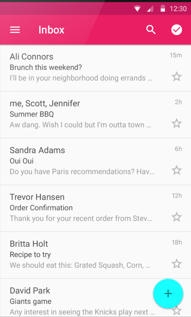
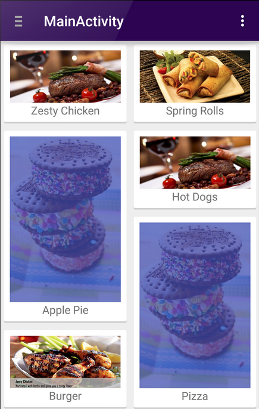

# RecyclerView
<!-- _class: lead -->
### 허준영(jyheo@hansung.ac.kr)


## Contents
* RecyclerView
* LayoutManager
* RecyclerView 사용 1-7
* RecyclerView – Item Changed


## RecyclerView
* ListView의 더욱 향상되고 유연해진 버전
    - 한정된 수의 뷰를 유지함으로써 매우 효율적으로 스크롤할 수 있는, 큰 데이터 집합을 표시하기 위한 컨테이너
    - 런타임에 요소가 변경되는 데이터 컬렉션이 있는 경우  
    RecyclerView 위젯을 사용
    - 어댑터와 레이아웃 관리자를 지정하여 사용  
 



[https://developer.android.com/training/material/lists-cards.html?hl=ko](https://developer.android.com/training/material/lists-cards.html?hl=ko)


## RecyclerView
* 주요 클래스
    - RecyclerView.Adapter – 데이터를 관리하고 항목 뷰에 연결 시키는 역할
    - RecyclerView.ViewHolder – 항목 뷰를 담아두는 상자
    - LayoutManager – 항목 뷰들의 배치를 관리
* RecyclerView 사용
    1. RecyclerView library를 gradle build에 추가
    2. 데이터 소스로 사용할 모델 클래스 정의
    3. RecyclerView를 레이아웃에 추가
    4. 항목 표시를 위한 커스텀 row layout XML을 추가
    5. RecyclerView.Holder 상속한 ViewHolder 클래스
    6. RecyclerView.Adapter 상속한 Adapter 클래스
    7. 어댑터와 RecyclerView 연결


## LayoutManager
* LayoutManager
    - LinearLayoutManager
    - GridLayoutManager
    - StaggeredGridLayoutManager  
    


## 1. Gradle
* RecyclerView support library를 gradle build file에 추가
* app/build.gradle
    ```java
    dependencies {
        ...
        implementation 'androidx.recyclerview:recyclerview:1.1.0'
    }
    ```
* 예제에서 View Binding을 함께 사용하기 때문에
    ```java
    android {
        ...
        viewBinding {
            enabled true
        }
    }
    ```

## 2. 데이터 모델 클래스
* 데이터 소스로 사용할 모델 클래스 정의
* 예) Email 클래스
    - [RecyclerView/app/src/main/java/com/example/recyclerview/Email.java](https://github.com/jyheo/android-java-examples/blob/master/RecyclerView/app/src/main/java/com/example/recyclerview/Email.java)
        ```java
        class Email {
            String mSender;
            String mTitle;

            public Email(String sender, String title) {
                mSender = sender;
                mTitle = title;
            }
        }
        ```

## 3. RecyclerView를 레이아웃에 추가
* [RecyclerView/app/src/main/res/layout/activity_main.xml](https://github.com/jyheo/android-java-examples/blob/master/RecyclerView/app/src/main/res/layout/activity_main.xml)
    ```xml
    <?xml version="1.0" encoding="utf-8"?>
    <LinearLayout xmlns:android="http://schemas.android.com/apk/res/android"
        xmlns:tools="http://schemas.android.com/tools"
        android:layout_width="match_parent"
        android:layout_height="match_parent"
        android:orientation="vertical"
        tools:context="com.example.recyclerview.MainActivity">

        <androidx.recyclerview.widget.RecyclerView
            android:id="@+id/recyclerview"
            android:scrollbars="vertical"
            android:layout_width="match_parent"
            android:layout_height="match_parent" />

    </LinearLayout>
    ```

## 4. 항목을 위한 레이아웃
* 항목 표시를 위한 커스텀 row layout XML을 추가
* [RecyclerView/app/src/main/res/layout/item.xml](https://github.com/jyheo/android-java-examples/blob/master/RecyclerView/app/src/main/res/layout/item.xml)
    ```xml
    <?xml version="1.0" encoding="utf-8"?>
    <LinearLayout
        xmlns:android="http://schemas.android.com/apk/res/android"
        xmlns:app="http://schemas.android.com/apk/res-auto"
        android:orientation="horizontal"
        android:layout_width="match_parent"
        android:layout_height="wrap_content" >
        <ImageView
            android:layout_width="wrap_content"
            android:layout_height="match_parent"
            app:srcCompat="@drawable/ic_person_black_24dp" />
        <TextView
            android:id="@+id/textSender"
            android:layout_width="0dp"
            android:layout_height="wrap_content"
            android:layout_weight="1" />
        <TextView
            android:id="@+id/textTitle"
            android:layout_width="0dp"
            android:layout_height="wrap_content"
            android:layout_weight="2" />
    </LinearLayout>
    ```


## 5. RecyclerView.Holder 상속한 ViewHolder 클래스 생성
* [RecyclerView/app/src/main/java/com/example/recyclerview/EmailAdapter.java](https://github.com/jyheo/android-java-examples/blob/master/RecyclerView/app/src/main/java/com/example/recyclerview/EmailAdapter.java#L12)
    ```java
    class ViewHolder extends RecyclerView.ViewHolder {
        ItemBinding mBinding;

        ViewHolder(ItemBinding binding) {
            super(binding.getRoot());
            mBinding = binding;
        }
    }
    ```
    - ItemBinding은 자동 생성된 item.xml의 view binding 클래스 
    - ViewHolder에 binding을 주기 전에 inflate해야 함


## 6. RecyclerView.Adapter 상속한 Adapter 클래스 생성
* [RecyclerView/app/src/main/java/com/example/recyclerview/EmailAdapter.java](https://github.com/jyheo/android-java-examples/blob/master/RecyclerView/app/src/main/java/com/example/recyclerview/EmailAdapter.java#L21)
    ```java
    public class EmailAdapter extends RecyclerView.Adapter<ViewHolder> {

        private List<Email> mEmails;

        EmailAdapter(List<Email> emails) {
            mEmails = emails;
        }

        @NonNull
        @Override
        public ViewHolder onCreateViewHolder(@NonNull ViewGroup parent, int viewType) {
            Context context = parent.getContext();
            LayoutInflater inflater = LayoutInflater.from(context);
            ItemBinding binding = ItemBinding.inflate(inflater, parent, false);
            return new ViewHolder(binding);
        }
    ```

## 6. RecyclerView.Adapter (계속)
- EmailAdapter.java 코드 계속
    ```java
        @Override
        public void onBindViewHolder(@NonNull ViewHolder holder, int position) {
            Email email = mEmails.get(position);
            holder.mBinding.textSender.setText(email.mSender);
            holder.mBinding.textTitle.setText(email.mTitle);
        }

        @Override
        public int getItemCount() {
            return mEmails.size();
        }
    }
    ```


## 7. 어댑터와 RecyclerView 연결
* [RecyclerView/app/src/main/java/com/example/recyclerview/MainActivity.java](https://github.com/jyheo/android-java-examples/blob/master/RecyclerView/app/src/main/java/com/example/recyclerview/MainActivity.java)
    ```java
    public class MainActivity extends AppCompatActivity {

        ArrayList<Email> mEmails = new ArrayList<>();

        @Override
        protected void onCreate(Bundle savedInstanceState) {
            super.onCreate(savedInstanceState);
            ActivityMainBinding binding = ActivityMainBinding.inflate(getLayoutInflater());
            setContentView(binding.getRoot());

            EmailAdapter adapter = new EmailAdapter(mEmails);
            binding.recyclerview.setAdapter(adapter);
            binding.recyclerview.setLayoutManager(new LinearLayoutManager(this));
            binding.recyclerview.setHasFixedSize(true);

            mEmails.add(0, new Email("Friend", "Hello! Do you have ..."));
            adapter.notifyItemInserted(0);
        }        
    }
    ```


## RecyclerView – Item Changed
* 항목 추가/삭제 등의 변경이 있을 때 adapter에게 알려줘야 함

    Method                      | Description
    ----------------------------|---------------------------------
    notifyItemChanged(int pos)  | pos위치의 item이 변경되었음을 알림
    notifyItemInserted(int pos) | pos위치에 새로 item이 추가되었음을 알림
    notifyItemRemoved(int pos)  | pos위치의 item이 데이터 셋에서 삭제되었음을 알림
    notifyDataSetChanged()      | 데이터 셋에 어떠한 변경이 있음을 알릴 때. 가급적 사용 자제

    ```java
    mEmails.add(0, new Email("Friend", "Hello! Do you have ..."));
    adapter.notifyItemInserted(0);
    ```
