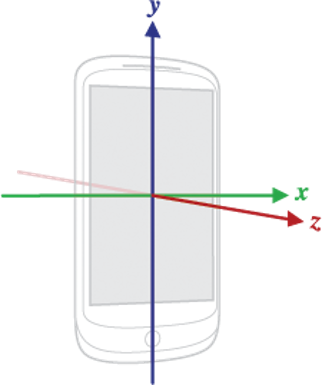
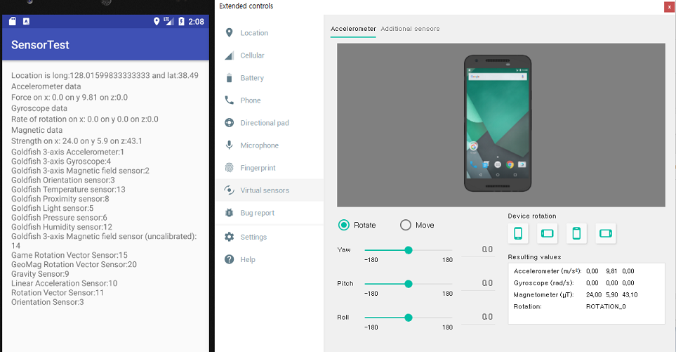

layout: true
.top-line[]

---
class: center, middle
# 센서

jyheo0@gmail.com

---
## 센서
* 가속도 센서(Accelerometer)
	- 중력이 포함된 값
	- TYPE_ACCELEROMETER
* 자이로스코프(Gyroscope)
	- 회전 속도 값
	- TYPE_GYROSCOPE
* 지자기 센서(Geomagnetic Field Sensor)
	- TYPE_MAGNETIC_FIELD
* 조도 센서(Light Sensor)
	- TYPE_LIGHT

---
## 센서 좌표 시스템



---
## 센서 사용 시작하기

```java
public class MainActivity extends AppCompatActivity implements SensorEventListener {

	SensorManager mSm = null;
	
	@Override
    protected void onCreate(Bundle savedInstanceState) {
		...

 *      mLm = (LocationManager) getSystemService(LOCATION_SERVICE);
 *      mSm = (SensorManager) getSystemService(Context.SENSOR_SERVICE);
 *      List<Sensor> sensors = mSm.getSensorList(Sensor.TYPE_ALL);
        StringBuilder sb = new StringBuilder();
        for (Sensor s : sensors)
            sb.append(s.getName()).append(":").append(s.getType()).append("\n");
        mSensorList.setText(sb);
    }

	@Override
	protected void onStart() {
		super.onStart();		
*		Sensor accelSensor = mSm.getDefaultSensor(Sensor.TYPE_ACCELEROMETER);
		Sensor gyroSensor = mSm.getDefaultSensor(Sensor.TYPE_GYROSCOPE);
		Sensor magnetSensor = mSm.getDefaultSensor(Sensor.TYPE_MAGNETIC_FIELD);		
*		mSm.registerListener(this, accelSensor, SensorManager.SENSOR_DELAY_NORMAL);
		mSm.registerListener(this, gyroSensor, SensorManager.SENSOR_DELAY_NORMAL);
		mSm.registerListener(this, magnetSensor, SensorManager.SENSOR_DELAY_NORMAL);
	}
	
	...
}
```

.footnote[https://github.com/jyheo/AndroidTutorial/blob/master/SensorTest/app/src/main/java/com/example/jyheo/sensortest/MainActivity.java#L53-L59]
.footnote[https://github.com/jyheo/AndroidTutorial/blob/master/SensorTest/app/src/main/java/com/example/jyheo/sensortest/MainActivity.java#L91-L97]

---
## 센서 값 받기

```java
public class MainActivity extends AppCompatActivity implements SensorEventListener {
	...
	
	@Override
    public void onSensorChanged(SensorEvent event) {
        switch(event.sensor.getType()){
        case Sensor.TYPE_ACCELEROMETER:
            mAccel.setText("Force on x: " + event.values[0]
				+ " on y " + event.values[1] + " on z:" + event.values[2]);
            break;
        case Sensor.TYPE_GYROSCOPE:
            mGyro.setText("Rate of rotation on x: " + event.values[0] 
				+ " on y " + event.values[1] + " on z:" + event.values[2]);
            break;
        case Sensor.TYPE_MAGNETIC_FIELD:
            mMagnet.setText("Strength on x: " + event.values[0] 
				+ " on y " + event.values[1] + " on z:" + event.values[2]);
            break;
        }
    }

    @Override
    public void onAccuracyChanged(Sensor sensor, int accuracy) {
    }
}
```

.footnote[https://github.com/jyheo/AndroidTutorial/blob/master/SensorTest/app/src/main/java/com/example/jyheo/sensortest/MainActivity.java#L117-L129]

---
## 에뮬레이터에서 센서 테스트



---
## GPS(위치 센서) 값 받기
* GPS 값 읽어오기, 변경될 때마다 값 받기
	- LocationManager.getLastKnownLocation(LocationManager.GPS_PROVIDER)
	- LocationManager.requestLocationUpdates(...)

```java
    @AfterPermissionGranted(MY_PERMISSIONS_REQUEST_FINE_LOCATION)
    protected void onStart() {
        super.onStart();

        String[] perms = {Manifest.permission.ACCESS_FINE_LOCATION};
        if (EasyPermissions.hasPermissions(this, perms)) {
            try {
*               Location loc = mLm.getLastKnownLocation(LocationManager.GPS_PROVIDER);
                onLocationChanged(loc);
*               mLm.requestLocationUpdates(LocationManager.GPS_PROVIDER, MIN_TIME, MIN_DIST,
                        this);
            } catch(SecurityException e) { 
            }
        } else {
            EasyPermissions.requestPermissions(this, "I need the PERMISSION!",
                    MY_PERMISSIONS_REQUEST_FINE_LOCATION, perms);
        }
	}
```

.footnote[https://github.com/jyheo/AndroidTutorial/blob/master/SensorTest/app/src/main/java/com/example/jyheo/sensortest/MainActivity.java#L75-L89]

---
## GPS(위치 센서) 값 받기

```java
public class MainActivity extends AppCompatActivity implements LocationListener {
	...
	@Override
*   public void onLocationChanged(Location location) {
        //when location changed change text
        mLocationText.setText("Location is long:" + location.getLongitude() +
                " and lat:" + location.getLatitude());
    }

    @Override
    public void onStatusChanged(String provider, int status, Bundle extras) {}

    @Override
    public void onProviderEnabled(String provider) {}

    @Override
    public void onProviderDisabled(String provider) {}
}
```

.footnote[https://github.com/jyheo/AndroidTutorial/blob/master/SensorTest/app/src/main/java/com/example/jyheo/sensortest/MainActivity.java#L101-L114]

---
## 에뮬레이터에서 GPS 테스트


